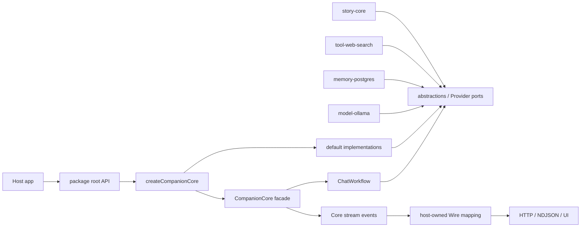
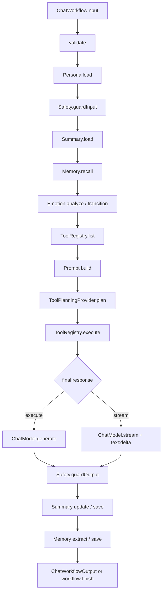

# `@ying-ai/ai-core` 架构审计

| 项目 | 内容                                                                    |
| ---- | ----------------------------------------------------------------------- |
| 日期 | 2026-09-20                                                              |
| 范围 | `packages/ai-core/`，并只读核对其直接消费者、冻结需求与历史 review 结论 |
| 基线 | `prod` / `c4643e1b197b` 的当前工作区                                    |
| 性质 | 只读诊断；不包含实现改动或重构计划                                      |

## 结论摘要

`ai-core` 的总体架构方向是成立的：契约层、默认实现、组合根、宿主边界和外部 Adapter 之间有清楚的职责划分；Provider 注入、Core Event / Wire Event 分离、工具规划与最终回答分离也都是适合当前 SDK 的真实扩展点。新增的边界校验已经把多项关键约束变成可执行规则，当前检查全部通过。

当前最值得优先处理的不是拆包，而是三个包内交叉边界：

1. `SafeWorkflowError` 在 Core 门面与参考 Workflow 中重复且运行时净化规则不一致；自定义 Workflow 发出的错误终止事件还会绕过门面净化。
2. 模型 runtime 的错误摘要只截断、不脱敏，却会进入 `modelOutput.runtime`、调试上下文和 Demo Wire 输出。
3. `execute()` / `stream()` 虽共享步骤实现，但完整生命周期顺序仍复制两份；两个最大 Workflow 文件继续承担多个能力域的变化原因。

建议保持 `ai-core` 为一个包，在包内收敛安全边界、生命周期编排和能力步骤所有权。取消/背压、调试上下文默认暴露和公共导出面属于需要产品兼容性决策的独立议题，不宜顺手混入一次结构调整。

---

## Scope & baseline

### 审计范围

- 主范围：`packages/ai-core/src/`、`scripts/`、`package.json`、双语 README、包级 `AGENTS.md`。
- 消费者证据：`apps/model-runtime-demo`、`packages/model-ollama`、`packages/memory-postgres`、`packages/story-core`、`packages/tool-web-search`。
- 历史契约：`.requirements/companion/stages/v1.0/`、`v1.1/` 与 `.code-reviews/companion/v1.1/conclusion.md`。
- 排除项：未调用真实模型、数据库或网络 Provider；未审计 UI 视觉和数据库 schema；未修改生产代码、测试代码或历史需求。

### 工作区基线

本审计针对**当前工作区**，不是干净 HEAD。开始审计时已经存在同一任务链产生的包级守则、边界校验、双语 README 和源码注释变更；这些改动被视为审计输入并原样保留。审计本身只新增本文件。

| 指标                                        |               当前值 |
| ------------------------------------------- | -------------------: |
| `src/**/*.ts`                               | 59 个文件 / 6,919 行 |
| `src` + `scripts`                           |             7,246 行 |
| 包根导出符号                                |                  160 |
| 当前 monorepo 中观察到的根导入符号          |                   76 |
| 具有文件级 JSDoc 头的源码文件               |              55 / 59 |
| 带 JSDoc 的 exported declarations（启发式） |            128 / 203 |

### 变更热点基线

`git log -- packages/ai-core/src` 显示：

- `simple-chat-workflow.ts`：18 次变更；
- `abstractions/workflow.ts`：15 次；
- `src/index.ts`：14 次；
- `abstractions/model.ts`：10 次；
- `implementations/model/openai.ts`：9 次；
- `core/companion-core.ts`：7 次。

这些数字只用于定位结构压力，不等同于缺陷数量。

---

## Functional Map

| 能力             | 主要入口 / 模块                                     | 责任                                         | 明确不负责                       |
| ---------------- | --------------------------------------------------- | -------------------------------------------- | -------------------------------- |
| 公共门面         | `CompanionCore`、`createCompanionCore()`            | 装配 Provider、暴露 inspect/execute/stream   | HTTP、认证、宿主持久化           |
| 模型边界         | `ChatModel`、`GenerateInput/Output`、`ModelProfile` | 屏蔽具体模型 SDK，表达能力需求               | 按 provider 名称在 Workflow 分支 |
| 内置模型 Adapter | `OpenAICompatibleModel`、`createModel()`            | AI SDK 映射、重试、fallback、capability 过滤 | 读取环境变量                     |
| Persona          | `PersonaProvider`、Prompt Builder                   | 载入、规范化、渲染 Persona                   | 用户资料持久化                   |
| Memory           | `MemoryProvider`、`MemoryExtractor`                 | recall / extract / save 契约与默认实现       | 持久数据库；由外部包实现         |
| Summary          | `SummaryProvider`、`SummaryUpdater`                 | load / update / save 和 history 分段         | 宿主对话历史所有权               |
| Emotion          | `EmotionEngine`、transition                         | 识别和确定性状态转移                         | 宿主持久化上一轮情绪             |
| Tool             | `ToolRegistry`、Tool adapter                        | 注册、列举、执行和模型消息适配               | 网络工具的具体实现               |
| Tool Planning    | `ToolPlanningProvider`                              | 在最终回答前决定 `no_tool` / `tool_calls`    | 面向用户的自然语言回答           |
| Safety           | `SafetyProvider`                                    | 输入/完整输出审核                            | V1.1 token 级实时审核            |
| Workflow         | `SimpleChatWorkflow`                                | 单轮能力编排、关键/降级语义、写回            | history 持久化、Wire 序列化      |
| 流协议           | `ChatWorkflowStreamEvent`、`WorkflowStreamEmitter`  | Core 内事件顺序与唯一终止                    | 网络背压、NDJSON、断线恢复       |
| 可观测性         | `CoreObserver`、`WorkflowTrace`                     | 旁路事件、步骤状态、预算标记                 | 日志存储和 UI                    |

默认组合根只要求 `model`；其余能力有默认、禁用或 noop 实现。注入 Memory / Summary 时，工厂会自动选择 model-backed extractor/updater。这让最小宿主可运行，同时保留外部替换能力。

---

## Architecture / Dependency Map

### 依赖方向判断

- `abstractions/` 是稳定契约层；当前边界脚本会拒绝其对实现层的依赖。
- `implementations/` 依赖契约与实现内 helper，不反向依赖 `core/` 或 `factories/`。
- `core/` / `factories/` 是组合边界；`companion-core-factory.ts` 的内部扇出最高（23），符合组合根特征。
- 所有已观察到的 workspace 消费者都从包根导入，没有发现跨包 deep import。
- 依赖扇入最高的是 `abstractions/model`（24），其次是 memory/tool 契约（各 13）；这些文件是高稳定性合同点。
- 存在两个**仅类型级**循环：
  - `abstractions/core-context -> abstractions/workflow -> abstractions/core-context`
  - `abstractions/workflow -> abstractions/workflow-stream -> abstractions/workflow`

类型 import 在运行时被擦除，因此当前没有运行时循环故障；但它说明 Workflow 接口、执行上下文、输出 DTO 和 Stream DTO 的合同所有权还没有形成单向图。

### 模式适配度

- Ports & Adapters：适配良好。Memory/Postgres、Ollama、Web Search 都在包外实现 Core 契约。
- Strategy：`ToolPlanningProvider`、模型 profile/fallback 是真实算法变化点，不是为模式而模式。
- Plugin boundary：`ToolRegistry` 是明确的独立注册边界，适合保留。
- Provider 抽象：Persona/Safety/Observer 等虽然实现数量不多，但承担宿主注入、禁用/noop 与测试替身职责，当前不构成明显过度抽象。
- Layered architecture：顶层方向健康；压力主要发生在 Workflow 实现层内部，而不是跨包层级倒置。

---

## Data & Side-effect Flow

### 单轮主链路

### 状态和副作用所有权

| 数据 / 副作用                                   | 所有者                 | 当前行为                                         |
| ----------------------------------------------- | ---------------------- | ------------------------------------------------ |
| history、session、emotion persistence           | Host                   | 每轮输入；Core 不保存                            |
| `WorkflowExecutionState`                        | Workflow 单轮内存      | 跨步骤可变；大多数字段按阶段写入                 |
| Persona / Summary / Memory / Tool / Safety 调用 | 注入 Provider          | 由 Workflow 决定关键失败或降级语义               |
| 模型网络调用                                    | `ChatModel` Adapter    | Core 只传结构化输入和能力需求                    |
| Summary / Memory 持久写回                       | 注入 Provider          | 完整输出 Safety 后执行；可恢复失败降级           |
| CoreObserver                                    | Host 注入              | 旁路；Observer 失败不得阻断主链路                |
| Core Stream Event                               | Workflow / Core facade | 可含 `Date`、完整 Output 和 debug 信息           |
| Wire Event                                      | Host                   | JSON 安全映射、剥离 `raw` / `Error` / 未转换日期 |

### 流式语义

V1.1 的冻结契约是“先发送最终回答 delta，再对完整文本做 Output Safety”。因此 Safety 拒绝时允许已存在 partial text，但必须以 `workflow:error(output_safety_rejected)` 终止，绝不能发送 `workflow:finish`。这不是 token 级 Safety。

---

## Public Contracts / Invariants

以下约束同时由代码、双语 README、阶段规格或契约脚本支持：

1. 宿主从 `@ying-ai/ai-core` 包根导入；跨包消费者不依赖实现路径。
2. `executeWorkflow()` 保留 Promise 输出；`streamWorkflow()` 返回 Core Event AsyncIterable。
3. `ChatWorkflow.stream` 可选；旧自定义 Workflow 不支持时返回 `workflow_stream_not_supported`。
4. `workflow:finish` / `workflow:error` 互斥且至多一次；终止后不再发事件。
5. 每个已开始步骤恰有一个对应 `step:end`；失败步骤先结束，再发工作流错误。
6. 正常完成时，全部非空 `text:delta` 按序拼接严格等于 `finish.output.text`；空白 delta 不得 trim 掉。
7. 工具规划和执行发生在最终文本前；最终 generate/stream 不再传 tools。
8. 输入 Safety 拒绝立即失败；流式 Output Safety 是完整文本后审计，拒绝时不允许成功终止。
9. Persona、工具列表和最终模型属于关键路径；Memory/Summary/Emotion 与后置写回按已定义规则降级。
10. history 和情绪持久化属于 Host；Core 只消费输入并返回新状态。
11. Provider 身份依赖稳定 `meta.id`，不依赖构造函数名。
12. `SafeWorkflowError` 不得包含 API key、headers、raw、stack、cause 或不可序列化对象。
13. Core Event 与 Wire Event 是不同层；网络序列化必须在包外完成。
14. `timeoutMs` 只标记预算，不取消底层 Provider。

需要修正的一处文字契约：包级 `AGENTS.md:34` 当前写成“never ... release model text that has not passed output Safety”，字面上禁止当前已冻结的先 delta 后审计行为；V1.1 Stage 2/5 和当前实现则明确允许 partial delta。正确的不变量应至少区分“释放 delta”与“返回成功 / 发出 finish”。

---

## Verification Map

### 本次新鲜验证

| 检查                                                               | 结果                | 覆盖边界                                                                                        |
| ------------------------------------------------------------------ | ------------------- | ----------------------------------------------------------------------------------------------- |
| `pnpm --filter @ying-ai/ai-core typecheck`                         | 通过                | 类型合同和内部引用                                                                              |
| `pnpm --filter @ying-ai/ai-core lint`                              | 通过                | ESLint + 59 个源码文件的边界校验                                                                |
| `pnpm --filter @ying-ai/ai-core verify:memory-extractor`           | 通过                | structured output 抽取与缺失输出错误                                                            |
| `pnpm --filter @ying-ai/model-runtime-demo verify:stream-contract` | 8 / 8 通过          | delta 聚合、旧 Workflow、缺失终止、步骤失败、Safety 拒绝、写回降级、Wire raw 剥离、NDJSON chunk |
| 上述 stream contract 内的 `ai-core build`                          | 通过                | 可构建性                                                                                        |
| 自定义脚本：内部 import cycle                                      | 发现 2 个类型级循环 | 架构依赖图                                                                                      |
| 自定义脚本：消费者根导入                                           | 76 个不同符号       | 当前 monorepo 公共 API 使用面                                                                   |

### 现有保护

- `verify-boundaries.mjs`：禁止 sibling package/app 反向依赖、越出 `src` 的相对 import、abstractions 依赖实现、implementations 依赖 core/factory、环境变量、console、direct fetch 和宿主框架/数据库依赖。
- Demo stream contract：当前最接近端到端的 fake-provider 契约验证。
- Memory extractor verification：单独保护 structured output 行为。
- 历史 stage review / follow-up：保留设计意图和人工验收证据。

### 未覆盖或覆盖偏弱

- 包内没有通用 unit/integration test script；历史 V1.1 结论也明确记录了这一点。
- 没有自动证明 `execute` 与 `stream` 的完整阶段顺序、关键/降级结果和输出字段持续等价。
- 没有覆盖自定义 Workflow 发出不安全 `workflow:error`、受控错误 details 注入复杂对象、runtime message 含 token/连接串等对抗场景。
- 没有覆盖消费者提前停止迭代后的 producer 取消、队列增长和写回行为。
- 边界脚本不检查 type-only cycle，也不检查新增根导出是否属于批准的公共面。
- 未做真实 Provider、浏览器或生产宿主验证；本报告不据此声称网络错误格式或生产隐私边界已验证。

---

## Code Comment / Engineering Documentation Map

| 载体                                 | 当前作用                                        | 评价 / 缺口                                                                                       |
| ------------------------------------ | ----------------------------------------------- | ------------------------------------------------------------------------------------------------- |
| 根 `AGENTS.md`                       | repo 总入口、优先级和验证协议                   | 清楚，适合作为 AI 导航                                                                            |
| `packages/ai-core/AGENTS.md`         | 包边界、依赖方向、合同不变量、验证矩阵          | 结构好；Output Safety 文案与冻结 V1.1 契约冲突                                                    |
| `README.md` / `README.zh-CN.md`      | 当前架构、模块、调用流、默认 Provider、错误语义 | 两种语言结构同步；应更明确 debugContext 默认随 output 返回，而不仅是 trace opt-in                 |
| 源码文件头注释                       | 模块职责、顺序、安全边界                        | 55/59 文件已有；四个小 formatter/error 文件无文件头并非架构阻塞                                   |
| 公共契约 JSDoc                       | Provider、输入输出、流事件、状态语义            | 核心合同较好；启发式统计仍有 75 个 exported declarations 无直接 JSDoc，需按公共稳定性而非配额判断 |
| `.requirements/companion/`           | 冻结产品/阶段合同                               | 是历史行为裁决依据，不应为了现代码回写                                                            |
| `.code-reviews/companion/`           | 审查和 follow-up 证据                           | 能说明为何保留双入口、后审计 Safety 和流协议                                                      |
| `docs/ai/model-provider-strategy.md` | 跨包模型 Provider 策略                          | 补充模型边界，不替代包 README                                                                     |

注释总体已经从“描述语法”转向职责、失败语义和顺序不变量。当前更大的文档风险不是注释数量，而是同一 Safety 规则在“冻结需求、包守则、实现注释”之间用词不一致。

---

## Hotspots / Hotspot Watchlist

| 热点                              | 证据                                                             | 判定                         | 理由                                                             |
| --------------------------------- | ---------------------------------------------------------------- | ---------------------------- | ---------------------------------------------------------------- |
| `simple-chat-workflow.ts`         | 785 行、18 次历史变更；双生命周期列表 + 11 个步骤 wrapper        | **STRUCTURAL ACTION LIKELY** | 主入口仍有多种变化原因，且顺序复制是行为漂移点                   |
| `workflow-steps.ts`               | 666 行；Tool、Emotion、Summary、Memory 混合；最大函数 161/140 行 | **STRUCTURAL ACTION LIKELY** | “剩余共享步骤”已成为跨能力聚合模块                               |
| `workflow-execution-state.ts`     | 13 个以上阶段字段，多数字段 optional，结束时运行时 require       | **NEEDS PLAN DECISION**      | 更强的阶段类型可降低错误，但也可能制造类型和文件碎片             |
| `companion-core.ts`               | 门面职责集中；另有一份 SafeWorkflowError 归一化                  | **NEEDS PLAN DECISION**      | 门面本身 cohesive；只应迁出共享安全边界，不宜泛化拆分            |
| `workflow-stream-emitter.ts`      | 201 行；顺序、等待者、唯一终止集中                               | **COHESIVE / PRESERVE**      | 单一并发不变量模块清楚；取消/背压应扩展协议而非拆散队列          |
| `implementations/model/openai.ts` | 530 行；generate/stream/retry/fallback/mapping                   | **COHESIVE / PRESERVE**      | 都属于一个 Adapter 的调用策略；先修安全摘要，不因行数拆分        |
| `persona-prompt-builder.ts`       | 315 行                                                           | **COHESIVE / PRESERVE**      | 规范化与渲染围绕一个确定性能力，长但内聚                         |
| `src/index.ts`                    | 单一根入口，160 个导出，14 次历史变更                            | **NEEDS PLAN DECISION**      | 当前消费者依赖根入口；收窄需兼容策略，不能机械删除未观察使用项   |
| type-only contract cycles         | 两个 abstractions 循环                                           | **NEEDS PLAN DECISION**      | 无运行时故障，但合同所有权不再单向；应在触碰 Workflow 合同时解决 |

---

## Evidence-backed Findings

### F-01 — 安全错误边界重复、净化规则不一致，且自定义 Workflow 可绕过门面净化

- 严重度：**High**
- 判定：**STRUCTURAL ACTION LIKELY**
- 证据：
  - `core/companion-core.ts:109-121` 对 Workflow 自己发出的终止事件直接 yield；只有抛出的异常才走 `toSafeWorkflowError()`。
  - `core/companion-core.ts:151-211` 有独立 error code 白名单和 details 标量过滤，但对 `candidate.message` 不做敏感值脱敏。
  - `workflow-safe-error.ts:48-118` 有第二套白名单和消息脱敏，但 `normalizeSafeWorkflowError()` 对运行时 `candidate.details` 原样透传。
  - Stage 5 重构补丁 `:19-23`、`:39`、`:547` 已把这项重复记录为双处维护风险；`:589` 明确将统一 helper 留给后续补丁。
- 影响：新增错误码或净化规则时两条路径可能漂移；类型不可信时，消息或 details 可能把凭据、连接串或复杂对象带入 Core Stream/Wire。
- 根因：安全 DTO 被当作 Workflow 实现 helper，而 Core facade 又必须自行兜底；缺少包内中立、非公共的单一安全边界。
- 安全方向：建立一个 Core 与 Workflow 都可依赖的 package-internal error sanitizer，并在门面 yield `workflow:error` 前统一归一化。保留冻结错误码、终止语义和自定义 Workflow 兼容性。
- 风险：可能改变宿主依赖的错误 message/details；必须先用现有和对抗性案例固定兼容边界。

### F-02 — `ModelRuntimeErrorItem.message` 名为安全摘要，但目前只规范空白并截断

- 严重度：**High**
- 判定：**STRUCTURAL ACTION LIKELY**
- 证据：
  - `implementations/model/openai.ts:449-466` 将底层 `Error.message` 直接压平并截断到 240 字符，没有 token、Bearer、连接串或 key=value 脱敏。
  - `abstractions/model.ts:132-160` 把 runtime errors 定义为结构化“安全错误摘要”。
  - `workflow-output-builder.ts:59-60,93-95,108` 把 runtime 放入 debug metadata 和 `modelOutput`。
  - Demo `chat-stream-wire.ts:132-155` 会序列化整个 metadata 和 `modelOutput.runtime`。
  - Stage 3 `03-model-provider-strategy.md:313-320` 明确禁止 runtime 记录 API Key、完整 prompt 或敏感原始响应。
- 影响：Provider/SDK 错误消息若含敏感配置，可进入浏览器响应或调试持久化。
- 根因：模型 Adapter 独立实现了“safe message”，但其安全定义只有长度和换行约束，没有复用 Workflow 的敏感值规则。
- 安全方向：将敏感字符串脱敏作为跨模型/工作流错误通道共享的最小策略；为 token、Bearer、数据库 URL、query 参数和超长文本加入对抗性合同验证。
- 风险：调试信息会变少；应保留本地安全日志与宿主可见摘要之间的分层。

### F-03 — 包级 Output Safety 守则与冻结的流式合同冲突

- 严重度：**Medium**
- 判定：**NEEDS PLAN DECISION**
- 证据：
  - `packages/ai-core/AGENTS.md:34` 禁止释放任何尚未通过 Output Safety 的模型文本。
  - Stage 2 `02-v1.1-contract.md:574-586` 与 Stage 5 `05-streaming-workflow.md:624-645` 明确规定 `text:delta × N -> 完整文本审核 -> workflow:error`。
  - `workflow-final-response.ts:118-125` 立即 emit delta；`simple-chat-workflow.ts:206-209` 随后才执行 output safety 和写回。
  - V1.1 结论 `conclusion.md:164-178` 将“用户可能已看到流式文本”列为已知边界。
- 影响：后续 AI/开发者可能把正确的 V1.1 行为误改为缓冲式输出，或反过来误以为 partial delta 已通过安全审核。
- 根因：守则把“不能作为成功输出返回”和“不能提前发送 delta”合并成一句话。
- 安全方向：先决定继续接受 V1.1 后审计合同，还是另立需求升级到 token 级/缓冲式 Safety；在当前合同下，守则应明确“未经审核不得 `workflow:finish` 或返回成功，但 partial delta 可能已发送”。
- 风险：若选择行为升级，会影响延迟、UI 状态和 Safety Provider 契约，不能作为文档修补顺手实施。

### F-04 — `execute()` 与 `stream()` 的完整生命周期顺序仍复制两份

- 严重度：**Medium**
- 判定：**STRUCTURAL ACTION LIKELY**
- 证据：`simple-chat-workflow.ts:99-117` 与 `:189-209` 分别列出同一组验证、九个前置步骤、最终调用、Safety 和两项写回；当前只通过人工同步保持一致。
- 影响：插入、删除、重排或改变降级步骤时容易只修改一条路径；回归可能表现为输出 metadata、Observer/Trace 或副作用顺序不同。
- 根因：Stage 5 重构抽出了步骤实现和 final response 分叉，但为了保留两条独立公开路径，没有继续抽出共享生命周期阶段。
- 安全方向：保留两个公开入口和独立 final generate/stream，实现层只共享清楚命名的 pre-final / post-final 生命周期；不要让一个入口消费另一个入口的输出流。
- 风险：任何抽取都可能改变精确事件顺序、失败时已完成步骤和 Observer 时机；需要先固定顺序特征测试。

### F-05 — Workflow 的两个最大文件仍按“共享剩余逻辑”而非能力所有权聚合

- 严重度：**Medium**
- 判定：**STRUCTURAL ACTION LIKELY**
- 证据：
  - `simple-chat-workflow.ts:257-785` 仍包含 Persona、Safety、Summary、Memory、Emotion、Tool 的步骤 wrapper。
  - `workflow-steps.ts:1-666` 同时包含 tool plan 规范化、tool list、emotion、summary load/update/save、memory recall/extract/save。
  - `updateAndSaveSummary()` 约 161 行，`extractAndSaveMemories()` 约 140 行。
  - Stage 5 补丁要求主文件只保留编排职责，并把“remaining shared workflow steps”放在最后移动；当前结果降低了单文件规模，但没有形成最终能力边界。
- 影响：Summary、Memory、Emotion、Tool 任一能力变化都会触碰相同文件，review 面和冲突概率持续增长。
- 根因：行为保持型重构优先移动代码，形成了过渡性的技术分组。
- 安全方向：按能力拆分 workflow step 模块，并把纯策略与 Observer/Trace wrapper 相邻放置；编排文件只保留顺序和关键/降级决策。
- 风险：过度拆分会造成跳转成本和参数搬运；应以独立变化原因和可测试不变量为界，不以行数为界。

### F-06 — 流 producer 没有消费者取消或队列背压合同

- 严重度：**Medium（已知 V1.1 边界）**
- 判定：**NEEDS PLAN DECISION**
- 证据：
  - `simple-chat-workflow.ts:156-170` 启动独立 producer，再消费 emitter；没有 `try/finally`、signal 或 return/cancel 协调。
  - `workflow-stream-emitter.ts:24-28,159-187` 使用无上限数组队列，没有容量或取消状态。
  - `abstractions/workflow.ts:48-55` 明确 `timeoutMs` 只记账、不取消 Provider。
  - Stage 2 `:231-233` 和 Stage 5 `:160-172` 明确把 AbortSignal、用户取消和断线恢复排除在 V1.1 外。
- 影响：消费者提前停止迭代后，模型调用、后置写回和 Observer 仍可能继续；若 producer 持续 emit，队列可能增长。
- 根因：V1.1 优先实现真实流式和终止协议，显式推迟了全链路取消与写回幂等设计。
- 安全方向：把取消/断连作为独立跨层合同决策，覆盖 Host -> Workflow -> ChatModel/Provider，并明确是否允许取消后继续写回。不要只给队列增加局部标志。
- 风险：公共输入合同、外部 Adapter、数据库写回和 UI 状态机都会受影响。

### F-07 — `debugContext` 默认进入每个成功 Output，且包含 prompt/history/memory 内容

- 严重度：**High（边界风险）**
- 判定：**NEEDS PLAN DECISION**
- 证据：
  - `workflow-output-builder.ts:22-45,66-108` 无条件构造并附加 `metadata.debugContext`；`includeTrace` 只控制 trace。
  - debug context 包括 `recentHistory`、memory/summary context、persona/system prompt、最终模型 messages 和工具结果。
  - Demo `chat-stream-wire.ts:132-155` 会把 metadata 整体转成 Wire JSON。
  - V1.0 Stage 7 `07-workflow-layer.md:298-309` 规定完整 system prompt/隐私文本不得默认展示，并说明现有 `debugContext.systemPrompt` 只供本地调试 demo。
- 影响：未来生产 Host 若复用 Demo 风格映射，可能在浏览器响应、日志或持久化中暴露系统提示、召回记忆和用户历史；还会增加每轮 payload。
- 根因：Debug Workbench 的诊断需求进入了通用 Output，而当前只有 trace 具有显式 opt-in。
- 安全方向：明确 debug context 是通用公共合同还是本地诊断能力；若仅供调试，采用显式 opt-in 或旁路 Observer/diagnostic sink，并让 Demo 主动开启。
- 风险：当前 Demo 和任何未观察到的宿主可能依赖这些字段；需要兼容迁移而不是直接删除。

### F-08 — `WorkflowExecutionState` 用大量 optional 字段表达阶段顺序，完整性到运行时才验证

- 严重度：**Medium**
- 判定：**NEEDS PLAN DECISION**
- 证据：`workflow-execution-state.ts:106-129` 把 persona、safety、summary、recall、emotion、prompt、planning、generation 和写回结果都定义为 optional；`:186-191` 与 `workflow-output-builder.ts:11-20` 在使用点抛出 missing state。
- 影响：错误重排或遗漏步骤仍能通过大部分编译检查，只在运行时失败；双入口同步更依赖人工审查。
- 根因：重构为了让 execute/stream 共享可变状态，选择了宽松的单一 state bag。
- 安全方向：在关键阶段边界引入可验证的 completed state 或显式阶段返回值，但保留一眼可读的中央编排；不建议把每一个字段都升级成复杂泛型状态机。
- 风险：过度类型化可能显著增加认知负担，收益需由实际失败模式和测试证明。

### F-09 — 根导出面宽，内部 helper 与稳定合同共用一个入口

- 严重度：**Medium-Low**
- 判定：**NEEDS PLAN DECISION**
- 证据：
  - `src/index.ts:10-55` 通过 wildcard 导出全部 abstractions，以及 prompt formatter、history utils、transition、tool adapter 等实现 helper。
  - `package.json` 只定义 `"."` 一个 export path，因此 160 个符号都处在同一根 API 面。
  - 当前 workspace 消费者使用了其中 76 个不同符号，且全部从根导入。
- 影响：内部重构容易变成兼容性变更；API review 难以区分稳定合同、默认实现和仅供内部复用的 helper。
- 根因：早期为方便宿主和相邻包复用，根 barrel 随功能持续增长。
- 安全方向：先建立“稳定合同 / 支持的默认实现 / internal helper”清单；若需要收窄，可采用显式导出或带迁移期的 subpath，而不是按当前 monorepo 未使用情况直接删除。
- 风险：包虽为 private，仍有未扫描的脚本或未来消费者；收窄属于兼容决策。

### F-10 — Abstractions 内存在两个 type-only dependency cycle

- 严重度：**Low**
- 判定：**NEEDS PLAN DECISION**
- 证据：静态 import 图发现 `core-context <-> workflow` 与 `workflow <-> workflow-stream`；相关引用均为 type import，当前无运行时副作用。
- 影响：合同所有权和变更影响面不够单向；未来若某个 import 变为运行时值，可能引入初始化顺序问题。
- 根因：Provider 接口、执行上下文、输出 DTO 和 stream terminal output 相互引用。
- 安全方向：下次批准修改 Workflow 公共合同时，考虑抽出最小共享 DTO/执行上下文；不建议为消除“图上红线”单独制造大量文件。
- 风险：当前收益有限，优先级低于安全边界和生命周期漂移。

### F-11 — 结构性重构缺少包级特征测试保护

- 严重度：**Medium**
- 判定：**STRUCTURAL ACTION LIKELY**
- 证据：包 `package.json` 没有通用 test script；V1.1 结论 `:164-178` 也把无 unit/E2E 层列为已知约束。当前 8 场景脚本位于 Demo，覆盖关键流协议但没有覆盖上述错误净化、取消和双路完整等价。
- 影响：最有价值的结构调整恰好触碰顺序、失败和副作用语义，而现有 typecheck/lint 无法证明行为保持。
- 根因：阶段验收以 fake-provider 脚本、review 和人工走查为主，测试资产没有随模块化下沉到包内。
- 安全方向：把冻结不变量形成少量包级特征测试：双路阶段顺序/结果等价、唯一终止、关键与降级语义、错误脱敏、custom Workflow 边界、消费者中止行为。测试应保护合同，不要绑定私有函数形状。
- 风险：若测试复制实现细节，会反过来阻碍安全重构；应以公开事件和副作用记录为断言。

---

## Scope Fit: keep one scope or split, reasons

### 结论：保持一个 package，进行包内模块收敛

当前不建议把 `ai-core` 拆成多个发布包。

理由：

1. 契约、Core 门面、默认组合和参考 Workflow 共同构成一个可运行 SDK；它们沿同一版本合同演进。
2. 外部能力已经通过独立包验证了边界：Ollama、Postgres Memory、Web Search 和 Story Core 都只依赖根契约。
3. 当前结构问题发生在 Workflow 实现内部，而不是包职责覆盖多个独立业务产品。
4. `OpenAICompatibleModel` 虽是具体 Adapter，但它目前是 Core 的基线模型实现和 `createModel()` 默认入口；没有证据显示它需要独立版本、独立发布或与 Core 解耦部署。
5. 立即拆包会同时触碰 76 个已观察使用符号中的模型/契约消费者，收益低于兼容成本。

未来可以重新评估拆出 `model-openai-compatible` 的触发条件：第二个 AI-SDK-backed provider 进入 Core、Adapter 依赖显著膨胀、需要独立发布节奏，或 Core 希望完全不携带模型 SDK 运行时依赖。在这些条件出现前，包内 Adapter 边界已经足够。

---

## Recommended Direction

以下是方向，不是实施计划：

- 把错误安全视为包级基础设施：一个净化策略覆盖 Workflow error、Trace/Observer 摘要和 Model runtime 摘要；Core facade 是最终外发守门点。
- 在任何 Workflow 结构调整前，先以公开事件和 Provider 调用记录固定 execute/stream 的共享不变量。
- 让 `SimpleChatWorkflow` 只表达生命周期和关键/降级决策；让 Summary、Memory、Emotion、Tool 等步骤回到各自能力边界。
- 保留 `WorkflowStreamEmitter`、OpenAI Adapter、Persona Builder 等当前内聚模块，不因文件长度机械拆分。
- 将 Output Safety 文案对齐到冻结合同；若要改变先 delta 后审计行为，应由新需求明确批准。
- 把 cancellation/backpressure、debugContext 暴露和公共导出收窄分别作为兼容性决策，不与行为保持型重构绑定。
- 在未来触碰 Workflow 公共合同时顺带消除 type-only cycle；不为低风险图形洁癖单独制造 churn。

---

## Open Questions / Verification Gaps

1. `debugContext` 的长期定位是什么：所有 Host 的公共输出，还是仅 Debug Workbench 的诊断能力？
2. 自定义 `ChatWorkflow` 被视为可信包内扩展，还是 Core facade 必须把它当作不可信 Provider 输出进行强制净化？
3. 下一版是否继续接受完整文本后审计，还是需要缓冲式/token 级 Output Safety？
4. 消费者取消后，Summary/Memory 写回应继续、取消，还是按“模型完成后允许写回”的独立策略处理？
5. 160 个根导出中，哪些承诺稳定兼容，哪些只是当前 monorepo 便利 API？
6. 模型 Adapter 的本地安全日志由谁承载，才能在外发摘要脱敏后仍保留足够排障信息？
7. 当前没有真实 Provider 和生产 Host 验证；SDK 错误字符串实际包含哪些敏感数据仍需专门采样，而不是依赖假设。

---

## 审计停止点

本文件完成诊断、风险排序和方向建议后停止。没有生成重构计划，没有修改生产/测试代码，也没有选择需要产品兼容性决策的具体方案。
