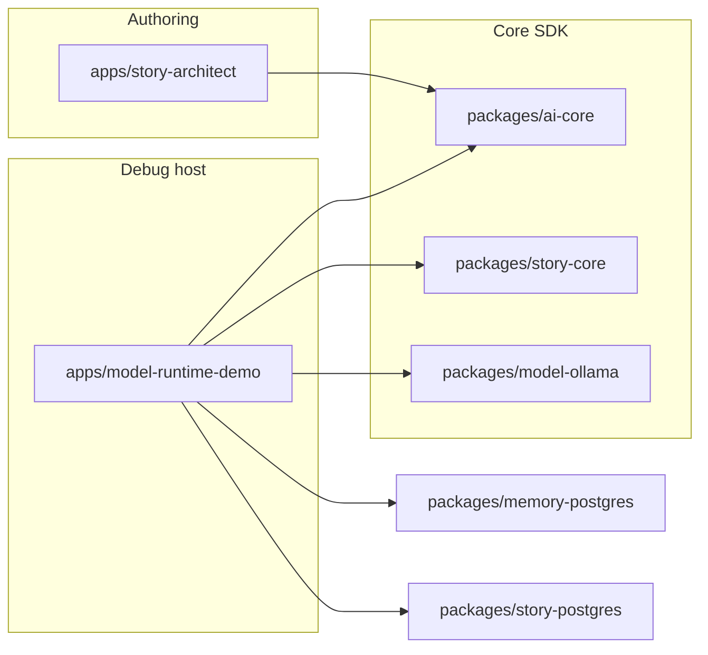

# ying-ai

**English** | [简体中文](README.zh-CN.md)

> **Name history:** This project was originally named `ying-companion`, focused on AI companion capabilities. As the scope kept expanding, Companion became one sub-feature among many, and the repository was renamed to **ying-ai**.

A general-purpose **AI capabilities monorepo** — home for independent AI applications (`apps/*`) built on shared, reusable AI capabilities and SDKs (`packages/*`). Built with pnpm workspaces and Turborepo.

> **Using an AI coding assistant?** See [AGENTS.md](AGENTS.md). This file is for humans.

---

## What & why

This repo is a **container for many AI apps**, not a single product. Each app under `apps/` is independent and picks whatever it needs from `packages/` — a model runtime, memory, tool, or domain SDK. New apps get added over time without disturbing existing ones; shared logic moves into `packages/` once two or more apps need it. See [Adding a new AI app](#adding-a-new-ai-app).

**First app in this repo — Companion SDK:** a pluggable AI companion core (chat + Persona + memory + tools) plus an independent Story Mode runtime, both hosted for local debugging in [`apps/model-runtime-demo`](apps/model-runtime-demo/). It reached **V1.3** — Story Mode adds a separate story domain/runtime, PostgreSQL recovery, model-backed planning/rendering, schema-driven state, NDJSON streaming, and a playable/debuggable Story Workbench. Scope details: [`.requirements/companion/prompts/02-execution.md`](.requirements/companion/prompts/02-execution.md) · Specs: [`.requirements/companion/stages/v1.3/`](.requirements/companion/stages/v1.3/) · Plan: [`.requirements/companion/prompts/06-v1.3-story-mode-plan.md`](.requirements/companion/prompts/06-v1.3-story-mode-plan.md).

---

## Architecture

_Apps and shared capabilities currently hosted in this repo:_

| Part                  | Path                                                                                                                            | Status                                                                   |
| --------------------- | ------------------------------------------------------------------------------------------------------------------------------- | ------------------------------------------------------------------------ |
| **AI Core SDK**       | [`packages/ai-core`](packages/ai-core/)                                                                                         | V1.1 — `executeWorkflow()` + `streamWorkflow()`, tool planning, profiles |
| **Ollama adapter**    | [`packages/model-ollama`](packages/model-ollama/)                                                                               | V1.1 — local `ChatModel` adapter                                         |
| **Memory (Postgres)** | [`packages/memory-postgres`](packages/memory-postgres/)                                                                         | V1.0 — pgvector long-term memory                                         |
| **Web Search Tool**   | [`packages/tool-web-search`](packages/tool-web-search/) + [`packages/tool-web-search-tavily`](packages/tool-web-search-tavily/) | V1.2 — provider-neutral search DTO/tool + Tavily adapter                 |
| **Story Core SDK**    | [`packages/story-core`](packages/story-core/)                                                                                   | V1.3 — Story workflow, Lore, planner/renderer, state validation          |
| **Story Postgres**    | [`packages/story-postgres`](packages/story-postgres/)                                                                           | V1.3 — snapshot sessions and atomic turn persistence                     |
| **Debug workbench**   | [`apps/model-runtime-demo`](apps/model-runtime-demo/)                                                                           | V1.3 — Companion chat + playable Story Workbench                         |
| **Story Architect**   | [`apps/story-architect`](apps/story-architect/)                                                                                 | Independent AI novel authoring workflow                                  |

> **Knowledge workspace:** the local-first Knowledge desktop app and its document-loader / organizer / searcher packages now live in the sibling repo [`ying-knowledge`](../ying-knowledge/).



**Boundary:** `ai-core` is a pure SDK — no env vars, HTTP, NDJSON, or database. The demo app owns provider config, Wire Event mapping, persistence, and UI.

---

## Repository layout

```txt
ying-ai/
├── apps/                        Independent AI apps — one folder per app
│   ├── model-runtime-demo/      @ying-ai/model-runtime-demo    (Companion SDK + Story Mode — first app)
│   └── story-architect/         @ying-ai/story-architect       (AI novel authoring app)
├── packages/                     Reusable AI capabilities & SDKs — shared across apps
│   ├── ai-core/                 @ying-ai/ai-core
│   ├── model-ollama/            @ying-ai/model-ollama
│   ├── memory-postgres/         @ying-ai/memory-postgres
│   ├── tool-web-search/         @ying-ai/tool-web-search
│   ├── tool-web-search-tavily/  @ying-ai/tool-web-search-tavily
│   ├── story-core/              @ying-ai/story-core
│   └── story-postgres/          @ying-ai/story-postgres
├── docs/ai/                     Agent operating rules (see AGENTS.md)
├── .requirements/                Requirements & stage task specs (per app/feature)
├── .code-reviews/                Code review archive
├── AGENTS.md                     AI agent entry
└── turbo.json
```

**Convention for new AI apps:** add a folder under `apps/<app-name>` with its own `package.json` (`@ying-ai/<app-name>`), English `README.md`, and Simplified Chinese `README.zh-CN.md` (with language switcher links at the top of both). Keep app-specific glue code in the app; move anything reusable across apps into `packages/<capability-name>`. See [Adding a new AI app](#adding-a-new-ai-app).

Package and app READMEs (EN · 中文): [story-architect](apps/story-architect/README.md) · [中文](apps/story-architect/README.zh-CN.md) · [ai-core](packages/ai-core/README.md) · [中文](packages/ai-core/README.zh-CN.md) · [model-ollama](packages/model-ollama/README.md) · [中文](packages/model-ollama/README.zh-CN.md) · [memory-postgres](packages/memory-postgres/README.md) · [中文](packages/memory-postgres/README.zh-CN.md) · [tool-web-search](packages/tool-web-search/README.md) · [中文](packages/tool-web-search/README.zh-CN.md) · [tool-web-search-tavily](packages/tool-web-search-tavily/README.md) · [中文](packages/tool-web-search-tavily/README.zh-CN.md) · [story-core](packages/story-core/README.md) · [中文](packages/story-core/README.zh-CN.md) · [story-postgres](packages/story-postgres/README.md) · [中文](packages/story-postgres/README.zh-CN.md) · [model-runtime-demo](apps/model-runtime-demo/README.md) · [中文](apps/model-runtime-demo/README.zh-CN.md)

---

## Roadmap (Companion SDK)

_Version history for the first app in this repo. Future apps track their own progress in their own `README.md` / `.requirements/` (optional — see below)._

**V1.0** (frozen): [`.requirements/companion/prompts/03-v1.0-plan.md`](.requirements/companion/prompts/03-v1.0-plan.md) · [stages](.requirements/companion/stages/v1.0/) · [reviews](.code-reviews/companion/v1.0/)

**V1.1** (complete):

```txt
Stage 1  Persona profile
Stage 2  Stream / Wire contract
Stage 3  Model profiles & tool planning
Stage 4  Workflow step refactor
Stage 5  Streaming workflow
Stage 6  Ollama adapter
Stage 7  Debug workbench (NDJSON)
Stage 8  Documentation & review
```

Full plan: [`.requirements/companion/prompts/04-v1.1-plan.md`](.requirements/companion/prompts/04-v1.1-plan.md) · Stage specs: [`.requirements/companion/stages/v1.1/`](.requirements/companion/stages/v1.1/)

**V1.2** (complete):

```txt
Stage 1  Web Search Tool + Tavily adapter
Stage 2  Demo AI SDK UI, Sources display, docs sync
```

Full plan: [`.requirements/companion/prompts/05-v1.2-plan.md`](.requirements/companion/prompts/05-v1.2-plan.md) · Stage specs: [`.requirements/companion/stages/v1.2/`](.requirements/companion/stages/v1.2/)

**V1.3** (complete):

```txt
Stage 1  Story domain and runtime foundation
Stage 2  Narrative workflow, Lore, and PostgreSQL persistence
Stage 3  Story Workbench and release closure
```

Full plan: [`.requirements/companion/prompts/06-v1.3-story-mode-plan.md`](.requirements/companion/prompts/06-v1.3-story-mode-plan.md) · Stage specs: [`.requirements/companion/stages/v1.3/`](.requirements/companion/stages/v1.3/)

---

## Adding a new AI app

This repo is designed to keep growing with new, unrelated AI apps. To add one:

1. **Create the app** under `apps/<app-name>/` with its own `package.json` (name it `@ying-ai/<app-name>`), English `README.md`, and Simplified Chinese `README.zh-CN.md` (with language switcher links at the top of both) describing what it does, how to run it, and its env vars.
2. **Reuse, don't fork.** Check `packages/` first — `ai-core` (model runtime/workflow), `model-ollama`, `memory-postgres`, `tool-web-search*` may already cover what you need. Don't couple a new app to Companion- or Story-specific code.
3. **Extract shared logic.** If two or more apps need the same capability, pull it into a new `packages/<capability-name>` following the existing package conventions (own `package.json`, `tsconfig*.json`, bilingual `README.md` / `README.zh-CN.md`, and a `verify:*` contract script if it has a testable boundary).
4. **No workspace wiring needed.** `pnpm-workspace.yaml` already globs `apps/*` and `packages/*`, and `turbo.json` tasks apply automatically — just `pnpm install` after adding the folder.
5. **Requirements docs are optional.** Add `.requirements/<app-name>/` (own `prompts/` + `stages/`, following the [`.requirements/companion/`](.requirements/companion/) pattern) only if the app benefits from staged specs like the Companion SDK did; a small app can just keep a good README.
6. **Update this README** — add a row to [Repository layout](#repository-layout) (and [Architecture](#architecture) if it's substantial) so humans and AI tools can find it.

---

## Prerequisites

- Node.js (LTS recommended)
- [pnpm 9](https://pnpm.io/) — version pinned in `package.json` → `packageManager`
- For full debug workbench: local PostgreSQL + pgvector (see demo README)
- For Ollama chat: [Ollama](https://ollama.com/) running locally with a pulled model

---

## Getting started

```bash
pnpm install
pnpm typecheck
pnpm lint
pnpm build:all
```

| Command             | Purpose                                                   |
| ------------------- | --------------------------------------------------------- |
| `pnpm dev`          | Select apps with checkboxes and run their `dev` scripts   |
| `pnpm dev:all`      | Run all `dev` tasks via Turbo                             |
| `pnpm build`        | Select apps with checkboxes and run their `build` scripts |
| `pnpm build:all`    | Build the entire workspace via Turbo                      |
| `pnpm typecheck`    | Typecheck the workspace                                   |
| `pnpm lint`         | Lint the workspace                                        |
| `pnpm format`       | Format with Prettier                                      |
| `pnpm format:check` | Check formatting                                          |
| `pnpm clean`        | Remove Turbo outputs and `node_modules`                   |

**Single package:**

```bash
pnpm turbo run typecheck --filter @ying-ai/ai-core
pnpm turbo run lint --filter @ying-ai/model-runtime-demo
```

More commands: [docs/ai/core/project-context.md](docs/ai/core/project-context.md).

---

## Run the Companion Debug Workbench (first app)

The Next.js demo hosts both the **Core Workflow Debug Workbench** and the V1.3 **Story Workbench**. The Companion surface covers Persona, memory, emotion, tools, Web Search and Sources; Story Mode adds story selection/import, persistent sessions, streamed narrative, dynamic state, and live/persisted workflow debugging.

```bash
cp apps/model-runtime-demo/.env.example apps/model-runtime-demo/.env
# Set OPENAI_API_KEY, OPENAI_BASE_URL, OPENAI_MODEL, DATABASE_URL (see demo README)
# Optional Web Search: WEB_SEARCH_ENABLED=true, WEB_SEARCH_BACKEND=tavily, TAVILY_API_KEY, toolCalling=true

pnpm --filter @ying-ai/model-runtime-demo dev
```

Open the URL from the terminal:

- `/` — conversation list; create companions and sessions
- `/conversations/[id]` — **AI SDK UI streaming chat** (chat-first view, composer Web Search switch, composer Debug action, optional Web Search Sources)
- `/companions/new` — Persona config (user address, hobbies, appearance, …)
- `/debug/model-runtime` — legacy model runtime smoke test
- `/stories` — Story Definition registry/import and Story Session entry
- `/stories/[storyId]/sessions/[sessionId]` — playable Story Runtime with state and Debug panels

Full env reference: [apps/model-runtime-demo/README.md](apps/model-runtime-demo/README.md).

### Model providers

| Provider          | Config location                   | Notes                                          |
| ----------------- | --------------------------------- | ---------------------------------------------- |
| OpenAI-compatible | Demo session UI + `.env` defaults | API key only in page memory & POST body        |
| Ollama            | Demo session UI (`host`, `model`) | Requires local Ollama; see model-ollama README |

Embedding for long-term memory remains a **separate** `EmbeddingProvider` (typically OpenAI via `memory-postgres`), independent of the chat provider.

---

## Current limitations — Companion SDK (V1.3)

Not in this release:

- User system, auth, multi-tenant isolation, production deployment
- Stop generation, reconnect/resume, WebSocket/SSE as primary transport
- Streaming multi-turn tool loop; token-level output safety
- Ollama embedding provider
- Tavily Extract/Crawl/Map/Research, deep browsing, search history, source persistence
- Story Definition import is process-local; created sessions retain an immutable snapshot, but imported catalog entries disappear after restart
- No visual story authoring studio, story marketplace, branching editor, or Companion Persona/Memory integration with Story Mode

Details: [`.code-reviews/companion/v1.1/conclusion.md`](.code-reviews/companion/v1.1/conclusion.md).

---

## Tech stack

_Below reflects the Companion SDK app; future apps may use a different stack where it makes sense — record it in that app's own README._

| Layer     | Tools                                                            |
| --------- | ---------------------------------------------------------------- |
| Workspace | pnpm 9, Turborepo, TypeScript                                    |
| Quality   | ESLint 9 (flat config), Prettier, Husky, lint-staged, commitlint |
| AI Core   | Vercel AI SDK (OpenAI-compatible); Ollama npm in `model-ollama`  |
| Debug UI  | Next.js 15, AI SDK UI, NDJSON over POST                          |

---

## Contributing

- **Commits:** conventional format, Chinese messages — [docs/ai/core/git-protocol.md](docs/ai/core/git-protocol.md)
- **Hooks:** Husky runs lint-staged and commitlint on commit
- **Style:** root ESLint + Prettier configs apply workspace-wide

Requirement and design docs are written in **Chinese**; code and paths stay as in the repo.

**Read path:** humans start here → AI tools start at [AGENTS.md](AGENTS.md).
