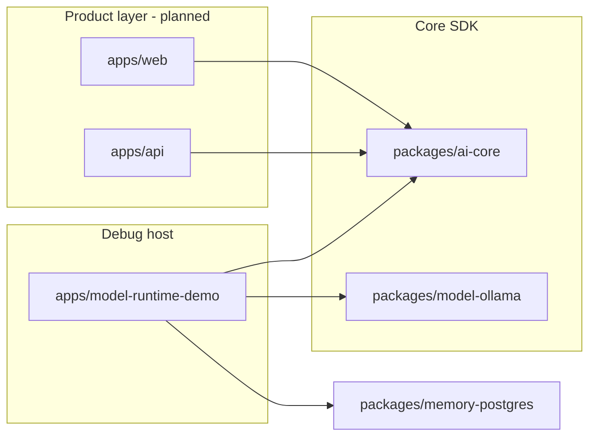

# ying-companion

Enterprise AI companion monorepo — admin backend, user-facing frontend, and a **pluggable AI Companion Core SDK**. Built with pnpm workspaces and Turborepo.

> **Using an AI coding assistant?** See [AGENTS.md](AGENTS.md). This file is for humans.

---

## What & why

The goal is a **pluggable AI companion core** that product apps (admin API + user web) can embed. V1 focuses on the SDK itself — no auth, user accounts, or deployment yet. Scope details: [`.requirements/prompts/02-execution.md`](.requirements/prompts/02-execution.md).

**Current milestone:** **V1.0 is frozen** (tag [`v1.0`](.code-reviews/v1.0/conclusion.md)). **V1.1 is complete** — Persona profile extensions, workflow-level streaming, model capability profiles, tool planning, Ollama adapter, and NDJSON debug workbench. Specs: [`.requirements/stages/v1.1/`](.requirements/stages/v1.1/) · Reviews: [`.code-reviews/v1.1/`](.code-reviews/v1.1/conclusion.md).

---

## Architecture

| Part                  | Path                                                    | Status                                                                   |
| --------------------- | ------------------------------------------------------- | ------------------------------------------------------------------------ |
| **AI Core SDK**       | [`packages/ai-core`](packages/ai-core/)                 | V1.1 — `executeWorkflow()` + `streamWorkflow()`, tool planning, profiles |
| **Ollama adapter**    | [`packages/model-ollama`](packages/model-ollama/)       | V1.1 — local `ChatModel` adapter                                         |
| **Memory (Postgres)** | [`packages/memory-postgres`](packages/memory-postgres/) | V1.0 — pgvector long-term memory                                         |
| **Debug workbench**   | [`apps/model-runtime-demo`](apps/model-runtime-demo/)   | V1.1 — streaming chat, Persona config, NDJSON timeline                   |
| **Product API**       | [`apps/api`](apps/api/)                                 | Scaffold — planned RBAC backend                                          |
| **Product web**       | [`apps/web`](apps/web/)                                 | Scaffold — planned user frontend                                         |



**Boundary:** `ai-core` is a pure SDK — no env vars, HTTP, NDJSON, or database. The demo app owns provider config, Wire Event mapping, persistence, and UI.

---

## Repository layout

```txt
ying-companion/
├── apps/
│   ├── api/                  @ying-companion/api
│   ├── web/                  @ying-companion/web
│   └── model-runtime-demo/   @ying-companion/model-runtime-demo
├── packages/
│   ├── ai-core/              @ying-companion/ai-core
│   ├── model-ollama/         @ying-companion/model-ollama
│   └── memory-postgres/      @ying-companion/memory-postgres
├── docs/ai/                  Agent operating rules (see AGENTS.md)
├── .requirements/            Requirements & stage task specs
├── .code-reviews/            Code review archive
├── AGENTS.md                 AI agent entry
└── turbo.json
```

Package READMEs: [ai-core](packages/ai-core/README.md) · [model-ollama](packages/model-ollama/README.md) · [memory-postgres](packages/memory-postgres/README.md) · [model-runtime-demo](apps/model-runtime-demo/README.md) · [web](apps/web/README.md) · [api](apps/api/README.md)

---

## Roadmap

**V1.0** (frozen): [`.requirements/prompts/03-v1.0-plan.md`](.requirements/prompts/03-v1.0-plan.md) · [stages](.requirements/stages/v1.0/) · [reviews](.code-reviews/v1.0/)

**V1.1** (complete):

```txt
Stage 1  Persona profile
Stage 2  Stream / Wire contract
Stage 3  Model profiles & tool planning
Stage 4  Workflow step refactor
Stage 5  Streaming workflow
Stage 6  Ollama adapter
Stage 7  Debug workbench (NDJSON)
Stage 8  Documentation & review
```

Full plan: [`.requirements/prompts/04-v1.1-plan.md`](.requirements/prompts/04-v1.1-plan.md) · Stage specs: [`.requirements/stages/v1.1/`](.requirements/stages/v1.1/)

---

## Prerequisites

- Node.js (LTS recommended)
- [pnpm 9](https://pnpm.io/) — version pinned in `package.json` → `packageManager`
- For full debug workbench: local PostgreSQL + pgvector (see demo README)
- For Ollama chat: [Ollama](https://ollama.com/) running locally with a pulled model

---

## Getting started

```bash
pnpm install
pnpm typecheck
pnpm lint
pnpm build
```

| Command             | Purpose                                 |
| ------------------- | --------------------------------------- |
| `pnpm dev`          | Run all `dev` tasks via Turbo           |
| `pnpm build`        | Build all packages                      |
| `pnpm typecheck`    | Typecheck the workspace                 |
| `pnpm lint`         | Lint the workspace                      |
| `pnpm format`       | Format with Prettier                    |
| `pnpm format:check` | Check formatting                        |
| `pnpm clean`        | Remove Turbo outputs and `node_modules` |

**Single package:**

```bash
pnpm turbo run typecheck --filter @ying-companion/ai-core
pnpm turbo run lint --filter @ying-companion/model-runtime-demo
```

More commands: [docs/ai/core/project-context.md](docs/ai/core/project-context.md).

---

## Run the Debug Workbench

The fastest way to inspect V1.1 locally is the Next.js **Core Workflow Debug Workbench**. It creates companions and conversations, calls `@ying-companion/ai-core` via `streamWorkflow()`, streams NDJSON to the browser, and shows Persona, Timeline, runtime, memory, emotion, tools, and writeback results.

```bash
cp apps/model-runtime-demo/.env.example apps/model-runtime-demo/.env
# Set OPENAI_API_KEY, OPENAI_BASE_URL, OPENAI_MODEL, DATABASE_URL (see demo README)

pnpm --filter @ying-companion/model-runtime-demo dev
```

Open the URL from the terminal:

- `/` — conversation list; create companions and sessions
- `/conversations/[id]` — **streaming chat** (left debug panel, right chat)
- `/companions/new` — Persona config (user address, hobbies, appearance, …)
- `/debug/model-runtime` — legacy model runtime smoke test

Full env reference: [apps/model-runtime-demo/README.md](apps/model-runtime-demo/README.md).

### Model providers

| Provider          | Config location                   | Notes                                          |
| ----------------- | --------------------------------- | ---------------------------------------------- |
| OpenAI-compatible | Demo session UI + `.env` defaults | API key only in page memory & POST body        |
| Ollama            | Demo session UI (`host`, `model`) | Requires local Ollama; see model-ollama README |

Embedding for long-term memory remains a **separate** `EmbeddingProvider` (typically OpenAI via `memory-postgres`), independent of the chat provider.

---

## V1.1 limitations (summary)

Not in this release:

- User system, auth, multi-tenant isolation, production deployment
- Stop generation, reconnect/resume, WebSocket/SSE as primary transport
- Streaming multi-turn tool loop; token-level output safety
- Ollama embedding provider

Details: [`.code-reviews/v1.1/conclusion.md`](.code-reviews/v1.1/conclusion.md).

---

## Tech stack

| Layer     | Tools                                                            |
| --------- | ---------------------------------------------------------------- |
| Workspace | pnpm 9, Turborepo, TypeScript                                    |
| Quality   | ESLint 9 (flat config), Prettier, Husky, lint-staged, commitlint |
| AI Core   | Vercel AI SDK (OpenAI-compatible); Ollama npm in `model-ollama`  |
| Debug UI  | Next.js 15 (`apps/model-runtime-demo`), NDJSON over POST         |

---

## Contributing

- **Commits:** conventional format, Chinese messages — [docs/ai/core/git-protocol.md](docs/ai/core/git-protocol.md)
- **Hooks:** Husky runs lint-staged and commitlint on commit
- **Style:** root ESLint + Prettier configs apply workspace-wide

Requirement and design docs are written in **Chinese**; code and paths stay as in the repo.

**Read path:** humans start here → AI tools start at [AGENTS.md](AGENTS.md).
