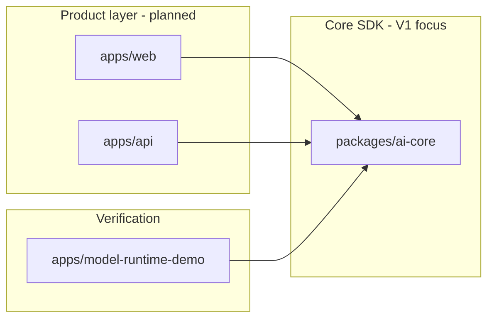

# ying-companion

Enterprise AI companion monorepo — admin backend, user-facing frontend, and a **pluggable AI Companion Core SDK**. Built with pnpm workspaces and Turborepo.

> **Using an AI coding assistant?** See [AGENTS.md](AGENTS.md). This file is for humans.

---

## What & why

The goal is a **pluggable AI companion core** that product apps (admin API + user web) can embed. V1 focuses on the SDK itself — no auth, user accounts, or deployment yet. Scope details: [`.requirements/prompts/02-execution.md`](.requirements/prompts/02-execution.md).

**Current milestone:** V1.0 packaged; V1.1 stage 1 extends Persona profile fields and prompt previewing. See V1.1 specs under [`.requirements/stages/v1.1/`](.requirements/stages/v1.1/).

---

## Architecture

| Part                  | Path                                                  | Status                                                                |
| --------------------- | ----------------------------------------------------- | --------------------------------------------------------------------- |
| **AI Core SDK**       | [`packages/ai-core`](packages/ai-core/)               | V1.0 core complete; V1.1 Persona profile + prompt builder in progress |
| **Runtime debug app** | [`apps/model-runtime-demo`](apps/model-runtime-demo/) | V1.0 debug workbench; V1.1 Persona editing and prompt preview         |
| **Product API**       | [`apps/api`](apps/api/)                               | Scaffold — planned RBAC backend                                       |
| **Product web**       | [`apps/web`](apps/web/)                               | Scaffold — planned user frontend                                      |



---

## Repository layout

```txt
ying-companion/
├── apps/
│   ├── api/                  @ying-companion/api
│   ├── web/                  @ying-companion/web
│   └── model-runtime-demo/   @ying-companion/model-runtime-demo
├── packages/
│   └── ai-core/              @ying-companion/ai-core
├── docs/ai/                  Agent operating rules (see AGENTS.md)
├── .requirements/            Requirements & stage task specs
├── .code-reviews/            Code review archive
├── AGENTS.md                 AI agent entry
└── turbo.json
```

Package READMEs: [web](apps/web/README.md) · [api](apps/api/README.md) · [model-runtime-demo](apps/model-runtime-demo/README.md)

---

## Roadmap (V1)

From the frozen V1.0 roadmap [`.requirements/prompts/03-v1.0-plan.md`](.requirements/prompts/03-v1.0-plan.md):

```txt
Stage 1  Model Runtime
Stage 2  Core abstractions & DI
Stage 3  Chat main loop
Stage 4  Memory (structured + vector RAG)
Stage 5  Emotion state machine
Stage 6  Tool calling
Stage 7  Workflow orchestration
Stage 8  Debug UI & observability
```

V1.0 stage specs: [`.requirements/stages/v1.0/`](.requirements/stages/v1.0/). Historical V1.0 reviews: [`.code-reviews/v1.0/`](.code-reviews/v1.0/).

---

## Prerequisites

- Node.js (LTS recommended)
- [pnpm 9](https://pnpm.io/) — version pinned in `package.json` → `packageManager`

---

## Getting started

```bash
pnpm install
pnpm typecheck
pnpm lint
pnpm build
```

| Command             | Purpose                                 |
| ------------------- | --------------------------------------- |
| `pnpm dev`          | Run all `dev` tasks via Turbo           |
| `pnpm build`        | Build all packages                      |
| `pnpm typecheck`    | Typecheck the workspace                 |
| `pnpm lint`         | Lint the workspace                      |
| `pnpm format`       | Format with Prettier                    |
| `pnpm format:check` | Check formatting                        |
| `pnpm clean`        | Remove Turbo outputs and `node_modules` |

**Single package:**

```bash
pnpm turbo run typecheck --filter @ying-companion/ai-core
pnpm turbo run lint --filter @ying-companion/model-runtime-demo
```

More commands: [docs/ai/core/project-context.md](docs/ai/core/project-context.md).

---

## Run the Model Runtime demo

The fastest way to inspect V1.0 locally is the Next.js debug workbench. It creates companions and conversations, calls `@ying-companion/ai-core`, and shows persisted messages, memories, workflow traces, observer events, retry/fallback info, and model output.

```bash
cp apps/model-runtime-demo/.env.example apps/model-runtime-demo/.env
# Set OPENAI_API_KEY, OPENAI_BASE_URL, OPENAI_MODEL
# Optional: OPENAI_FALLBACK_MODEL, retry counts — see demo README

pnpm --filter @ying-companion/model-runtime-demo dev
```

Open the URL from the terminal and use **「调用模型」**. Full env reference: [apps/model-runtime-demo/README.md](apps/model-runtime-demo/README.md).

---

## Tech stack

| Layer     | Tools                                                            |
| --------- | ---------------------------------------------------------------- |
| Workspace | pnpm 9, Turborepo, TypeScript                                    |
| Quality   | ESLint 9 (flat config), Prettier, Husky, lint-staged, commitlint |
| AI Core   | Vercel AI SDK, OpenAI-compatible provider abstraction            |
| Debug UI  | Next.js 15 (`apps/model-runtime-demo`)                           |

---

## Contributing

- **Commits:** conventional format, Chinese messages — [docs/ai/core/git-protocol.md](docs/ai/core/git-protocol.md)
- **Hooks:** Husky runs lint-staged and commitlint on commit
- **Style:** root ESLint + Prettier configs apply workspace-wide

Requirement and design docs are written in **Chinese**; code and paths stay as in the repo.
