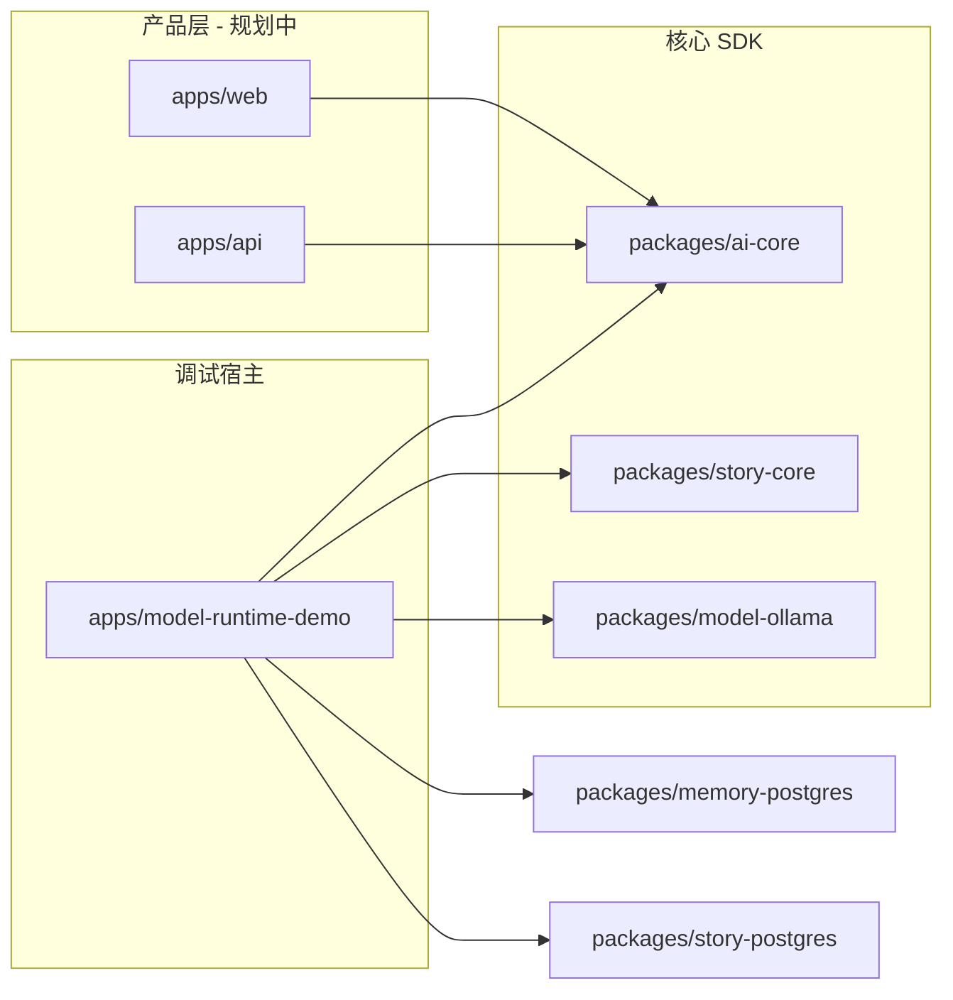

# ying-ai

**[English](./README.md)** | 简体中文

一个通用的 **AI 能力 monorepo** —— 用来存放各种独立 AI 应用（`apps/*`），这些应用基于共享、可复用的 AI 能力与 SDK（`packages/*`）构建。基于 pnpm workspaces 和 Turborepo。

> **使用 AI 编程助手？** 请看 [AGENTS.md](AGENTS.md)。本文件是给人类看的。

---

## 是什么 & 为什么

这个仓库是一个**容纳多个 AI 应用的容器**，而不是单一产品。`apps/` 下的每个应用都是独立的，可以按需从 `packages/` 里挑选自己需要的能力——模型运行时、记忆、工具或领域 SDK。新应用会随时间不断加入，不会影响已有应用；当有两个或更多应用需要同一段逻辑时，就把它抽取到 `packages/` 里。参见 [如何添加一个新的 AI 应用](#如何添加一个新的-ai-应用)。

**仓库里的第一个应用 —— Companion SDK：** 一个可插拔的 AI 伴侣核心（对话 + Persona + 记忆 + 工具），外加一个独立的 Story Mode 运行时，两者都托管在 [`apps/model-runtime-demo`](apps/model-runtime-demo/) 中用于本地调试。它已经达到 **V1.3** —— Story Mode 增加了独立的故事域/运行时、PostgreSQL 恢复、模型驱动的规划/渲染、基于 Schema 的状态、NDJSON 流式传输，以及一个可玩/可调试的 Story Workbench。范围说明：[`.requirements/companion/prompts/02-execution.md`](.requirements/companion/prompts/02-execution.md) · 规格：[`.requirements/companion/stages/v1.3/`](.requirements/companion/stages/v1.3/) · 计划：[`.requirements/companion/prompts/06-v1.3-story-mode-plan.md`](.requirements/companion/prompts/06-v1.3-story-mode-plan.md)。

---

## 架构

_组成 Companion SDK 的应用与包 —— 这是本仓库托管的第一个应用：_

| 部分                 | 路径                                                                                                                            | 状态                                                                 |
| -------------------- | ------------------------------------------------------------------------------------------------------------------------------- | -------------------------------------------------------------------- |
| **AI Core SDK**      | [`packages/ai-core`](packages/ai-core/)                                                                                         | V1.1 —— `executeWorkflow()` + `streamWorkflow()`、工具规划、模型档案 |
| **Ollama 适配器**    | [`packages/model-ollama`](packages/model-ollama/)                                                                               | V1.1 —— 本地 `ChatModel` 适配器                                      |
| **记忆（Postgres）** | [`packages/memory-postgres`](packages/memory-postgres/)                                                                         | V1.0 —— 基于 pgvector 的长期记忆                                     |
| **Web Search 工具**  | [`packages/tool-web-search`](packages/tool-web-search/) + [`packages/tool-web-search-tavily`](packages/tool-web-search-tavily/) | V1.2 —— 与厂商无关的搜索 DTO/工具 + Tavily 适配器                    |
| **Story Core SDK**   | [`packages/story-core`](packages/story-core/)                                                                                   | V1.3 —— Story 工作流、Lore、规划器/渲染器、状态校验                  |
| **Story Postgres**   | [`packages/story-postgres`](packages/story-postgres/)                                                                           | V1.3 —— 快照式会话与原子化回合持久化                                 |
| **调试工作台**       | [`apps/model-runtime-demo`](apps/model-runtime-demo/)                                                                           | V1.3 —— Companion 对话 + 可玩的 Story Workbench                      |
| **Story Architect**  | [`apps/story-architect`](apps/story-architect/)                                                                                 | 独立的 AI 小说创作流程                                               |
| **产品 API**         | [`apps/api`](apps/api/)                                                                                                         | 脚手架 —— 计划中的 RBAC 后端                                         |
| **产品前端**         | [`apps/web`](apps/web/)                                                                                                         | 脚手架 —— 计划中的用户前端                                           |



**边界：** `ai-core` 是一个纯粹的 SDK —— 不读环境变量、不涉及 HTTP、NDJSON 或数据库。demo 应用负责持有 provider 配置、Wire Event 映射、持久化和 UI。

---

## 仓库目录结构

```txt
ying-ai/
├── apps/                        独立的 AI 应用 —— 每个应用一个文件夹
│   ├── api/                     @ying-ai/api                   （脚手架）
│   ├── web/                     @ying-ai/web                   （脚手架）
│   ├── model-runtime-demo/      @ying-ai/model-runtime-demo    （Companion SDK + Story Mode —— 第一个应用）
│   └── story-architect/         @ying-ai/story-architect       （AI 小说创作应用）
├── packages/                     可复用的 AI 能力与 SDK —— 各应用共享
│   ├── ai-core/                 @ying-ai/ai-core
│   ├── model-ollama/            @ying-ai/model-ollama
│   ├── memory-postgres/         @ying-ai/memory-postgres
│   ├── tool-web-search/         @ying-ai/tool-web-search
│   ├── tool-web-search-tavily/  @ying-ai/tool-web-search-tavily
│   ├── story-core/              @ying-ai/story-core
│   └── story-postgres/          @ying-ai/story-postgres
├── docs/ai/                     Agent 操作规则（见 AGENTS.md）
├── .requirements/                需求与阶段任务规格（按应用/功能划分）
├── .code-reviews/                代码评审归档
├── AGENTS.md                     AI agent 入口
└── turbo.json
```

**新增 AI 应用的约定：** 在 `apps/<app-name>` 下新建一个文件夹，带上自己的 `package.json`（`@ying-ai/<app-name>`）、英文 `README.md` 与简体中文 `README.zh-CN.md`（两者顶部都要有语言切换链接）。应用专属的粘合代码留在应用内部；跨应用可复用的东西移到 `packages/<capability-name>`。参见 [如何添加一个新的 AI 应用](#如何添加一个新的-ai-应用)。

各包及应用 README（中文 · EN）：[story-architect](apps/story-architect/README.zh-CN.md) · [EN](apps/story-architect/README.md) · [ai-core](packages/ai-core/README.zh-CN.md) · [EN](packages/ai-core/README.md) · [model-ollama](packages/model-ollama/README.zh-CN.md) · [EN](packages/model-ollama/README.md) · [memory-postgres](packages/memory-postgres/README.zh-CN.md) · [EN](packages/memory-postgres/README.md) · [tool-web-search](packages/tool-web-search/README.zh-CN.md) · [EN](packages/tool-web-search/README.md) · [tool-web-search-tavily](packages/tool-web-search-tavily/README.zh-CN.md) · [EN](packages/tool-web-search-tavily/README.md) · [story-core](packages/story-core/README.zh-CN.md) · [EN](packages/story-core/README.md) · [story-postgres](packages/story-postgres/README.zh-CN.md) · [EN](packages/story-postgres/README.md) · [model-runtime-demo](apps/model-runtime-demo/README.zh-CN.md) · [EN](apps/model-runtime-demo/README.md) · [web](apps/web/README.zh-CN.md) · [EN](apps/web/README.md) · [api](apps/api/README.zh-CN.md) · [EN](apps/api/README.md)

---

## 路线图（Companion SDK）

_本仓库第一个应用的版本历史。未来的应用会在各自的 `README.md` / `.requirements/` 中记录自己的进展（可选，见下文）。_

**V1.0**（已冻结）：[`.requirements/companion/prompts/03-v1.0-plan.md`](.requirements/companion/prompts/03-v1.0-plan.md) · [阶段规格](.requirements/companion/stages/v1.0/) · [评审](.code-reviews/companion/v1.0/)

**V1.1**（已完成）：

```txt
阶段 1  Persona 档案
阶段 2  Stream / Wire 契约
阶段 3  模型档案与工具规划
阶段 4  Workflow 步骤重构
阶段 5  流式 Workflow
阶段 6  Ollama 适配器
阶段 7  调试工作台（NDJSON）
阶段 8  文档与评审
```

完整计划：[`.requirements/companion/prompts/04-v1.1-plan.md`](.requirements/companion/prompts/04-v1.1-plan.md) · 阶段规格：[`.requirements/companion/stages/v1.1/`](.requirements/companion/stages/v1.1/)

**V1.2**（已完成）：

```txt
阶段 1  Web Search 工具 + Tavily 适配器
阶段 2  Demo AI SDK UI、Sources 展示、文档同步
```

完整计划：[`.requirements/companion/prompts/05-v1.2-plan.md`](.requirements/companion/prompts/05-v1.2-plan.md) · 阶段规格：[`.requirements/companion/stages/v1.2/`](.requirements/companion/stages/v1.2/)

**V1.3**（已完成）：

```txt
阶段 1  Story 域与运行时基础
阶段 2  叙事 Workflow、Lore 与 PostgreSQL 持久化
阶段 3  Story Workbench 与发布收尾
```

完整计划：[`.requirements/companion/prompts/06-v1.3-story-mode-plan.md`](.requirements/companion/prompts/06-v1.3-story-mode-plan.md) · 阶段规格：[`.requirements/companion/stages/v1.3/`](.requirements/companion/stages/v1.3/)

---

## 如何添加一个新的 AI 应用

这个仓库的设计目标就是持续接纳新的、彼此独立的 AI 应用。添加一个新应用的步骤：

1. **创建应用**：在 `apps/<app-name>/` 下新建文件夹，带上自己的 `package.json`（命名为 `@ying-ai/<app-name>`）、英文 `README.md` 与简体中文 `README.zh-CN.md`（两者顶部都要有语言切换链接），说明这个应用是做什么的、怎么运行、需要哪些环境变量。
2. **复用，不要分叉。** 先看 `packages/` —— `ai-core`（模型运行时 / workflow）、`model-ollama`、`memory-postgres`、`tool-web-search*` 可能已经覆盖你需要的能力。不要把新应用耦合到 Companion 或 Story 专属代码上。
3. **抽取共享逻辑。** 如果两个或更多应用需要同一种能力，把它抽取到新的 `packages/<capability-name>`，遵循现有包的约定（自己的 `package.json`、`tsconfig*.json`、双语 `README.md` / `README.zh-CN.md`，如果有可测试的边界还要带一个 `verify:*` 契约脚本）。
4. **不需要额外接入 workspace。** `pnpm-workspace.yaml` 已经通配了 `apps/*` 和 `packages/*`，`turbo.json` 的任务也会自动生效——新建文件夹后跑一次 `pnpm install` 就行。
5. **需求文档是可选的。** 只有当这个应用也需要像 Companion SDK 那样的分阶段规格时，才新增 `.requirements/<app-name>/`（自己的 `prompts/` + `stages/`，可参考 [`.requirements/companion/`](.requirements/companion/) 的模式）；小型应用只保留一份好的 README 就够了。
6. **更新本 README** —— 在[仓库目录结构](#仓库目录结构)里加一行（如果分量足够重，也在[架构](#架构)里加一行），方便人和 AI 工具都能找到它。

---

## 前置依赖

- Node.js（推荐 LTS 版本）
- [pnpm 9](https://pnpm.io/) —— 版本号固定在 `package.json` 的 `packageManager` 字段里
- 如需完整的调试工作台：本地 PostgreSQL + pgvector（见 demo 的 README）
- 如需 Ollama 对话：本地运行 [Ollama](https://ollama.com/) 并拉取好模型

---

## 快速开始

```bash
pnpm install
pnpm typecheck
pnpm lint
pnpm build
```

| 命令                | 用途                             |
| ------------------- | -------------------------------- |
| `pnpm dev`          | 通过 Turbo 运行所有 `dev` 任务   |
| `pnpm build`        | 构建所有包                       |
| `pnpm typecheck`    | 对整个 workspace 做类型检查      |
| `pnpm lint`         | 对整个 workspace 做 lint         |
| `pnpm format`       | 用 Prettier 格式化               |
| `pnpm format:check` | 检查格式                         |
| `pnpm clean`        | 清理 Turbo 产物和 `node_modules` |

**单个包：**

```bash
pnpm turbo run typecheck --filter @ying-ai/ai-core
pnpm turbo run lint --filter @ying-ai/model-runtime-demo
```

更多命令：[docs/ai/core/project-context.md](docs/ai/core/project-context.md)。

---

## 运行 Companion 调试工作台（第一个应用）

这个 Next.js demo 同时承载了 **Core Workflow 调试工作台** 和 V1.3 的 **Story Workbench**。Companion 侧覆盖 Persona、记忆、情绪、工具、Web Search 和 Sources；Story Mode 增加了故事选择/导入、持久化会话、流式叙事、动态状态，以及实时/持久化的 workflow 调试。

```bash
cp apps/model-runtime-demo/.env.example apps/model-runtime-demo/.env
# 设置 OPENAI_API_KEY、OPENAI_BASE_URL、OPENAI_MODEL、DATABASE_URL（详见 demo 的 README）
# Web Search 为可选项：WEB_SEARCH_ENABLED=true、WEB_SEARCH_BACKEND=tavily、TAVILY_API_KEY、toolCalling=true

pnpm --filter @ying-ai/model-runtime-demo dev
```

打开终端里给出的 URL：

- `/` —— 会话列表；创建 companion 和会话
- `/conversations/[id]` —— **AI SDK UI 流式对话**（以聊天为主的视图，输入框上有 Web Search 开关和 Debug 按钮，可选展示 Web Search Sources）
- `/companions/new` —— Persona 配置（用户称呼、爱好、外观……）
- `/debug/model-runtime` —— 旧版模型运行时烟雾测试
- `/stories` —— Story Definition 注册表/导入，以及 Story Session 入口
- `/stories/[storyId]/sessions/[sessionId]` —— 可玩的 Story Runtime，带状态和 Debug 面板

完整环境变量参考：[apps/model-runtime-demo/README.zh-CN.md](apps/model-runtime-demo/README.zh-CN.md)。

### 模型 Provider

| Provider    | 配置位置                        | 说明                                       |
| ----------- | ------------------------------- | ------------------------------------------ |
| OpenAI 兼容 | Demo 会话 UI + `.env` 默认值    | API key 只存在于页面内存和 POST body 中    |
| Ollama      | Demo 会话 UI（`host`、`model`） | 需要本地 Ollama；见 model-ollama 的 README |

长期记忆的 embedding 仍然是一个**独立**的 `EmbeddingProvider`（通常是通过 `memory-postgres` 使用 OpenAI），与对话 provider 无关。

---

## 当前限制 —— Companion SDK（V1.3）

本次发布不包含：

- 用户系统、鉴权、多租户隔离、生产部署
- 停止生成、断线重连/恢复、以 WebSocket/SSE 作为主传输方式
- 流式多轮工具循环；token 级别的输出安全
- Ollama embedding provider
- Tavily 的 Extract/Crawl/Map/Research、深度浏览、搜索历史、来源持久化
- Story Definition 的导入是进程内的；已创建的会话会保留一份不可变快照，但导入的目录条目会在重启后消失
- 没有可视化的故事创作工坊、故事市场、分支编辑器，也没有把 Companion 的 Persona/Memory 与 Story Mode 打通

详见：[`.code-reviews/companion/v1.1/conclusion.md`](.code-reviews/companion/v1.1/conclusion.md)。

---

## 技术栈

_下表反映的是 Companion SDK 这个应用的技术栈；未来的应用可以按需选用不同的技术栈——记录在各自应用自己的 README 里。_

| 层级      | 工具                                                              |
| --------- | ----------------------------------------------------------------- |
| Workspace | pnpm 9、Turborepo、TypeScript                                     |
| 质量保障  | ESLint 9（flat config）、Prettier、Husky、lint-staged、commitlint |
| AI Core   | Vercel AI SDK（OpenAI 兼容）；Ollama npm 包在 `model-ollama` 中   |
| 调试 UI   | Next.js 15、AI SDK UI、基于 POST 的 NDJSON                        |

---

## 贡献指南

- **提交规范：** conventional 格式，提交信息用中文 —— [docs/ai/core/git-protocol.md](docs/ai/core/git-protocol.md)
- **Hooks：** Husky 在 commit 时运行 lint-staged 和 commitlint
- **代码风格：** 根目录的 ESLint + Prettier 配置作用于整个 workspace

需求与设计文档用**中文**书写；代码和路径保持仓库原样（通常是英文）。

**阅读路径：** 人类从这里开始 → AI 工具从 [AGENTS.md](AGENTS.md) 开始。
