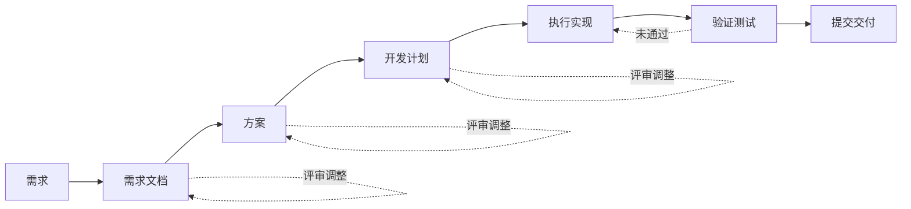
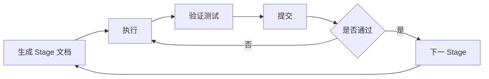

# 一句话，Seed Evolving 给我做了一个 AI 小说创作 Agent

> - 作者：陈大鱼头
> - github：[https://github.com/KRISACHAN](https://github.com/KRISACHAN)
> - 邮箱：[chenjinwen77@gmail.com](mailto:chenjinwen77@gmail.com)
> - 项目地址：https://github.com/KRISACHAN/ying-story-architect

## 前言

众所周知，鱼头最近在高强度刷某果、某红柿。


刷多了之后感觉这些剧情已经满足不了我，就寻思着要不自己写个小说吧。

于是就有了跟豆包的对话。


[点我查看对话](https://www.doubao.com/thread/xdb493f14e9ef8ee69fa520fd0fa68728)

在几轮对话之后发现有点低效，于是产生了一个新想法：“我是不是可以用 AI 写一个小说生成器？”

因为这是我一时的想法浮现，没有详细的想法，也没有太多的时间去输出 PRD，所以算是一个一句话需求，而且目的也不是盈利，所以不能太贵。

即是如此，我就需要有一个能够支持我从一句话需求到一个完整 MVP 能力的模型去做。

所以此次我关注的是 4 点能力：

1. 长程任务规划
2. 工具调用能力
3. Coding 场景适配
4. 价格实惠

## Doubao-Seed-Evolving

在查询的过程中发现 Doubao Seed 更新了个新版本模型 [Doubao-Seed-Evolving](https://ark.volcengine.com/region:cn-beijing/model/detail?_vtm_=a441938.b75322.0_0.0_0.0.58_7650357318802048575&name=doubao-seed-evolving)。

我看模型介绍也很有意思：

> Seed-Evolving 是面向 Agent 与 Coding 场景打造的 Seed 系列模型，具备复杂任务编排、长程规划、代码生成与工具调用能力。统一调用 Model ID `doubao-seed-evolving`，无需关注版本切换，即可持续获得最新模型能力。

在 2026/07/14 还更新了三大亮点。


本身它也支持接入许多第三方工具，例如：Codex, Claude, OpenClaw, 直接调用 Responses API 或其它。

（更多支持接入工具可以看：[接入三方工具](https://ark.volcengine.com/region:cn-beijing/docs/82379/2160841?lang=zh)）

我看了下价格，嗯，非常好！！！

所以我就氪金了个 49.9 的版本。


大家有兴趣的可以去 [模型详情](https://ark.volcengine.com/region:cn-beijing/model/detail?name=doubao-seed-evolving) 看看具体说明。

当然，如果只是想简单体验下，那么直接访问 [火山方舟 - 体验](https://console.volcengine.com/ark/region:cn-beijing/experience/gen_chat?model=doubao-seed-evolving-latest-version) 进行对话即可。


## 接入 Claude Code 与项目初始化

### 接入 Claude Code

开通之后我选择接入到 Claude Code 里（各位可以按需自行选择工具）

环境变量如下：

`~/.claude/settings.json`

```json
{
  "env": {
    "ANTHROPIC_AUTH_TOKEN": "<ARK_API_KEY>",
    "ANTHROPIC_BASE_URL": "https://ark.cn-beijing.volces.com/api/plan",
    "ANTHROPIC_MODEL": "doubao-seed-evolving"
  }
}
```

### 项目初始化

确定要做，那么第一步就是在 github 上建项目 [ying-story-architect](https://github.com/KRISACHAN/ying-story-architect) 并执行 `git clone https://github.com/KRISACHAN/ying-story-architect.git`

然后创建 `requirements/` 文件夹来存放我具体的需求了。

## 让 AI 参与一次完整的软件开发流程

在实施之前我得先澄清下我是如何让 AI 参与一次完整的软件开发流程，那就是：



也就是：

```txt
需求
 ↓
需求文档 ↺
 ↓
方案 ↺
 ↓
计划 ↺
 ↓
执行
 ↓
验证 ↺
 ↓
提交
```

并且每一个独立的部分我都会开一个独立的 chat 来执行。

在以前的需求我会引入多个模型来协作做这件事。

就是 gpt 负责写方案，cursor 负责 review，codex 负责写代码。

但是本次主要是想本地跑小说生成器，顺便测试下这个新模型的能力，所以就不那么复杂，一人一模型就好了！！！

就是先做 MVP，然后再拓展。

## 一句话需求

不过既然 **Seed Evolving** 号称 **支持 1M 超长上下文，长程任务能力与 Tokens 效率同步提升**。

那么我就从一句话需求开始，看看它能给我做到什么程度。

接下来我不会直接告诉它技术方案，而是只提供产品目标。

```txt
/goal 我想开发一个 Web App 形式的 AI 小说创作 Agent，用户可以从一句故事灵感或详细需求开始，通过多轮 AI 对话逐步构建世界观、人物关系、故事大纲和章节内容；这是一个 MVP，不要直接写代码，先分析需求并制定实现方案；如果存在不确定的需求，先向我提问确认。
```

最终生成了一个完整的 mvp 方案文档在 [AI 小说创作 Agent MVP 需求文档](https://github.com/KRISACHAN/ying-story-architect/blob/prod/requirements/architecture.md)。

因为文档太长，就不在文章中贴出来了，有兴趣的话，各位可以点进去看。

## v1.0 MVP 开发计划

需求文档完成了，那就是编写执行实施文档了，这个文档主要是为了给我以及后续的 ai 开发看每个阶段开发什么，当前阶段要注意什么，确保边界正确。

```txt
接下来我需要你基于 architecture.md 生成 v1.0 MVP 开发计划，输出到 @requirements/architecture.md 。

要求：
- 不重新设计方案，只拆解开发任务；
- 以用户核心流程拆分 Stage；
- Stage 控制在 3-5 个以内；
- 每个 Stage 包含目标、任务和验收标准；
- 优先保证 MVP 核心功能，不增加非必要复杂度。
```

具体的文档在 [v1.0 MVP 开发计划](https://github.com/KRISACHAN/ying-story-architect/blob/prod/requirements/prompts/01-v1.0-plan.md)

因为文档太长，所以也不在文章中贴出来了，有兴趣的话，各位可以点进去看。

## stage 执行

开发计划已经完成了，接下来就是紧张刺激的编码环节。

这个环节主要是在`生成 stage 文档`, `按文档执行`, `校验与测试`, `提交` 四个模块之间循环。



没有什么特别，一路等就行，prompt 大概也就是这样：

```txt
/goal
我当前的需求是开发一个 Web App 形式的 AI 小说创作 Agent，用户可以从一句故事灵感或详细需求开始，通过多轮 AI 对话逐步构建世界观、人物关系、故事大纲和章节内容。
这是需求文档：@requirements/architecture.md
这是开发计划：@requirements/prompts/01-v1.0-plan.md

你根据上下文给我生成 `Stage ${n}: ${title}` 文档到 @requirements/stages/v1.0

记住，千万不要写代码，只要写方案就行。
```

这部分的流程就是先生成文档，没问题后再让 AI 严格按照 Stage 文档执行。

```txt
行，现在你根据 @requirements/stages/v1.0/${stage-name}.md 直接开发吧。
```

有问题再根据实际的问题去修改。

## 修复 BUG 的 stage

三个 stage 全部完成之后，我发现页面有一些 bug，因此我让模型再写一个 stage 4 专门用来修复 bug

```txt
/goal
可以是可以了，但有几个问题。
1. 从顶部导航返回前面的节点，例如返回到`世界观`，模型就会重新开始跑生成。既然生成了，那么我返回任意一部分都不应该主动重新生成，应该添加个`重新生成`的按钮，让我一键生成。此外，如果当前节点内容重新生成，后面的节点也应该情况，并且回到 `下一步` 生成内容的流程
2. 没有生成小说名的地方，小说名需要生成，同时支持修改，以及列表里展示标题就是它
3. 章节内容生成字数很少，而且还不支持修改；一章内容长度要合理，而且要支持修改。

你基于我这个需求出发，在 @requirements/stages/v1.0/  一个 stage 4 ，bugfix 的版本。
记住，先不要写代码，写文档就行 。
```

## 最终 MVP 产出

> 初始 prompt: `Web 前端工程师陈鱼穿越到一个以 html + css + js 来施法战斗的异世界。`
> 执行流程：输入 -> 世界观 -> 人物 -> 大纲 -> 章节


如果作为文章 DEMO 或者是项目 MVP，实现到这里就已经足够了。

剩下的就是完善 UI / UX 跟不断打磨系统 Prompt。

这就不是一篇文章可以完成的事了，当然，我不断扩大文章范围的话，也可以。

大家如果想体验的话，可以直接 `git clone https://github.com/KRISACHAN/ying-story-architect` 来看效果。

## 结论


实现整体功能，我花了总共 9 小时，76,883,972 tokens，约 7688 万 tokens。

当然，这 9 小时我不是说一直在做，也有做别的事的时候。

从性价比来看，[Doubao-Seed-Evolving](https://ark.volcengine.com/region:cn-beijing/model/detail?name=doubao-seed-evolving) 还是很棒的，并没有因为价格便宜效果就不行，而是实实在在地在干活。

我认为在日常的 OPC 或者办公场景都是可以游刃有余的，无论是复杂任务拆解，持续开发场景还是上下文理解都是不错的！\*\*\* Add File: ying-ai/apps/story-architect/next-env.d.ts
/// <reference types="next" />
/// <reference types="next/image-types/global" />
import "./.next/types/routes.d.ts";

// NOTE: This file should not be edited
// see https://nextjs.org/docs/app/api-reference/config/typescript for more information.
