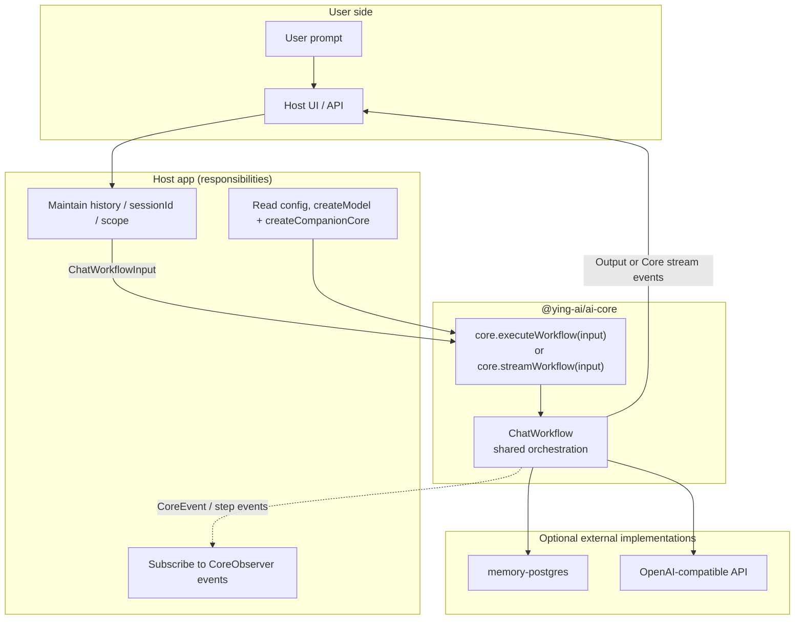
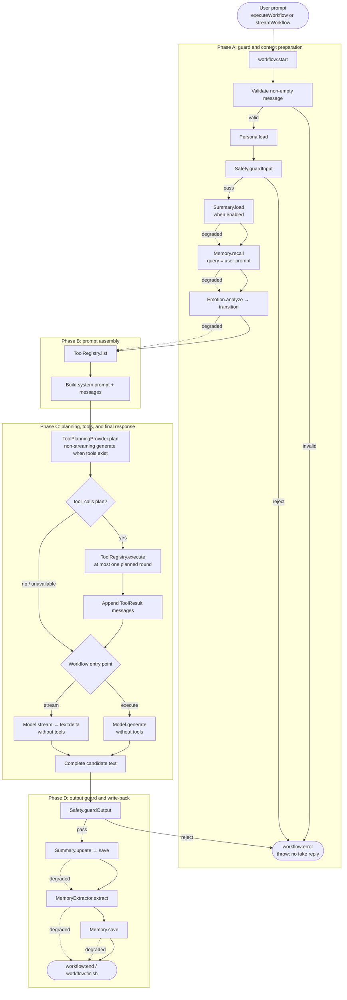
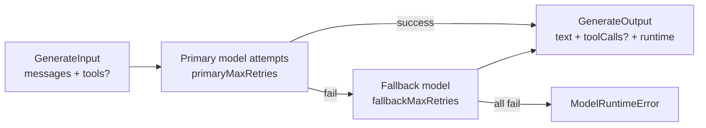

# @ying-ai/ai-core

**English** | [简体中文](./README.zh-CN.md)

Host-agnostic AI Companion Core SDK. It provides pluggable Provider contracts, model runtime, and non-streaming or streaming chat workflow orchestration so host apps can inject configuration and drive the full “user input → companion reply” lifecycle.

---

## 1. Package role and boundaries

`@ying-ai/ai-core` is a **transport- and durable-storage-agnostic** companion Core:

- Defines capability contracts for Persona, Memory, Emotion, Tool, Safety, Workflow, and more
- Ships default / placeholder implementations so it still runs before full capabilities are wired
- Exposes single-turn chat via `CompanionCore.executeWorkflow()`
- Exposes the workflow-level Core event stream via `CompanionCore.streamWorkflow()`
- **Does not** read env vars, **does not** connect to a database, **does not** own debug UI (see [`memory-postgres`](../memory-postgres/README.md) and [`model-runtime-demo`](../../apps/model-runtime-demo/README.md))

| Not included                             | Owned by                     |
| ---------------------------------------- | ---------------------------- |
| `DATABASE_URL` / `pg.Pool`               | Host + `memory-postgres`     |
| HTTP / NDJSON / Wire event serialization | Host app                     |
| Chat history / emotion-state persistence | Host app                     |
| User system / auth                       | Product API / Web            |
| `console` / debug panel                  | Host + `CoreObserver` events |

---

## 2. Module overview

Organized under `src/`. Contracts in `abstractions/` define the replaceable capability slots; built-in implementations supply defaults. Workflow consumes Provider contracts and keeps prompt formatting and tool-message adaptation inside implementation-local helpers.

### 2.1 `abstractions/` — public contracts (stable API)

| File                 | Module                | Role                                                                                                                      |
| -------------------- | --------------------- | ------------------------------------------------------------------------------------------------------------------------- |
| `provider.ts`        | Provider base         | `CoreProvider` + `CoreProviderMeta`: unified parent type and stable `meta.id` for all slots                               |
| `core-context.ts`    | DI context            | `CompanionCoreContext`: Provider set after factory assembly; `ChatWorkflowCoreContext` for Workflow                       |
| `model.ts`           | Model runtime         | `ChatModel`, `ModelProfile`, `GenerateInput/Output`, `ModelRuntimeInfo`; sole boundary between Core and LLM               |
| `tool-planning.ts`   | Tool planning         | `ToolPlanningProvider`, `ToolPlan`: tool-call decision contract separate from final reply generation                      |
| `persona.ts`         | Companion persona     | `PersonaProvider`, `CompanionPersona`: name, gender, personality, speaking style, user address, hobbies, appearance, etc. |
| `memory.ts`          | Long-term memory      | `MemoryProvider` (recall/save), `MemoryExtractor`, `EmbeddingProvider`, `MemoryScope`                                     |
| `summary.ts`         | Rolling summary       | `SummaryProvider` (load/save), `SummaryUpdater` (compress old messages into `ConversationSummary`)                        |
| `emotion.ts`         | Emotion state machine | `EmotionEngine`: analyze the intended companion emotion and transition from the previous state                            |
| `tool.ts`            | Tool calling          | `ToolRegistry`: register tools, execute `tool_call`, return `ToolResult`; V1 param schema uses Core’s object convention   |
| `safety.ts`          | Content safety        | `SafetyProvider`: `guardInput` / `guardOutput`; Workflow throws on reject                                                 |
| `workflow.ts`        | Chat orchestration    | `ChatWorkflow`, `ChatWorkflowInput/Output`: main host↔Core contract; implementations may optionally expose `stream`       |
| `workflow-stream.ts` | Streaming protocol    | `ChatWorkflowStreamEvent`, `SafeWorkflowError`: Core-internal stream events and safe error DTOs                           |
| `observer.ts`        | Observability         | `CoreObserver`, `CoreEvent`: per-step `*:start` / `*:end` events for host observability                                   |

### 2.2 `core/` — facade and factory

| File                        | Role                                                                                                                     |
| --------------------------- | ------------------------------------------------------------------------------------------------------------------------ |
| `companion-core.ts`         | `CompanionCore` facade: `inspect()` for mounted Providers; `executeWorkflow()` / `streamWorkflow()` delegate to Workflow |
| `companion-core-factory.ts` | `createCompanionCore()`: assemble Provider defaults; auto-wire `ModelMemoryExtractor` when `memory` is injected          |

### 2.3 `factories/` · `config/` · `errors/`

| Path                                           | Role                                                                                    |
| ---------------------------------------------- | --------------------------------------------------------------------------------------- |
| `factories/model.factory.ts`                   | `createModel()`: create `OpenAICompatibleModel` (host passes apiKey / model, etc.)      |
| `config/model-config.ts`                       | `OpenAICompatibleConfig`: primary model, fallback model, retry count types              |
| `errors/model-runtime-error.ts`                | `ModelRuntimeError`: thrown when primary and fallback retries all fail                  |
| `errors/model-capability-unavailable-error.ts` | `ModelCapabilityUnavailableError`: thrown when no candidate meets required capabilities |

### 2.4 `implementations/` — built-in defaults

| Path                                              | Default impl                  | Role                                                                                                       |
| ------------------------------------------------- | ----------------------------- | ---------------------------------------------------------------------------------------------------------- |
| `model/openai.ts`                                 | `OpenAICompatibleModel`       | Vercel AI SDK adapter; `generate` / `stream`, retry and fallback                                           |
| `tool-planning/default-tool-planning-provider.ts` | `DefaultToolPlanningProvider` | Calls `generate({ requiredCapabilities: { toolCalling: true } })` and only emits `no_tool` or `tool_calls` |
| `workflow/simple-chat-workflow.ts`                | `SimpleChatWorkflow`          | Reference single-turn orchestration shared by execute/stream, including Tool Planning and Workflow Trace   |
| `workflow/disabled-chat-workflow.ts`              | `DisabledChatWorkflow`        | Throws on `execute` when Workflow is explicitly disabled                                                   |
| `persona/default-persona-provider.ts`             | `DefaultPersonaProvider`      | Default persona “映映” (Ying Ying)                                                                         |
| `persona/persona-prompt-builder.ts`               | Persona Prompt Builder        | Normalize structured Persona; build previewable Persona paragraph and final system prompt                  |
| `memory/noop-memory-provider.ts`                  | `NoopMemoryProvider`          | Empty impl when memory is not injected                                                                     |
| `memory/in-memory-memory-provider.ts`             | `InMemoryMemoryProvider`      | In-process keyword recall (dev/debug)                                                                      |
| `memory/model-memory-extractor.ts`                | `ModelMemoryExtractor`        | LLM + Zod structured memory extraction                                                                     |
| `memory/prompt-formatter.ts`                      | `formatMemoriesForPrompt`     | Format recall results into prompt text blocks                                                              |
| `summary/noop-summary-provider.ts`                | `NoopSummaryProvider`         | Empty summary storage                                                                                      |
| `summary/in-memory-summary-provider.ts`           | `InMemorySummaryProvider`     | In-process summary Map (demo)                                                                              |
| `summary/model-summary-updater.ts`                | `ModelSummaryUpdater`         | LLM-driven rolling summary updates                                                                         |
| `summary/history-utils.ts`                        | `splitForSummary`, etc.       | Split long history (old vs recent messages)                                                                |
| `summary/prompt-formatter.ts`                     | `formatSummaryForPrompt`      | Inject summary into prompt                                                                                 |
| `emotion/disabled-emotion-engine.ts`              | `DisabledEmotionEngine`       | Emotion placeholder; returns neutral by default to avoid extra model calls                                 |
| `emotion/model-emotion-engine.ts`                 | `ModelEmotionEngine`          | Reuses `ChatModel` to infer companion intended emotion and run transitions                                 |
| `emotion/prompt-formatter.ts`                     | `formatEmotionForPrompt`      | Format final emotion state into a prompt text block                                                        |
| `tool/empty-tool-registry.ts`                     | `EmptyToolRegistry`           | Default empty registry; chat behavior unchanged when no tools                                              |
| `tool/local-tool-registry.ts`                     | `LocalToolRegistry`           | Local register / list / execute with controlled error wrapping                                             |
| `tool/tool-adapter.ts`                            | Tool adapter                  | `ToolDefinition -> GenerateInput.tools`, `ModelToolCall -> ToolCall`, final-response messages              |
| `tool/format-tool-results.ts`                     | Tool result formatter         | Serialize `ToolResult` into tool-role message content for final-response generation                        |
| `safety/passthrough-safety-provider.ts`           | `PassthroughSafetyProvider`   | Always allow                                                                                               |
| `observer/noop-core-observer.ts`                  | `NoopCoreObserver`            | Drop all events                                                                                            |

### 2.5 External collaborator packages (outside this package)

| Package                    | Implements                             | Role                                                                            |
| -------------------------- | -------------------------------------- | ------------------------------------------------------------------------------- |
| `@ying-ai/memory-postgres` | `MemoryProvider` + `EmbeddingProvider` | PostgreSQL + pgvector persistence and semantic recall                           |
| `apps/model-runtime-demo`  | Host (debug)                           | Read env, maintain history, map Core events to Wire/NDJSON, and render Timeline |

### 2.6 Current capability status

| Capability                     | Current status                                                                 |
| ------------------------------ | ------------------------------------------------------------------------------ |
| Model runtime                  | `generate` / `stream`, retry/fallback, capability filtering, structured output |
| Workflow entry points          | `executeWorkflow` and workflow-level `streamWorkflow`                          |
| Context capabilities           | Persona, summary, memory, emotion, safety; defaults remain injectable          |
| Tool planning and execution    | Independent planning, at most one execution round, then final reply generation |
| Observability                  | Trace, Observer events, safe Core stream events                                |
| Transport, persistence, and UI | Host-owned; implemented by collaborator packages/apps                          |

---

## 3. Real call flow today

> The diagrams below describe the current end-to-end path from user prompt to final reply.

### 3.1 Participants and data-flow overview



**Host passes on every call:**

```ts
await core.executeWorkflow({
  sessionId: "session-1",
  message: "user prompt this turn", // user input
  history: [...], // short-term chat history (host-owned)
  scope: { ownerType, ownerId, companionId },
  summaryOptions: { enabled, ... },
  memoryOptions: { limit, minImportance },
});
```

**Host receives:**

```ts
result.text; // final reply (show to user)
result.memories; // memories recalled this turn
result.metadata; // extracted/saved memories, summary, debugContext, etc.
```

---

### 3.2 Current single-turn flow



**Current `SimpleChatWorkflow` orchestration constraints:**

| Step                   | Behavior                                                                                          |
| ---------------------- | ------------------------------------------------------------------------------------------------- |
| `Persona.load`         | Critical path; failure aborts the turn                                                            |
| `Safety`               | Any input/output rejection throws; unchecked text is never returned as a successful output        |
| `Summary.load`         | Auxiliary read; failure degrades to no summary and continues                                      |
| `Memory.recall`        | Auxiliary read; failure degrades to empty recall and continues                                    |
| `Emotion.analyze`      | Auxiliary read; failure falls back to previous/neutral and continues                              |
| `ToolRegistry.list`    | Critical path; failure aborts the turn                                                            |
| Tool planning          | Non-streaming; skipped with no tools and degrades to `no_tool` when the planner is unavailable    |
| Tool execution         | At most one planned execution round before final response generation                              |
| Final response         | `executeWorkflow` uses `generate`; `streamWorkflow` uses `stream`; neither passes tools           |
| Unexpected final calls | Tool calls returned by final `generate` are recorded as `droppedToolCalls`, never executed        |
| Write-back path        | `Summary.update/save` and `Memory.extract/save` failures do not block the already generated reply |

> Default `createCompanionCore({ model })` still uses `DisabledEmotionEngine` and does not trigger an extra emotion-analysis LLM call.
> After the host explicitly injects `new ModelEmotionEngine({ model })`, Workflow analyzes intended emotion and appends the final emotion into the prompt.

---

### 3.3 Real call sequence on a timeline

Using **one user message** as the example, the actual Core-internal calls (including multiple LLM / embedding calls):

```txt
1. Host
   └─ core.executeWorkflow(...) or core.streamWorkflow(...)

2. Shared context preparation
   ├─ observer.emit(workflow:start)
   ├─ validate non-empty message             → throw if invalid
   ├─ persona.load({ sessionId })          → CompanionPersona
   ├─ safety.guardInput(message)          → throw if rejected
   ├─ summary.load(scope)                  → ConversationSummary | null (optional)
   ├─ memory.recall({ scope, query })      → host-injected PostgresMemoryProvider
   │    └─ embeddingProvider.embed(query)  → vector
   │    └─ SQL pgvector TopK               → RecalledMemory[]
   ├─ emotion.analyze({ message, history, persona, recalledMemories, previous })
   │                                      → EmotionState
   └─ emotion.transition({ previous, detected })

3. Prompt assembly (no model call)
   ├─ formatSummaryForPrompt(summary)
   ├─ formatMemoriesForPrompt(memories)
   ├─ tools.list()                         → ToolDefinition[] (if host injected tools)
   ├─ buildPersonaSystemPrompt(persona, summary, memory, emotion, tools)
   └─ messages = [system, ...recentHistory, user:message]

4. Tool planning (non-streaming)
   ├─ [if tools exist] toolPlanning.plan({ model, messages, tools })
   │    └─ model.generate({ requiredCapabilities: { toolCalling: true } })
   └─ ToolPlan = no_tool | tool_calls

5. Optional tool execution
   ├─ [if tool_calls] tools.execute(call)  → ToolResult
   └─ append assistant tool_calls + tool result messages

6. Final user-visible response (tools are not passed)
   ├─ executeWorkflow → model.generate({ messages })
   └─ streamWorkflow  → model.stream({ messages }) → text:delta events

7. Output guard
   └─ safety.guardOutput(text)             → throw if rejected

8. Write-back (after final response generation; failures are degraded)
   ├─ summaryUpdater.update + summary.save  → compress old history (optional)
   ├─ memoryExtractor.extract(...)          → extra 1 LLM call (structuredOutput extract)
   └─ memory.save(...)                      → extra N embeddings + DB INSERT

9. Terminal success
   ├─ executeWorkflow → ChatWorkflowOutput
   └─ streamWorkflow  → workflow:finish { output }

10. Host
   ├─ Show text to user
   ├─ history.push(user, assistant)        → pass again next turn
   └─ Map Core events to any Wire DTO and update observability UI
```

**Logical model/provider operations per successful turn:**

| Operation         | Trigger                                              | Logical count |
| ----------------- | ---------------------------------------------------- | ------------- |
| Tool planning     | Tools exist and a planner is configured              | 0–1           |
| Final reply       | Every successful main path (`generate` or `stream`)  | 1             |
| `MemoryExtractor` | Model-backed extractor is enabled                    | 0–1           |
| `SummaryUpdater`  | Model-backed updater is enabled and threshold is met | 0–1           |
| `Emotion.analyze` | Model-backed emotion engine is injected              | 0–1           |
| Embedding         | Recall plus one save operation per extracted memory  | 0–(1 + M)     |

Retries and fallback can make the physical provider-attempt count higher than these logical counts.

---

### 3.4 Model Runtime sub-flow (each `generate` / `stream`)



- **Streaming `stream`**: used both by direct model debugging and the final `streamWorkflow` reply. Tool planning and execution finish before that final stream, which receives no tools. Once streaming has emitted text, the runtime does not switch models or insert tools.

---

## 4. Concepts involved

### 4.1 Architecture and design patterns

| Concept                           | How it shows up in the full flow                                                               |
| --------------------------------- | ---------------------------------------------------------------------------------------------- |
| **Dependency injection**          | Host injects implementations via `createCompanionCore({ model, memory, emotion, tools, ... })` |
| **Strategy / plugins**            | Workflow only calls interfaces; swap `PostgresMemoryProvider` → LangChainMemoryProvider        |
| **Facade**                        | Host calls `executeWorkflow` / `streamWorkflow`; it does not coordinate individual Providers   |
| **Observer**                      | Each step `emit`s events; debug UI needs no Core code changes                                  |
| **Orchestration vs side effects** | recall / extract are side effects; final reply comes from `Model.generate` or `Model.stream`   |
| **Fail-safe**                     | Memory / Summary / Observer failures do not block replies; Safety failures must throw          |

### 4.2 AI / LLM concepts in a single turn

| Concept                      | Where                                             | Notes                                                                   |
| ---------------------------- | ------------------------------------------------- | ----------------------------------------------------------------------- |
| **Chat Completion**          | Final `generate` / `stream`                       | `ChatMessage[]` → user-visible text reply                               |
| **RAG**                      | `Memory.recall`                                   | Embed query → TopK → inject into system prompt                          |
| **Structured output**        | `MemoryExtractor`                                 | `GenerateInput.structuredOutput` / JSON + Zod schema                    |
| **Rolling context window**   | `Summary` + `recentHistory`                       | Compress old messages; control tokens                                   |
| **Persona Prompting**        | `buildPersonaPrompt` / `buildPersonaSystemPrompt` | Structured Persona, user address, hobbies, appearance drive reply style |
| **Emotion Prompting**        | `Emotion.analyze`                                 | Emotion continuity injected into prompt                                 |
| **Function Calling**         | Tool planning → execute → final response          | Planning is separate from user-visible response generation              |
| **Embedding**                | recall / save                                     | Semantic retrieval & persistence (in `memory-postgres`)                 |
| **Primary retry & fallback** | Model `generate` / `stream` calls                 | `ModelRuntimeInfo` records attempts and error summaries                 |

### 4.3 Memory and isolation

| Concept                  | Notes                                                                                 |
| ------------------------ | ------------------------------------------------------------------------------------- |
| **MemoryScope**          | `ownerType + ownerId + companionId`: multi-user / multi-companion isolation           |
| **extract → save loop**  | Extract **after** generation → embed → store; next turn recalls **before** generation |
| **importance threshold** | Default `>= 3` to save / recall                                                       |
| **Memory vs history**    | history = short-term (host-passed); memory = long-term (Provider-persisted)           |

### 4.4 Engineering and boundaries

| Practice             | Notes                                                                                                                                                  |
| -------------------- | ------------------------------------------------------------------------------------------------------------------------------------------------------ |
| **Interfaces first** | Host depends only on `abstractions/` types                                                                                                             |
| **Stable meta.id**   | `core.inspect()` and Observer do not rely on class names                                                                                               |
| **debugContext**     | `metadata.debugContext` exposes prompt/tool-planning diagnostics; `toolFollowUpMessages` is the final-response input after tool execution (debug only) |
| **Package boundary** | DB lives in `memory-postgres`; ai-core has zero `pg` dependency                                                                                        |

---

## 5. Quick start

```ts
import { createModel, createCompanionCore } from "@ying-ai/ai-core";

const model = createModel({
  apiKey: "...",
  baseUrl: "...",
  model: "gpt-4o-mini",
});

const core = createCompanionCore({ model });

const result = await core.executeWorkflow({
  sessionId: "session-1",
  message: "你好",
  history: [],
  workflowOptions: {
    includeTrace: true,
    timeoutMs: 30_000,
  },
});

console.log(result.text);
console.log(result.metadata?.trace?.steps.map((step) => [step.step, step.status]));
```

`workflowOptions.timeoutMs` is only used for timing and the `trace.budgetExceeded` flag; it does not cancel underlying Provider calls. Critical-path failures still throw; on failure you can read the trajectory up to the failure point from `payload.trace` on the `workflow:error` Observer event.

To replace Workflow, the host only injects a new `ChatWorkflow` implementation and must not reverse-edit Model / Memory / Emotion / Tool / Safety Provider interfaces. Minimal smoke can inline a `ChatWorkflow` on the host side:

```ts
import { createCompanionCore, type ChatWorkflow } from "@ying-ai/ai-core";

const customWorkflow: ChatWorkflow = {
  meta: {
    id: "workflow.host-smoke",
    kind: "workflow",
    name: "Host Smoke Workflow",
  },
  async execute() {
    return {
      text: "Fixed reply from replaced Workflow",
      metadata: { smoke: true },
    };
  },
};

const core = createCompanionCore({
  model,
  workflow: customWorkflow,
});

console.log(core.inspect().providers.workflow.id); // workflow.host-smoke
```

`apps/model-runtime-demo` passes `workflowOptions.includeTrace: true` for its debugging Timeline; production hosts can keep the default `false` and enable it only when they need trace diagnostics.

To enable the real emotion state machine, the host explicitly injects `ModelEmotionEngine` and is responsible for storing / passing back previous emotion:

```ts
import { createCompanionCore, createModel, ModelEmotionEngine } from "@ying-ai/ai-core";

const model = createModel({ apiKey: "...", model: "gpt-4o-mini" });
const core = createCompanionCore({
  model,
  emotion: new ModelEmotionEngine({ model }),
});

let previousEmotion = undefined;

const result = await core.executeWorkflow({
  sessionId: "session-1",
  message: "我今天有点难受",
  history: [],
  emotion: previousEmotion,
});

previousEmotion = result.emotion;
```

`EmotionState` means “the companion’s emotional state toward the user.” Core does not persist it or create an emotion table; the product layer should only persist `current / intensity / updatedAt` and pass it back next turn as `ChatWorkflowInput.emotion`.

To enable local tool calling, the host explicitly injects `LocalToolRegistry`. Core still defaults to `EmptyToolRegistry`; with no tools, behavior matches plain chat:

```ts
import { createCompanionCore, createModel, LocalToolRegistry } from "@ying-ai/ai-core";

const model = createModel({ apiKey: "...", model: "gpt-4o-mini" });
const tools = new LocalToolRegistry();

tools.register(
  {
    name: "get_current_time",
    description: "获取当前本地时间。",
    parameters: {
      type: "object",
      properties: {},
      required: [],
      additionalProperties: false,
    },
  },
  async (input) => ({
    name: "get_current_time",
    ...(input.call.id !== undefined ? { toolCallId: input.call.id } : {}),
    ok: true,
    result: {
      timezone: "Asia/Shanghai",
      timezoneLabel: "北京时间",
      localTime: new Intl.DateTimeFormat("zh-CN", {
        timeZone: "Asia/Shanghai",
        dateStyle: "medium",
        timeStyle: "medium",
        hour12: false,
      }).format(new Date()),
      utcIso: new Date().toISOString(),
    },
  }),
);

const core = createCompanionCore({ model, tools });

const result = await core.executeWorkflow({
  sessionId: "session-1",
  message: "现在几点了？",
  history: [],
});

result.toolResults; // tool execution results this turn
result.metadata?.toolCallsDropped; // true if final generate unexpectedly requested tools
```

Tool planning is a separate non-streaming model call. If the plan contains tool calls, Core executes at most one planned round and then runs the final user-visible `generate` without tools. Any unexpected `toolCalls` returned by that final generate go into `droppedToolCalls` for diagnostics and are never executed.

---

## 5.1 Model capabilities and tool-planning contract

`ChatModel` exposes `primaryProfile` and optional `fallbackProfile`. Workflow and host debug panels may only decide `streaming`, `toolCalling`, and `usage` from `ModelProfile.capabilities` — never branch on provider name.

Each model call can declare required capabilities via `GenerateInput.requiredCapabilities`:

```ts
await model.stream({
  messages,
  requiredCapabilities: { streaming: true },
});
```

The OpenAI-compatible adapter filters primary / fallback profiles first; candidates that lack capabilities never send a request and are recorded in `ModelRuntimeInfo.capabilitySkips` or `ModelCapabilityUnavailableError.capabilitySkips`. Calls without `requiredCapabilities` keep the backward-compatible unrestricted behavior.

Internal structured tasks can declare an object schema via `GenerateInput.structuredOutput`. The OpenAI-compatible adapter uses Vercel AI SDK `Output.object({ schema })` to generate and validate structured objects; non–AI SDK adapters may map to their own JSON/structured-output capability and then validate with the same schema. When an adapter receives `structuredOutput`, it must populate `GenerateOutput.structuredOutput` or explicitly throw that structured output is unsupported. `ModelMemoryExtractor` uses this contract for long-term memory extraction and no longer depends on manually slicing JSON from free text.

```ts
await model.generate({
  messages,
  temperature: 0,
  structuredOutput: {
    type: "object",
    schema: MemoryExtractionResultSchema,
    name: "memory_extraction_result",
  },
});
```

`DefaultToolPlanningProvider` is a standalone planner: when tools exist it requires `toolCalling: true`, returns only `no_tool` or `tool_calls`, does not execute tools, and never treats the planning model’s natural-language `text` as the user-visible reply.

---

## 5.2 Streaming workflow (`streamWorkflow`)

### Dual entry points

| Method              | Return type                              | Use                                     |
| ------------------- | ---------------------------------------- | --------------------------------------- |
| `executeWorkflow()` | `Promise<ChatWorkflowOutput>`            | Non-streaming hosts and background jobs |
| `streamWorkflow()`  | `AsyncIterable<ChatWorkflowStreamEvent>` | Chat UI, live Timeline, debug panel     |

`streamWorkflow()` must terminate with `workflow:finish` (success) or `workflow:error` (failure); having only `text:delta` does not mean success. The Core facade emits a safe `workflow:error` if a terminal event is missing.

### Core stream events

```txt
workflow:start
step:start / step:end
text:delta
tool:call / tool:result
workflow:finish | workflow:error
```

User-visible reply text goes through `model.stream()` → `text:delta`. Model-backed internal steps such as emotion analysis, memory extraction, summary updates, and tool planning continue to use non-streaming `generate()`; tool execution calls `ToolRegistry` and completes before the final stream.

### Core Event vs Wire Event

- **Core Event** (`ChatWorkflowStreamEvent`): may include `Date`, full `ChatWorkflowOutput`, and debug context.
- **Wire Event** (host-defined, e.g. demo’s `ChatWorkflowStreamWireEvent`): JSON-serializable DTO; must not pass through `raw`, `Error` instances, or unconverted `Date` values.

NDJSON, HTTP, and persistence ordering (`workflow:finish` after DB write-back) are the host’s responsibility — see [`apps/model-runtime-demo`](../../apps/model-runtime-demo/README.md).

### Error semantics summary

| Situation                             | Expected behavior                                      |
| ------------------------------------- | ------------------------------------------------------ |
| Model fails before first `text:delta` | retry / fallback or `workflow:error`                   |
| Fails after partial text              | Keep partial text; `workflow:error`; no finish         |
| Output Safety rejects                 | `workflow:error`; do not send `workflow:finish`        |
| Auxiliary context / write-back fails  | Main reply can complete; trace / debug marked degraded |

---

## 6. Default Provider implementations

| Slot                   | Default                                        | `meta.id`                 |
| ---------------------- | ---------------------------------------------- | ------------------------- |
| `ChatModel`            | `createModel()` → `OpenAICompatibleModel`      | `model.openai-compatible` |
| `ToolPlanningProvider` | `DefaultToolPlanningProvider`                  | `tool-planning.default`   |
| `PersonaProvider`      | `DefaultPersonaProvider`                       | `persona.default`         |
| `MemoryProvider`       | `NoopMemoryProvider`                           | `memory.noop`             |
| `MemoryExtractor`      | `NoopMemoryExtractor` / `ModelMemoryExtractor` | `memory-extractor.*`      |
| `SummaryProvider`      | `NoopSummaryProvider`                          | `summary.noop`            |
| `SummaryUpdater`       | `NoopSummaryUpdater` / `ModelSummaryUpdater`   | `summary-updater.*`       |
| `EmotionEngine`        | `DisabledEmotionEngine`                        | `emotion.disabled`        |
| `ToolRegistry`         | `EmptyToolRegistry`                            | `tool.empty-registry`     |
| `SafetyProvider`       | `PassthroughSafetyProvider`                    | `safety.passthrough`      |
| `ChatWorkflow`         | `SimpleChatWorkflow`                           | `workflow.simple-chat`    |
| `CoreObserver`         | `NoopCoreObserver`                             | `observer.noop`           |

---

## 7. Verification

Run checks from the repository root. The change-by-change source of truth is the [package verification matrix](./AGENTS.md#verification-matrix); the common package gates are:

```bash
pnpm --filter @ying-ai/ai-core typecheck
pnpm --filter @ying-ai/ai-core lint
pnpm --filter @ying-ai/ai-core build
pnpm --filter @ying-ai/ai-core verify:memory-extractor # memory extraction changes only
```

For documentation-only changes, run a focused Prettier check plus package lint. Package lint includes `scripts/verify-boundaries.mjs`. This package has no general unit-test script, so workflow/runtime behavior also requires the focused verification or manual acceptance named by the governing requirement or consuming app; package checks alone do not prove host transport, persistence, or UI end to end.

---

## Related docs

### Current design and integration

- Package modification guardrails: [`AGENTS.md`](./AGENTS.md)
- Model Provider boundary: [`docs/ai/model-provider-strategy.md`](../../docs/ai/model-provider-strategy.md)
- Public package entry point: [`src/index.ts`](./src/index.ts)
- Ollama adapter: [`packages/model-ollama`](../model-ollama/README.md)
- Debug host: [`apps/model-runtime-demo`](../../apps/model-runtime-demo/README.md)
- PostgreSQL memory: [`packages/memory-postgres`](../memory-postgres/README.md)

### Accepted requirements and review history

- V1 boundaries: [`.requirements/companion/prompts/02-execution.md`](../../.requirements/companion/prompts/02-execution.md)
- V1.0 master plan: [`.requirements/companion/prompts/03-v1.0-plan.md`](../../.requirements/companion/prompts/03-v1.0-plan.md)
- V1.1 master plan: [`.requirements/companion/prompts/04-v1.1-plan.md`](../../.requirements/companion/prompts/04-v1.1-plan.md)
- V1.0 stage specs: [`.requirements/companion/stages/v1.0/`](../../.requirements/companion/stages/v1.0/)
- V1.1 stage specs: [`.requirements/companion/stages/v1.1/`](../../.requirements/companion/stages/v1.1/)
- V1.1 release conclusion: [`.code-reviews/companion/v1.1/conclusion.md`](../../.code-reviews/companion/v1.1/conclusion.md)
