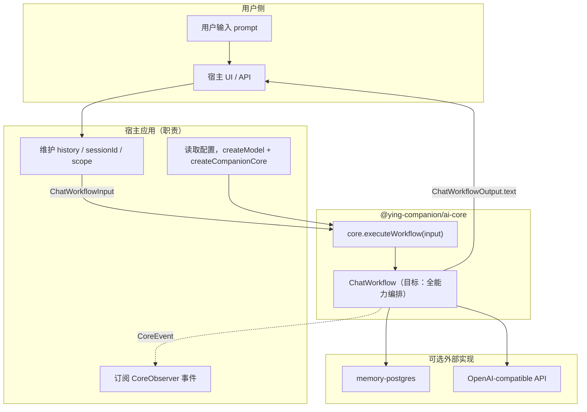
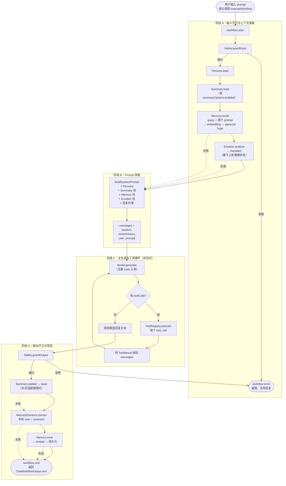
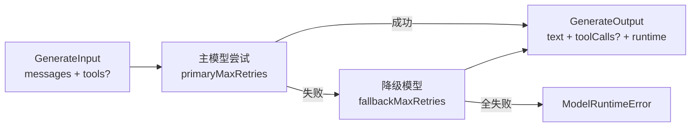

# @ying-companion/ai-core

AI Companion Core V1 的纯 SDK 核心包。提供可插拔的 Provider 抽象、模型运行时与聊天工作流编排，供宿主应用注入配置并驱动「用户输入 → 伴侣回复」的完整生命周期。

---

## 1. 包定位与边界

`@ying-companion/ai-core` 是**业务无关**的伴侣 Core：

- 定义 Persona、Memory、Emotion、Tool、Safety、Workflow 等全部能力插槽
- 提供默认/占位实现，未接入完整能力时仍可运行
- 通过 `CompanionCore.executeWorkflow()` 暴露单轮聊天入口
- **不读**环境变量、**不连**数据库、**不写**调试 UI（见 [`memory-postgres`](../memory-postgres/README.md) 与 [`model-runtime-demo`](../../apps/model-runtime-demo/README.md)）

| 不包含                     | 归属                       |
| -------------------------- | -------------------------- |
| `DATABASE_URL` / `pg.Pool` | 宿主 + `memory-postgres`   |
| 用户系统 / 鉴权            | 后续产品 API / Web         |
| `console` / 调试面板       | 宿主 + `CoreObserver` 事件 |

---

## 2. 模块说明

以下按 `src/` 目录组织。每个模块都是**可替换插槽**；Workflow 只依赖 `abstractions/` 中的接口。

### 2.1 `abstractions/` — 公共契约（稳定 API）

| 文件              | 模块           | 作用                                                                                                             |
| ----------------- | -------------- | ---------------------------------------------------------------------------------------------------------------- |
| `provider.ts`     | Provider 基础  | `CoreProvider` + `CoreProviderMeta`：所有插槽的统一父类型与稳定 `meta.id`                                        |
| `core-context.ts` | 依赖注入上下文 | `CompanionCoreContext`：工厂装配后的 Provider 集合；`ChatWorkflowCoreContext` 供 Workflow 使用                   |
| `model.ts`        | 模型运行时     | `ChatModel`、`GenerateInput/Output`、`ModelRuntimeInfo`；Core 与 LLM 的唯一边界                                  |
| `persona.ts`      | 伴侣角色       | `PersonaProvider`、`CompanionPersona`：名称、性别、性格、说话风格等，拼入 system prompt                          |
| `memory.ts`       | 长期记忆       | `MemoryProvider`（recall/save）、`MemoryExtractor`（抽取）、`EmbeddingProvider`（向量化）、`MemoryScope`（隔离） |
| `summary.ts`      | 滚动摘要       | `SummaryProvider`（load/save）、`SummaryUpdater`（压缩旧消息为 `ConversationSummary`）                           |
| `emotion.ts`      | 情绪状态机     | `EmotionEngine`：`analyze` 识别情绪、`transition` 做状态转移（阶段 5 接入 Workflow）                             |
| `tool.ts`         | 工具调用       | `ToolRegistry`：注册工具、执行 `tool_call`、返回 `ToolResult`（阶段 6 接入 Workflow）                            |
| `safety.ts`       | 内容安全       | `SafetyProvider`：`guardInput` / `guardOutput`，拒绝时 Workflow 抛错                                             |
| `workflow.ts`     | 聊天编排       | `ChatWorkflow`、`ChatWorkflowInput/Output`：宿主与 Core 之间的主业务契约                                         |
| `observer.ts`     | 可观测性       | `CoreObserver`、`CoreEvent`：各阶段 `*:start` / `*:end` 事件，供宿主展示调试信息                                 |

### 2.2 `core/` — 门面与工厂

| 文件                        | 作用                                                                                              |
| --------------------------- | ------------------------------------------------------------------------------------------------- |
| `companion-core.ts`         | `CompanionCore` 门面：`inspect()` 查看已挂载 Provider；`executeWorkflow()` 委托 Workflow          |
| `companion-core-factory.ts` | `createCompanionCore()`：组装各 Provider 默认值；注入 `memory` 时自动配 `ModelMemoryExtractor` 等 |

### 2.3 `factories/` · `config/` · `errors/`

| 路径                            | 作用                                                                        |
| ------------------------------- | --------------------------------------------------------------------------- |
| `factories/model.factory.ts`    | `createModel()`：创建 `OpenAICompatibleModel`（宿主传入 apiKey / model 等） |
| `config/model-config.ts`        | `OpenAICompatibleConfig`：主模型、降级模型、重试次数类型                    |
| `errors/model-runtime-error.ts` | `ModelRuntimeError`：主/降级模型全部重试失败时抛出                          |

### 2.4 `implementations/` — 内置默认实现

| 子目录                                  | 默认实现                    | 作用                                                      |
| --------------------------------------- | --------------------------- | --------------------------------------------------------- |
| `model/openai.ts`                       | `OpenAICompatibleModel`     | Vercel AI SDK 适配；`generate` / `stream`、重试与降级     |
| `workflow/simple-chat-workflow.ts`      | `SimpleChatWorkflow`        | 当前 V1 聊天主链路（阶段 3+4）；阶段 7 将演进为全能力编排 |
| `workflow/disabled-chat-workflow.ts`    | `DisabledChatWorkflow`      | 显式禁用 Workflow 时 `execute` 抛错                       |
| `persona/default-persona-provider.ts`   | `DefaultPersonaProvider`    | 默认角色「映映」                                          |
| `memory/noop-memory-provider.ts`        | `NoopMemoryProvider`        | 未注入 memory 时的空实现                                  |
| `memory/in-memory-memory-provider.ts`   | `InMemoryMemoryProvider`    | 进程内关键词 recall（开发调试用）                         |
| `memory/model-memory-extractor.ts`      | `ModelMemoryExtractor`      | LLM + Zod 结构化记忆抽取                                  |
| `memory/prompt-formatter.ts`            | `formatMemoriesForPrompt`   | 将 recall 结果格式化为 prompt 文本块                      |
| `summary/noop-summary-provider.ts`      | `NoopSummaryProvider`       | 摘要存储空实现                                            |
| `summary/in-memory-summary-provider.ts` | `InMemorySummaryProvider`   | 进程内摘要 Map（demo 用）                                 |
| `summary/model-summary-updater.ts`      | `ModelSummaryUpdater`       | LLM 驱动滚动摘要更新                                      |
| `summary/history-utils.ts`              | `splitForSummary` 等        | 长对话 history 切分（旧消息 vs 近期消息）                 |
| `summary/prompt-formatter.ts`           | `formatSummaryForPrompt`    | 摘要注入 prompt                                           |
| `emotion/disabled-emotion-engine.ts`    | `DisabledEmotionEngine`     | 情绪占位（阶段 5 前返回 neutral）                         |
| `tool/empty-tool-registry.ts`           | `EmptyToolRegistry`         | 工具占位（阶段 6 前禁止注册/执行）                        |
| `safety/passthrough-safety-provider.ts` | `PassthroughSafetyProvider` | 安全透传（一律放行）                                      |
| `observer/noop-core-observer.ts`        | `NoopCoreObserver`          | 丢弃所有事件                                              |

### 2.5 外部协作包（不在本包内）

| 包                                | 实现的抽象                             | 作用                                           |
| --------------------------------- | -------------------------------------- | ---------------------------------------------- |
| `@ying-companion/memory-postgres` | `MemoryProvider` + `EmbeddingProvider` | PostgreSQL + pgvector 持久化与语义 recall      |
| `apps/model-runtime-demo`         | 宿主（调试用）                         | 读 env、维护 history、注入 Core、展示 Observer |

### 2.6 当前进度 vs 目标

| 阶段 | 能力                | 状态                                   |
| ---- | ------------------- | -------------------------------------- |
| 1    | Model Runtime       | ✅                                     |
| 2    | Core 抽象层         | ✅                                     |
| 3    | 聊天主链路          | ✅                                     |
| 4    | 长期记忆 + 滚动摘要 | ✅                                     |
| 5    | 情绪状态机          | 🔌 接口就绪，Workflow 未调用           |
| 6    | 工具调用多步循环    | 🔌 接口就绪，Workflow 未执行 toolCalls |
| 7    | 完整 Workflow 编排  | 🔜 演进 `SimpleChatWorkflow`           |
| 8    | 调试 UI             | 部分在 demo                            |

---

## 3. 完整开发后的真实调用流程

> 下图描述 **V1 全部阶段（1–7）完成后**，用户发送一条 prompt 到拿到最终回复的**真实端到端路径**。
> 与当前实现的差异见各步骤标注。

### 3.1 参与方与数据流总览



**宿主每次调用传入：**

```ts
await core.executeWorkflow({
  sessionId: "session-1",
  message: "用户本轮 prompt",      // 用户输入
  history: [...],                  // 短期对话历史（宿主维护）
  scope: { ownerType, ownerId, companionId },
  summaryOptions: { enabled, ... },
  memoryOptions: { limit, minImportance },
});
```

**宿主拿到：**

```ts
result.text; // 最终回复（展示给用户）
result.memories; // 本轮 recall 的记忆
result.metadata; // 抽取/保存的记忆、摘要、debugContext 等
```

---

### 3.2 单轮完整流程（V1 目标态）



**与当前 `SimpleChatWorkflow` 的差异：**

| 步骤                | 目标态（阶段 7）                                               | 当前实现（阶段 4）                        |
| ------------------- | -------------------------------------------------------------- | ----------------------------------------- |
| `Emotion.analyze`   | ✅ 拼入 prompt                                                 | ❌ 未调用（`DisabledEmotionEngine` 占位） |
| `Tool` 多步循环     | ✅ `tool_call → execute → re-generate`                         | ❌ 忽略 `toolCalls`                       |
| `Persona.load` 时机 | 与 recall / emotion 可并行                                     | 串行，且在 Safety 之后                    |
| 其余                | Safety / Summary / Memory recall / Model / Memory extract·save | ✅ 已实现                                 |

---

### 3.3 按时间线的真实调用序列

下面用**一次用户发消息**为例，列出 Core 内部实际发生的调用（含多次 LLM / embedding）：

```txt
1. 宿主
   └─ core.executeWorkflow({ message, history, sessionId, scope, ... })

2. Workflow 开始
   ├─ observer.emit(workflow:start)
   ├─ safety.guardInput(message)          → 不通过则抛错
   ├─ persona.load({ sessionId })          → CompanionPersona
   ├─ summary.load(scope)                  → ConversationSummary | null（可选）
   ├─ memory.recall({ scope, query })      → 宿主注入的 PostgresMemoryProvider
   │    └─ embeddingProvider.embed(query)  → 向量
   │    └─ SQL pgvector TopK               → RecalledMemory[]
   ├─ emotion.analyze({ message, previous }) → EmotionState（阶段 5）
   └─ emotion.transition({ previous, detected })

3. Prompt 拼装（无模型调用）
   ├─ formatSummaryForPrompt(summary)
   ├─ formatMemoriesForPrompt(memories)
   ├─ buildPersonaSystemPrompt(persona, summary, memory, emotion)
   └─ messages = [system, ...recentHistory, user:message]

4. 主生成 + 工具循环（阶段 6，非流式 generate）
   ├─ model.generate({ messages, tools })  → text + toolCalls?
   ├─ [若有 toolCalls] tools.execute(call) → ToolResult
   ├─ [若有 toolCalls] model.generate(...)  → 二次生成（可循环多轮）
   └─ 得到最终 assistant 文本

5. 输出守卫
   └─ safety.guardOutput(text)             → 不通过则抛错

6. 写回（generate 之后，不阻断主回复）
   ├─ summaryUpdater.update + summary.save  → 压缩旧 history（可选）
   ├─ memoryExtractor.extract(...)          → 额外 1 次 LLM（JSON 抽取）
   └─ memory.save(...)                      → 额外 N 次 embedding + DB INSERT

7. 返回
   ├─ observer.emit(workflow:end)
   └─ ChatWorkflowOutput { text, memories, metadata, modelOutput, ... }

8. 宿主
   ├─ 将 text 展示给用户
   ├─ history.push(user, assistant)        → 下一轮再传入
   └─ 根据 Observer 事件更新调试面板
```

**单轮可能的模型调用次数（目标态全开）：**

| 调用                   | 触发条件                    | 次数  |
| ---------------------- | --------------------------- | ----- |
| 主 `generate`          | 每轮必有                    | 1+    |
| `generate`（工具二次） | 模型返回 toolCalls          | 0–N   |
| `MemoryExtractor`      | 每轮必有（注入 memory 时）  | 1     |
| `SummaryUpdater`       | 消息数超阈值                | 0–1   |
| `Emotion.analyze`      | 阶段 5 后每轮               | 1     |
| `embedding`            | recall 1 次 + save 每条记忆 | 1 + M |

---

### 3.4 Model Runtime 子流程（每次 `generate` / `stream`）



- **流式 `stream`**：用于 demo 直连模型调试；V1 工具多步循环以**非流式 `generate`** 为准（流式一旦吐字不再切换模型/插工具）。

---

## 4. 涉及到的知识点

### 4.1 架构与设计模式

| 知识点               | 在完整流程中的体现                                                            |
| -------------------- | ----------------------------------------------------------------------------- |
| **依赖注入**         | 宿主 `createCompanionCore({ model, memory, emotion, tools, ... })` 注入各实现 |
| **策略 / 插件化**    | Workflow 只调接口；可换 `PostgresMemoryProvider` → LangChainMemoryProvider    |
| **门面模式**         | 宿主只调 `executeWorkflow`，不感知内部 10+ Provider                           |
| **观察者模式**       | 每个步骤 `emit` 事件，调试 UI 无需改 Core 代码                                |
| **编排与副作用分离** | recall / extract 是副作用；主回复由 `Model.generate` 决定                     |
| **Fail-safe**        | Memory / Summary / Observer 失败不阻断回复；Safety 失败必须抛错               |

### 4.2 单轮流程中的 AI / LLM 知识点

| 知识点                 | 出现在哪一步                        | 说明                                     |
| ---------------------- | ----------------------------------- | ---------------------------------------- |
| **Chat Completion**    | 主 `generate`、工具二次生成         | `ChatMessage[]` → 文本回复               |
| **RAG**                | `Memory.recall`                     | query 向量化 → TopK → 注入 system prompt |
| **结构化输出（JSON）** | `MemoryExtractor`、`SummaryUpdater` | LLM + Zod schema 校验                    |
| **滚动上下文窗口**     | `Summary` + `recentHistory`         | 长对话压缩旧消息，控制 token             |
| **Persona Prompting**  | `buildPersonaSystemPrompt`          | 角色、性别、性格驱动回复风格             |
| **Emotion Prompting**  | `Emotion.analyze`（阶段 5）         | 情绪连续性注入 prompt                    |
| **Function Calling**   | 主 `generate` + Tool 循环（阶段 6） | `toolCalls` → execute → re-generate      |
| **Embedding**          | recall / save                       | 语义检索与持久化（在 `memory-postgres`） |
| **主模型重试与降级**   | 每次 `generate`                     | `ModelRuntimeInfo` 记录尝试与错误摘要    |

### 4.3 记忆与隔离

| 概念                       | 说明                                                       |
| -------------------------- | ---------------------------------------------------------- |
| **MemoryScope**            | `ownerType + ownerId + companionId`：多用户/多伴侣不互串   |
| **extract → save 闭环**    | 生成**后**抽取 → 向量化 → 入库；下轮 recall **前**检索     |
| **importance 阈值**        | 默认 `>= 3` 才 save / recall                               |
| **Memory 与 history 分工** | history = 短期（宿主传）；memory = 长期（Provider 持久化） |

### 4.4 工程与边界

| 实践             | 说明                                                          |
| ---------------- | ------------------------------------------------------------- |
| **接口优先**     | 宿主只依赖 `abstractions/` 类型                               |
| **稳定 meta.id** | `core.inspect()` 与 Observer 不依赖类名                       |
| **debugContext** | `metadata.debugContext` 还原完整 prompt（调试用，非业务契约） |
| **包边界**       | DB 在 `memory-postgres`；ai-core 零 `pg` 依赖                 |

---

## 5. 快速上手

```ts
import { createModel, createCompanionCore } from "@ying-companion/ai-core";

const model = createModel({
  apiKey: "...",
  baseUrl: "...",
  model: "gpt-4o-mini",
});

const core = createCompanionCore({ model });

const result = await core.executeWorkflow({
  sessionId: "session-1",
  message: "你好",
  history: [],
});

console.log(result.text);
```

---

## 6. Provider 默认实现一览

| 插槽              | 默认实现                                       | `meta.id`                 |
| ----------------- | ---------------------------------------------- | ------------------------- |
| `ChatModel`       | `createModel()` → `OpenAICompatibleModel`      | `model.openai-compatible` |
| `PersonaProvider` | `DefaultPersonaProvider`                       | `persona.default`         |
| `MemoryProvider`  | `NoopMemoryProvider`                           | `memory.noop`             |
| `MemoryExtractor` | `NoopMemoryExtractor` / `ModelMemoryExtractor` | `memory-extractor.*`      |
| `SummaryProvider` | `NoopSummaryProvider`                          | `summary.noop`            |
| `SummaryUpdater`  | `NoopSummaryUpdater` / `ModelSummaryUpdater`   | `summary-updater.*`       |
| `EmotionEngine`   | `DisabledEmotionEngine`                        | `emotion.disabled`        |
| `ToolRegistry`    | `EmptyToolRegistry`                            | `tool.empty-registry`     |
| `SafetyProvider`  | `PassthroughSafetyProvider`                    | `safety.passthrough`      |
| `ChatWorkflow`    | `SimpleChatWorkflow`                           | `workflow.simple-chat`    |
| `CoreObserver`    | `NoopCoreObserver`                             | `observer.noop`           |

---

## 相关文档

- 总体规划：[`.requirements/prompts/03-plan.md`](../../.requirements/prompts/03-plan.md)
- V1 边界：[`.requirements/prompts/02-execution.md`](../../.requirements/prompts/02-execution.md)
- 阶段规格：[`.requirements/stages/`](../../.requirements/stages/)
- 调试应用：[`apps/model-runtime-demo`](../../apps/model-runtime-demo/README.md)
- PostgreSQL 记忆：[`packages/memory-postgres`](../memory-postgres/README.md)
