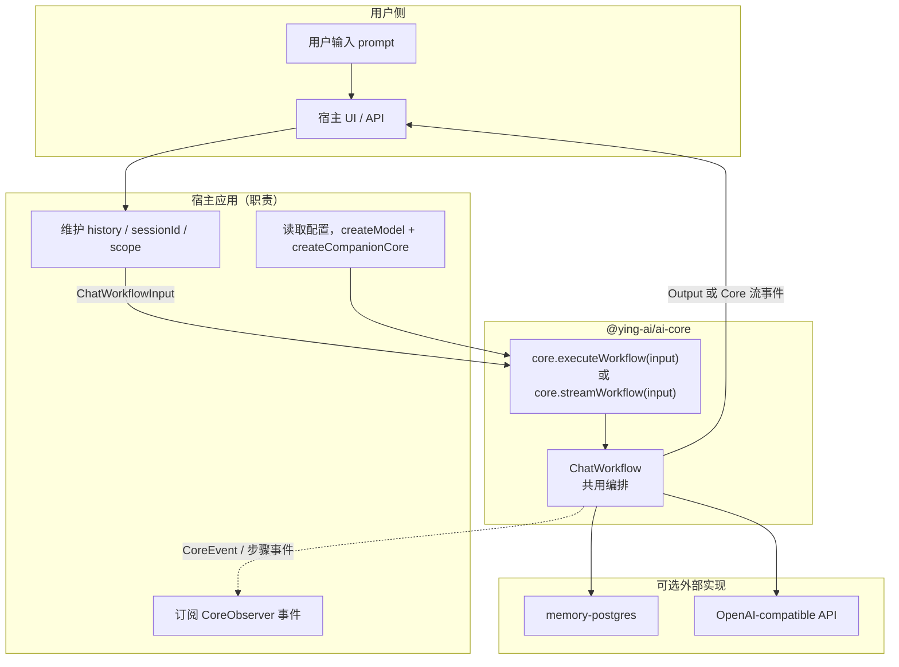
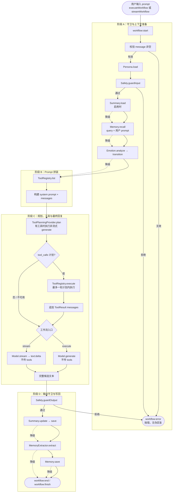
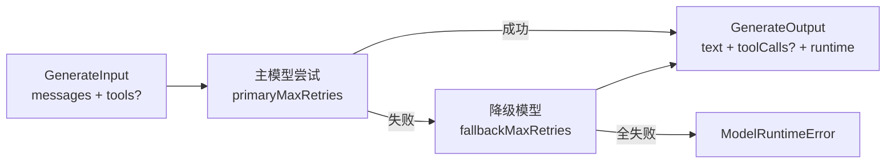

# @ying-ai/ai-core

**[English](./README.md)** | 简体中文

宿主无关的 AI Companion Core SDK。提供可插拔的 Provider 契约、模型运行时，以及非流式或流式聊天工作流编排，供宿主应用注入配置并驱动「用户输入 → 伴侣回复」的完整生命周期。

---

## 1. 包定位与边界

`@ying-ai/ai-core` 是**传输与持久化存储无关**的伴侣 Core：

- 定义 Persona、Memory、Emotion、Tool、Safety、Workflow 等能力契约
- 提供默认/占位实现，未接入完整能力时仍可运行
- 通过 `CompanionCore.executeWorkflow()` 暴露单轮聊天入口
- 通过 `CompanionCore.streamWorkflow()` 暴露工作流级 Core 事件流入口
- **不读**环境变量、**不连**数据库、**不写**调试 UI（见 [`memory-postgres`](../memory-postgres/README.zh-CN.md) 与 [`model-runtime-demo`](../../apps/model-runtime-demo/README.zh-CN.md)）

| 不包含                          | 归属                       |
| ------------------------------- | -------------------------- |
| `DATABASE_URL` / `pg.Pool`      | 宿主 + `memory-postgres`   |
| HTTP / NDJSON / Wire 事件序列化 | 宿主应用                   |
| 对话历史 / 情绪状态持久化       | 宿主应用                   |
| 用户系统 / 鉴权                 | 产品 API / Web             |
| `console` / 调试面板            | 宿主 + `CoreObserver` 事件 |

---

## 2. 模块说明

以下按 `src/` 目录组织。`abstractions/` 中的契约定义可替换能力插槽，内置实现提供默认行为；Workflow 通过 Provider 契约协作，并把 prompt 格式化、工具消息适配等细节留在实现层内部。

### 2.1 `abstractions/` — 公共契约（稳定 API）

| 文件                 | 模块           | 作用                                                                                                             |
| -------------------- | -------------- | ---------------------------------------------------------------------------------------------------------------- |
| `provider.ts`        | Provider 基础  | `CoreProvider` + `CoreProviderMeta`：所有插槽的统一父类型与稳定 `meta.id`                                        |
| `core-context.ts`    | 依赖注入上下文 | `CompanionCoreContext`：工厂装配后的 Provider 集合；`ChatWorkflowCoreContext` 供 Workflow 使用                   |
| `model.ts`           | 模型运行时     | `ChatModel`、`ModelProfile`、`GenerateInput/Output`、`ModelRuntimeInfo`；Core 与 LLM 的唯一边界                  |
| `tool-planning.ts`   | 工具规划       | `ToolPlanningProvider`、`ToolPlan`：独立于最终回复生成的工具调用决策契约                                         |
| `persona.ts`         | 伴侣角色       | `PersonaProvider`、`CompanionPersona`：名称、性别、性格、说话风格、用户称呼、兴趣与外貌设定等                    |
| `memory.ts`          | 长期记忆       | `MemoryProvider`（recall/save）、`MemoryExtractor`（抽取）、`EmbeddingProvider`（向量化）、`MemoryScope`（隔离） |
| `summary.ts`         | 滚动摘要       | `SummaryProvider`（load/save）、`SummaryUpdater`（压缩旧消息为 `ConversationSummary`）                           |
| `emotion.ts`         | 情绪状态机     | `EmotionEngine`：分析伴侣意向情绪，并基于上一状态执行转移                                                        |
| `tool.ts`            | 工具调用       | `ToolRegistry`：注册工具、执行 `tool_call`、返回 `ToolResult`；V1 参数 schema 使用 Core 自己的 object 约定       |
| `safety.ts`          | 内容安全       | `SafetyProvider`：`guardInput` / `guardOutput`，拒绝时 Workflow 抛错                                             |
| `workflow.ts`        | 聊天编排       | `ChatWorkflow`、`ChatWorkflowInput/Output`：宿主与 Core 之间的主契约；实现可选暴露 `stream`                      |
| `workflow-stream.ts` | 流式协议       | `ChatWorkflowStreamEvent`、`SafeWorkflowError`：Core 内部流事件与安全错误 DTO                                    |
| `observer.ts`        | 可观测性       | `CoreObserver`、`CoreEvent`：各步骤 `*:start` / `*:end` 事件，供宿主观测运行过程                                 |

### 2.2 `core/` — 门面与工厂

| 文件                        | 作用                                                                                                          |
| --------------------------- | ------------------------------------------------------------------------------------------------------------- |
| `companion-core.ts`         | `CompanionCore` 门面：`inspect()` 查看已挂载 Provider；`executeWorkflow()` / `streamWorkflow()` 委托 Workflow |
| `companion-core-factory.ts` | `createCompanionCore()`：组装各 Provider 默认值；注入 `memory` 时自动配 `ModelMemoryExtractor` 等             |

### 2.3 `factories/` · `config/` · `errors/`

| 路径                                           | 作用                                                                        |
| ---------------------------------------------- | --------------------------------------------------------------------------- |
| `factories/model.factory.ts`                   | `createModel()`：创建 `OpenAICompatibleModel`（宿主传入 apiKey / model 等） |
| `config/model-config.ts`                       | `OpenAICompatibleConfig`：主模型、降级模型、重试次数类型                    |
| `errors/model-runtime-error.ts`                | `ModelRuntimeError`：主/降级模型全部重试失败时抛出                          |
| `errors/model-capability-unavailable-error.ts` | `ModelCapabilityUnavailableError`：候选模型不满足本次调用所需能力时抛出     |

### 2.4 `implementations/` — 内置默认实现

| 子目录                                            | 默认实现                      | 作用                                                                                              |
| ------------------------------------------------- | ----------------------------- | ------------------------------------------------------------------------------------------------- |
| `model/openai.ts`                                 | `OpenAICompatibleModel`       | Vercel AI SDK 适配；`generate` / `stream`、重试与降级                                             |
| `tool-planning/default-tool-planning-provider.ts` | `DefaultToolPlanningProvider` | 调用 `generate({ requiredCapabilities: { toolCalling: true } })` 只产出 `no_tool` 或 `tool_calls` |
| `workflow/simple-chat-workflow.ts`                | `SimpleChatWorkflow`          | execute/stream 共用的参考单轮编排，包含工具规划与 Workflow Trace                                  |
| `workflow/disabled-chat-workflow.ts`              | `DisabledChatWorkflow`        | 显式禁用 Workflow 时 `execute` 抛错                                                               |
| `persona/default-persona-provider.ts`             | `DefaultPersonaProvider`      | 默认角色「映映」                                                                                  |
| `persona/persona-prompt-builder.ts`               | Persona Prompt Builder        | normalize 结构化 Persona，生成可预览 Persona 段落与最终 system prompt                             |
| `memory/noop-memory-provider.ts`                  | `NoopMemoryProvider`          | 未注入 memory 时的空实现                                                                          |
| `memory/in-memory-memory-provider.ts`             | `InMemoryMemoryProvider`      | 进程内关键词 recall（开发调试用）                                                                 |
| `memory/model-memory-extractor.ts`                | `ModelMemoryExtractor`        | LLM + Zod 结构化记忆抽取                                                                          |
| `memory/prompt-formatter.ts`                      | `formatMemoriesForPrompt`     | 将 recall 结果格式化为 prompt 文本块                                                              |
| `summary/noop-summary-provider.ts`                | `NoopSummaryProvider`         | 摘要存储空实现                                                                                    |
| `summary/in-memory-summary-provider.ts`           | `InMemorySummaryProvider`     | 进程内摘要 Map（demo 用）                                                                         |
| `summary/model-summary-updater.ts`                | `ModelSummaryUpdater`         | LLM 驱动滚动摘要更新                                                                              |
| `summary/history-utils.ts`                        | `splitForSummary` 等          | 长对话 history 切分（旧消息 vs 近期消息）                                                         |
| `summary/prompt-formatter.ts`                     | `formatSummaryForPrompt`      | 摘要注入 prompt                                                                                   |
| `emotion/disabled-emotion-engine.ts`              | `DisabledEmotionEngine`       | 情绪占位；默认返回 neutral，避免自动增加模型调用                                                  |
| `emotion/model-emotion-engine.ts`                 | `ModelEmotionEngine`          | 复用 `ChatModel` 推断伴侣意向情绪并执行状态转移                                                   |
| `emotion/prompt-formatter.ts`                     | `formatEmotionForPrompt`      | 将最终情绪状态格式化为 prompt 文本块                                                              |
| `tool/empty-tool-registry.ts`                     | `EmptyToolRegistry`           | 默认空工具注册表；无工具时聊天行为保持不变                                                        |
| `tool/local-tool-registry.ts`                     | `LocalToolRegistry`           | 本地工具注册、列出、执行与受控错误包装                                                            |
| `tool/tool-adapter.ts`                            | 工具适配器                    | `ToolDefinition -> GenerateInput.tools`、`ModelToolCall -> ToolCall`、最终回复消息                |
| `tool/format-tool-results.ts`                     | 工具结果格式化                | 将 `ToolResult` 序列化为最终回复生成所需的 tool role 消息内容                                     |
| `safety/passthrough-safety-provider.ts`           | `PassthroughSafetyProvider`   | 安全透传（一律放行）                                                                              |
| `observer/noop-core-observer.ts`                  | `NoopCoreObserver`            | 丢弃所有事件                                                                                      |

### 2.5 外部协作包（不在本包内）

| 包                         | 实现的抽象                             | 作用                                                         |
| -------------------------- | -------------------------------------- | ------------------------------------------------------------ |
| `@ying-ai/memory-postgres` | `MemoryProvider` + `EmbeddingProvider` | PostgreSQL + pgvector 持久化与语义 recall                    |
| `apps/model-runtime-demo`  | 宿主（调试用）                         | 读 env、维护 history、映射 Core→Wire/NDJSON，并展示 Timeline |

### 2.6 当前能力状态

| 能力              | 当前状态                                                        |
| ----------------- | --------------------------------------------------------------- |
| 模型运行时        | `generate` / `stream`、重试/降级、能力筛选、结构化输出          |
| 工作流入口        | `executeWorkflow` 与工作流级 `streamWorkflow`                   |
| 上下文能力        | Persona、Summary、Memory、Emotion、Safety；默认实现均可注入替换 |
| 工具规划与执行    | 独立规划、最多一轮执行，再进入最终回复生成                      |
| 可观测性          | Trace、Observer 事件、安全的 Core 流事件                        |
| 传输、持久化与 UI | 由宿主负责，并在协作包/应用中实现                               |

---

## 3. 当前真实调用流程

> 下图描述当前从用户发送 prompt 到拿到最终回复的真实端到端路径。

### 3.1 参与方与数据流总览



**宿主每次调用传入：**

```ts
await core.executeWorkflow({
  sessionId: "session-1",
  message: "用户本轮 prompt",      // 用户输入
  history: [...],                  // 短期对话历史（宿主维护）
  scope: { ownerType, ownerId, companionId },
  summaryOptions: { enabled, ... },
  memoryOptions: { limit, minImportance },
});
```

**宿主拿到：**

```ts
result.text; // 最终回复（展示给用户）
result.memories; // 本轮 recall 的记忆
result.metadata; // 抽取/保存的记忆、摘要、debugContext 等
```

---

### 3.2 当前单轮完整流程



**当前 `SimpleChatWorkflow` 的编排约束：**

| 步骤                | 行为                                                                                  |
| ------------------- | ------------------------------------------------------------------------------------- |
| `Persona.load`      | 关键路径；失败终止本轮                                                                |
| `Safety`            | 输入/输出任一拒绝都会抛错，不把未通过检查的文本作为成功结果返回                       |
| `Summary.load`      | 辅助读取路径；失败降级为无摘要继续                                                    |
| `Memory.recall`     | 辅助读取路径；失败降级为空召回继续                                                    |
| `Emotion.analyze`   | 辅助读取路径；失败回退 previous/neutral 继续                                          |
| `ToolRegistry.list` | 关键路径；失败终止本轮                                                                |
| 工具规划            | 非流式；无工具时跳过，规划器不可用时降级为 `no_tool`                                  |
| 工具执行            | 最终回复生成前，最多执行一轮已规划的工具                                              |
| 最终回复            | `executeWorkflow` 使用 `generate`；`streamWorkflow` 使用 `stream`；两者都不再传 tools |
| 最终意外调用        | 最终 `generate` 返回的 tool calls 仅记入 `droppedToolCalls`，不会执行                 |
| 写回路径            | `Summary.update/save`、`Memory.extract/save` 失败不阻断已生成回复                     |

> 默认 `createCompanionCore({ model })` 仍使用 `DisabledEmotionEngine`，不会额外触发情绪分析 LLM。
> 宿主显式注入 `new ModelEmotionEngine({ model })` 后，Workflow 会分析意向情绪并把最终情绪拼入 prompt。

---

### 3.3 按时间线的真实调用序列

下面用**一次用户发消息**为例，列出 Core 内部实际发生的调用（含多次 LLM / embedding）：

```txt
1. 宿主
   └─ core.executeWorkflow(...) 或 core.streamWorkflow(...)

2. 共用上下文准备
   ├─ observer.emit(workflow:start)
   ├─ 校验 message 非空                       → 无效则抛错
   ├─ persona.load({ sessionId })          → CompanionPersona
   ├─ safety.guardInput(message)          → 不通过则抛错
   ├─ summary.load(scope)                  → ConversationSummary | null（可选）
   ├─ memory.recall({ scope, query })      → 宿主注入的 PostgresMemoryProvider
   │    └─ embeddingProvider.embed(query)  → 向量
   │    └─ SQL pgvector TopK               → RecalledMemory[]
   ├─ emotion.analyze({ message, history, persona, recalledMemories, previous })
   │                                      → EmotionState
   └─ emotion.transition({ previous, detected })

3. Prompt 拼装（无模型调用）
   ├─ formatSummaryForPrompt(summary)
   ├─ formatMemoriesForPrompt(memories)
   ├─ tools.list()                         → ToolDefinition[]（若宿主注入工具）
   ├─ buildPersonaSystemPrompt(persona, summary, memory, emotion, tools)
   └─ messages = [system, ...recentHistory, user:message]

4. 工具规划（非流式）
   ├─ [存在工具时] toolPlanning.plan({ model, messages, tools })
   │    └─ model.generate({ requiredCapabilities: { toolCalling: true } })
   └─ ToolPlan = no_tool | tool_calls

5. 可选工具执行
   ├─ [若为 tool_calls] tools.execute(call) → ToolResult
   └─ 追加 assistant tool_calls + tool result messages

6. 最终用户可见回复（不再传 tools）
   ├─ executeWorkflow → model.generate({ messages })
   └─ streamWorkflow  → model.stream({ messages }) → text:delta 事件

7. 输出守卫
   └─ safety.guardOutput(text)             → 不通过则抛错

8. 写回（最终回复生成后；失败按 degraded 处理）
   ├─ summaryUpdater.update + summary.save  → 压缩旧 history（可选）
   ├─ memoryExtractor.extract(...)          → 额外 1 次 LLM（structuredOutput 抽取）
   └─ memory.save(...)                      → 额外 N 次 embedding + DB INSERT

9. 成功终止
   ├─ executeWorkflow → ChatWorkflowOutput
   └─ streamWorkflow  → workflow:finish { output }

10. 宿主
   ├─ 将 text 展示给用户
   ├─ history.push(user, assistant)        → 下一轮再传入
   └─ 将 Core 事件映射为所需 Wire DTO，并更新可观测界面
```

**单轮成功流程中的逻辑模型/Provider 操作：**

| 操作              | 触发条件                                 | 逻辑次数  |
| ----------------- | ---------------------------------------- | --------- |
| 工具规划          | 存在工具且配置了规划器                   | 0–1       |
| 最终回复          | 每条成功主路径（`generate` 或 `stream`） | 1         |
| `MemoryExtractor` | 启用模型驱动的抽取器                     | 0–1       |
| `SummaryUpdater`  | 启用模型驱动更新器且达到阈值             | 0–1       |
| `Emotion.analyze` | 注入模型驱动的情绪引擎                   | 0–1       |
| Embedding         | recall，加上每条抽取记忆的一次 save      | 0–(1 + M) |

重试与降级可能使真实 Provider 尝试次数高于上述逻辑次数。

---

### 3.4 Model Runtime 子流程（每次 `generate` / `stream`）



- **流式 `stream`**：既用于直连模型调试，也用于 `streamWorkflow` 的最终回复。工具规划与执行先完成，最终 stream 不再接收 tools；一旦已输出文本，运行时不会再切换模型或插入工具。

---

## 4. 涉及到的知识点

### 4.1 架构与设计模式

| 知识点               | 在完整流程中的体现                                                            |
| -------------------- | ----------------------------------------------------------------------------- |
| **依赖注入**         | 宿主 `createCompanionCore({ model, memory, emotion, tools, ... })` 注入各实现 |
| **策略 / 插件化**    | Workflow 只调接口；可换 `PostgresMemoryProvider` → LangChainMemoryProvider    |
| **门面模式**         | 宿主调用 `executeWorkflow` / `streamWorkflow`，无需编排各个 Provider          |
| **观察者模式**       | 每个步骤 `emit` 事件，调试 UI 无需改 Core 代码                                |
| **编排与副作用分离** | recall / extract 是副作用；最终回复由 `Model.generate` 或 `Model.stream` 产生 |
| **Fail-safe**        | Memory / Summary / Observer 失败不阻断回复；Safety 失败必须抛错               |

### 4.2 单轮流程中的 AI / LLM 知识点

| 知识点                | 出现在哪一步                                      | 说明                                                      |
| --------------------- | ------------------------------------------------- | --------------------------------------------------------- |
| **Chat Completion**   | 最终 `generate` / `stream`                        | `ChatMessage[]` → 用户可见文本回复                        |
| **RAG**               | `Memory.recall`                                   | query 向量化 → TopK → 注入 system prompt                  |
| **结构化输出**        | `MemoryExtractor`                                 | `GenerateInput.structuredOutput` / JSON + Zod schema 校验 |
| **滚动上下文窗口**    | `Summary` + `recentHistory`                       | 长对话压缩旧消息，控制 token                              |
| **Persona Prompting** | `buildPersonaPrompt` / `buildPersonaSystemPrompt` | 结构化 Persona、用户称呼、兴趣与外貌设定驱动回复风格      |
| **Emotion Prompting** | `Emotion.analyze`                                 | 情绪连续性注入 prompt                                     |
| **Function Calling**  | 工具规划 → 执行 → 最终回复                        | 规划与用户可见回复生成彼此分离                            |
| **Embedding**         | recall / save                                     | 语义检索与持久化（在 `memory-postgres`）                  |
| **主模型重试与降级**  | 模型 `generate` / `stream` 调用                   | `ModelRuntimeInfo` 记录尝试与错误摘要                     |

### 4.3 记忆与隔离

| 概念                       | 说明                                                       |
| -------------------------- | ---------------------------------------------------------- |
| **MemoryScope**            | `ownerType + ownerId + companionId`：多用户/多伴侣不互串   |
| **extract → save 闭环**    | 生成**后**抽取 → 向量化 → 入库；下轮 recall **前**检索     |
| **importance 阈值**        | 默认 `>= 3` 才 save / recall                               |
| **Memory 与 history 分工** | history = 短期（宿主传）；memory = 长期（Provider 持久化） |

### 4.4 工程与边界

| 实践             | 说明                                                                                                              |
| ---------------- | ----------------------------------------------------------------------------------------------------------------- |
| **接口优先**     | 宿主只依赖 `abstractions/` 类型                                                                                   |
| **稳定 meta.id** | `core.inspect()` 与 Observer 不依赖类名                                                                           |
| **debugContext** | `metadata.debugContext` 暴露 prompt / 工具规划诊断；`toolFollowUpMessages` 是工具执行后的最终回复输入（仅调试用） |
| **包边界**       | DB 在 `memory-postgres`；ai-core 零 `pg` 依赖                                                                     |

---

## 5. 快速上手

```ts
import { createModel, createCompanionCore } from "@ying-ai/ai-core";

const model = createModel({
  apiKey: "...",
  baseUrl: "...",
  model: "gpt-4o-mini",
});

const core = createCompanionCore({ model });

const result = await core.executeWorkflow({
  sessionId: "session-1",
  message: "你好",
  history: [],
  workflowOptions: {
    includeTrace: true,
    timeoutMs: 30_000,
  },
});

console.log(result.text);
console.log(result.metadata?.trace?.steps.map((step) => [step.step, step.status]));
```

`workflowOptions.timeoutMs` 只用于计时与 `trace.budgetExceeded` 标记，不会取消底层 Provider 调用。关键路径失败仍会抛错；失败时可从 `workflow:error` Observer 事件的 `payload.trace` 获取截至失败点的轨迹。

替换 Workflow 时，宿主只需要注入新的 `ChatWorkflow` 实现，不应反向修改 Model / Memory / Emotion / Tool / Safety Provider 接口。最小 smoke 可以在宿主侧内联一个 `ChatWorkflow`：

```ts
import { createCompanionCore, type ChatWorkflow } from "@ying-ai/ai-core";

const customWorkflow: ChatWorkflow = {
  meta: {
    id: "workflow.host-smoke",
    kind: "workflow",
    name: "Host Smoke Workflow",
  },
  async execute() {
    return {
      text: "来自替换 Workflow 的固定回复",
      metadata: { smoke: true },
    };
  },
};

const core = createCompanionCore({
  model,
  workflow: customWorkflow,
});

console.log(core.inspect().providers.workflow.id); // workflow.host-smoke
```

`apps/model-runtime-demo` 为调试 Timeline 传入 `workflowOptions.includeTrace: true`；正式宿主可保持默认 false，仅在需要 trace 诊断时开启。

启用真实情绪状态机时，宿主显式注入 `ModelEmotionEngine`，并负责保存/回传上轮情绪：

```ts
import { createCompanionCore, createModel, ModelEmotionEngine } from "@ying-ai/ai-core";

const model = createModel({ apiKey: "...", model: "gpt-4o-mini" });
const core = createCompanionCore({
  model,
  emotion: new ModelEmotionEngine({ model }),
});

let previousEmotion = undefined;

const result = await core.executeWorkflow({
  sessionId: "session-1",
  message: "我今天有点难受",
  history: [],
  emotion: previousEmotion,
});

previousEmotion = result.emotion;
```

`EmotionState` 表示「伴侣对用户的情绪状态」。Core 不保存该状态、不建情绪表；正式业务层应只持久化 `current / intensity / updatedAt`，下一轮再作为 `ChatWorkflowInput.emotion` 传回。

启用本地工具调用时，宿主显式注入 `LocalToolRegistry`。Core 默认仍使用 `EmptyToolRegistry`，无工具时行为与普通聊天一致：

```ts
import { createCompanionCore, createModel, LocalToolRegistry } from "@ying-ai/ai-core";

const model = createModel({ apiKey: "...", model: "gpt-4o-mini" });
const tools = new LocalToolRegistry();

tools.register(
  {
    name: "get_current_time",
    description: "获取当前本地时间。",
    parameters: {
      type: "object",
      properties: {},
      required: [],
      additionalProperties: false,
    },
  },
  async (input) => ({
    name: "get_current_time",
    ...(input.call.id !== undefined ? { toolCallId: input.call.id } : {}),
    ok: true,
    result: {
      timezone: "Asia/Shanghai",
      timezoneLabel: "北京时间",
      localTime: new Intl.DateTimeFormat("zh-CN", {
        timeZone: "Asia/Shanghai",
        dateStyle: "medium",
        timeStyle: "medium",
        hour12: false,
      }).format(new Date()),
      utcIso: new Date().toISOString(),
    },
  }),
);

const core = createCompanionCore({ model, tools });

const result = await core.executeWorkflow({
  sessionId: "session-1",
  message: "现在几点了？",
  history: [],
});

result.toolResults; // 本轮工具执行结果
result.metadata?.toolCallsDropped; // 最终 generate 意外请求工具时为 true
```

工具规划是独立的非流式模型调用。若计划包含工具调用，Core 最多执行一轮已规划工具，再以不传 tools 的方式运行最终用户可见 `generate`。最终 generate 意外返回的 `toolCalls` 会进入 `droppedToolCalls` 供诊断，绝不会执行。

---

## 5.1 模型能力与工具规划契约

`ChatModel` 暴露 `primaryProfile` 与可选 `fallbackProfile`。Workflow 和宿主调试面板只能根据
`ModelProfile.capabilities` 判断 `streaming`、`toolCalling`、`usage`，不得根据 provider 名称分支。

每次模型调用可通过 `GenerateInput.requiredCapabilities` 声明本次必须满足的能力：

```ts
await model.stream({
  messages,
  requiredCapabilities: { streaming: true },
});
```

OpenAI-compatible adapter 会先筛选 primary / fallback profile，能力不满足的候选不会发请求，并记录到
`ModelRuntimeInfo.capabilitySkips` 或 `ModelCapabilityUnavailableError.capabilitySkips`。未声明
`requiredCapabilities` 的调用保持向后兼容的非限制行为。

内部结构化任务可通过 `GenerateInput.structuredOutput` 声明对象 schema。OpenAI-compatible
adapter 使用 Vercel AI SDK `Output.object({ schema })` 生成并校验结构化对象；非 AI SDK
adapter 可映射到自身的 JSON/结构化输出能力后再用同一 schema 校验。Adapter 收到
`structuredOutput` 时必须填充 `GenerateOutput.structuredOutput`，或显式抛出不支持结构化输出的错误。
`ModelMemoryExtractor` 使用该契约抽取长期记忆，不再依赖从自由文本中手动截取 JSON。

```ts
await model.generate({
  messages,
  temperature: 0,
  structuredOutput: {
    type: "object",
    schema: MemoryExtractionResultSchema,
    name: "memory_extraction_result",
  },
});
```

`DefaultToolPlanningProvider` 是独立规划器：有工具时要求模型满足 `toolCalling: true`，只返回
`no_tool` 或 `tool_calls`，不会执行工具，也不会把规划模型的自然语言 `text` 作为用户可见回复。

---

## 5.2 流式工作流（`streamWorkflow`）

### 双路入口

| 方法                | 返回类型                                 | 用途                             |
| ------------------- | ---------------------------------------- | -------------------------------- |
| `executeWorkflow()` | `Promise<ChatWorkflowOutput>`            | 非流式宿主与后台任务             |
| `streamWorkflow()`  | `AsyncIterable<ChatWorkflowStreamEvent>` | 聊天 UI、实时 Timeline、调试面板 |

`streamWorkflow()` 必须以 `workflow:finish`（成功）或 `workflow:error`（失败）收口；仅有 `text:delta` 不代表成功完成。Core 门面对漏发终止事件会补发安全的 `workflow:error`。

### Core 流事件

```txt
workflow:start
step:start / step:end
text:delta
tool:call / tool:result
workflow:finish | workflow:error
```

最终用户可见回复走 `model.stream()` → `text:delta`。情绪分析、记忆抽取、摘要更新、工具规划等模型驱动的内部步骤仍使用非流式 `generate()`；工具执行调用 `ToolRegistry`，并在最终 stream 之前完成。

### Core Event vs Wire Event

- **Core Event**（`ChatWorkflowStreamEvent`）：可含 `Date`、完整 `ChatWorkflowOutput`、调试上下文。
- **Wire Event**（宿主定义，如 demo 的 `ChatWorkflowStreamWireEvent`）：JSON 可序列化 DTO；不得透传 `raw`、`Error` 实例或未转换的 `Date`。

NDJSON、HTTP、持久化顺序（`workflow:finish` 晚于 DB 写回）由宿主负责，见 [`apps/model-runtime-demo`](../../apps/model-runtime-demo/README.zh-CN.md)。

### 错误语义摘要

| 情况                         | 预期行为                                       |
| ---------------------------- | ---------------------------------------------- |
| 首个 `text:delta` 前模型失败 | retry / fallback 或 `workflow:error`           |
| 已输出部分文本后失败         | 保留 partial text；`workflow:error`，无 finish |
| Output Safety 拒绝           | `workflow:error`；不发送 `workflow:finish`     |
| 辅助上下文 / 写回失败        | 主回复可完成；trace / debug 标 degraded        |

---

## 6. Provider 默认实现一览

| 插槽                   | 默认实现                                       | `meta.id`                 |
| ---------------------- | ---------------------------------------------- | ------------------------- |
| `ChatModel`            | `createModel()` → `OpenAICompatibleModel`      | `model.openai-compatible` |
| `ToolPlanningProvider` | `DefaultToolPlanningProvider`                  | `tool-planning.default`   |
| `PersonaProvider`      | `DefaultPersonaProvider`                       | `persona.default`         |
| `MemoryProvider`       | `NoopMemoryProvider`                           | `memory.noop`             |
| `MemoryExtractor`      | `NoopMemoryExtractor` / `ModelMemoryExtractor` | `memory-extractor.*`      |
| `SummaryProvider`      | `NoopSummaryProvider`                          | `summary.noop`            |
| `SummaryUpdater`       | `NoopSummaryUpdater` / `ModelSummaryUpdater`   | `summary-updater.*`       |
| `EmotionEngine`        | `DisabledEmotionEngine`                        | `emotion.disabled`        |
| `ToolRegistry`         | `EmptyToolRegistry`                            | `tool.empty-registry`     |
| `SafetyProvider`       | `PassthroughSafetyProvider`                    | `safety.passthrough`      |
| `ChatWorkflow`         | `SimpleChatWorkflow`                           | `workflow.simple-chat`    |
| `CoreObserver`         | `NoopCoreObserver`                             | `observer.noop`           |

---

## 7. 验证

在仓库根目录执行检查。逐类改动的权威路由见[包级验证矩阵](./AGENTS.md#verification-matrix)；常用包级门禁为：

```bash
pnpm --filter @ying-ai/ai-core typecheck
pnpm --filter @ying-ai/ai-core lint
pnpm --filter @ying-ai/ai-core build
pnpm --filter @ying-ai/ai-core verify:memory-extractor # 仅记忆抽取改动
```

仅修改文档时执行聚焦 Prettier 检查与包级 lint；包级 lint 已包含 `scripts/verify-boundaries.mjs`。本包目前没有通用单元测试脚本，因此 Workflow / runtime 行为还必须执行对应需求规格或消费应用指定的聚焦验证 / 人工验收；仅通过包级检查不能证明宿主传输、持久化或 UI 的端到端流程。

---

## 相关文档

### 当前设计与集成

- 包级修改守则：[`AGENTS.md`](./AGENTS.md)
- Model Provider 边界：[`docs/ai/model-provider-strategy.md`](../../docs/ai/model-provider-strategy.md)
- 包公共入口：[`src/index.ts`](./src/index.ts)
- Ollama 适配器：[`packages/model-ollama`](../model-ollama/README.zh-CN.md)
- 调试宿主：[`apps/model-runtime-demo`](../../apps/model-runtime-demo/README.zh-CN.md)
- PostgreSQL 记忆：[`packages/memory-postgres`](../memory-postgres/README.zh-CN.md)

### 已确认需求与审查历史

- V1 边界：[`.requirements/companion/prompts/02-execution.md`](../../.requirements/companion/prompts/02-execution.md)
- V1.0 总体规划：[`.requirements/companion/prompts/03-v1.0-plan.md`](../../.requirements/companion/prompts/03-v1.0-plan.md)
- V1.1 总体规划：[`.requirements/companion/prompts/04-v1.1-plan.md`](../../.requirements/companion/prompts/04-v1.1-plan.md)
- V1.0 阶段规格：[`.requirements/companion/stages/v1.0/`](../../.requirements/companion/stages/v1.0/)
- V1.1 阶段规格：[`.requirements/companion/stages/v1.1/`](../../.requirements/companion/stages/v1.1/)
- V1.1 版本结论：[`.code-reviews/companion/v1.1/conclusion.md`](../../.code-reviews/companion/v1.1/conclusion.md)
