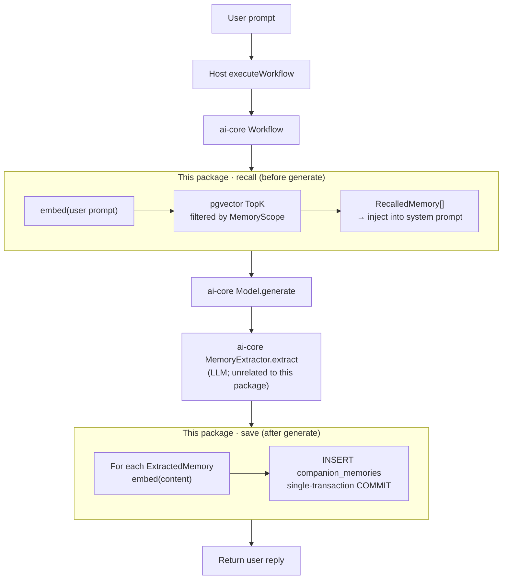
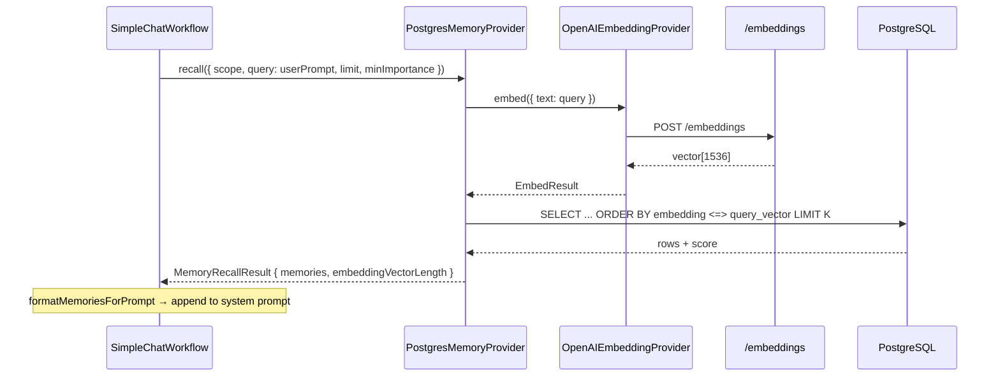
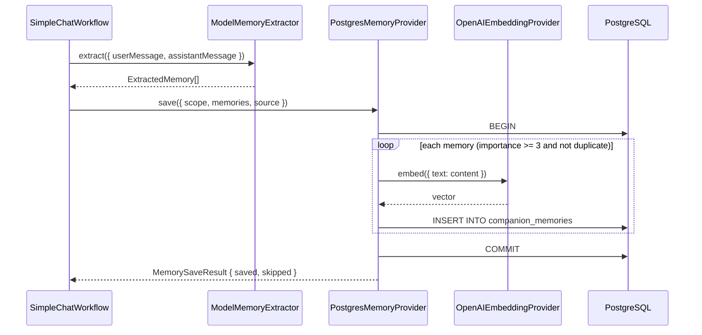
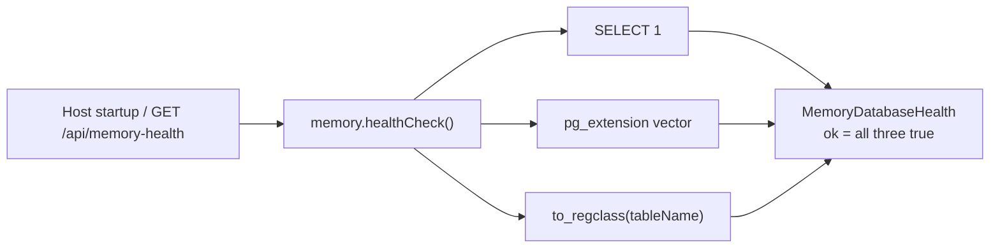

# @ying-ai/memory-postgres

**English** | [简体中文](./README.zh-CN.md)

PostgreSQL + pgvector long-term memory adapter for `@ying-ai/ai-core`. Implements `MemoryProvider` and `EmbeddingProvider`, turning Core’s memory abstractions into **durable, semantically searchable** vector storage.

---

## 1. Package role and boundaries

This package is the **database implementation layer of ai-core’s memory system**. It does not participate in chat orchestration; it is only called during Workflow `recall` / `save` steps.

| Principle                | Notes                                                                       |
| ------------------------ | --------------------------------------------------------------------------- |
| Does not read env vars   | Host reads `DATABASE_URL`, `OPENAI_API_KEY`, etc. and passes them as args   |
| Does not create pools    | Caller creates and owns `pg.Pool`; this package only uses the injected pool |
| Does not pollute ai-core | `pg` / `pgvector` deps stay isolated here                                   |
| Pluggable injection      | `createCompanionCore({ memory: new PostgresMemoryProvider(...) })`          |

**This package owns:** embedding + persistence (INSERT) + semantic recall (pgvector TopK) + healthCheck

**This package does not own:** memory extraction (`ModelMemoryExtractor` in ai-core), prompt assembly, or chat main-path orchestration

---

## 2. Module overview

### 2.1 `src/` sources

| File                           | ai-core abstraction | Role                                                                                                                |
| ------------------------------ | ------------------- | ------------------------------------------------------------------------------------------------------------------- |
| `index.ts`                     | —                   | Public export entry                                                                                                 |
| `postgres-memory-provider.ts`  | `MemoryProvider`    | `recall` (query vector → pgvector TopK), `save` (embed + INSERT in a transaction), `healthCheck`, `dispose` (no-op) |
| `openai-embedding-provider.ts` | `EmbeddingProvider` | Calls OpenAI-compatible `POST /embeddings` to turn text into float vectors                                          |

### 2.2 `postgres-memory-provider.ts` internals

| Symbol                                      | Kind                | Role                                                          |
| ------------------------------------------- | ------------------- | ------------------------------------------------------------- |
| `PostgresMemoryProviderOptions`             | Constructor options | Inject `pool`, `embeddingProvider`, optional `tableName`      |
| `MemoryDatabaseHealth`                      | Health result       | `ok` / `databaseConnected` / `pgvectorEnabled` / `tableReady` |
| `PostgresMemoryProvider`                    | Main class          | Implements `MemoryProvider`                                   |
| `hasDuplicate`                              | Internal            | Deduplicate by `type + content` within the same scope         |
| `rowToMemoryRecord` / `rowToRecalledMemory` | Mapping             | DB row → ai-core `MemoryRecord` / `RecalledMemory`            |
| `toPgVector`                                | Utility             | `number[]` → pgvector literal `[x,y,z,...]`                   |
| `validateTableName`                         | Safety              | Whitelist table names to prevent SQL injection                |

### 2.3 `openai-embedding-provider.ts` internals

| Symbol                           | Role                                                             |
| -------------------------------- | ---------------------------------------------------------------- |
| `OpenAIEmbeddingProviderOptions` | `apiKey`, `baseUrl`, `model`, injectable `fetch` (tests)         |
| `OpenAIEmbeddingProvider.embed`  | Single text → `EmbedResult.vector`; throws on HTTP/format errors |

### 2.4 `migrations/`

| File                                 | Role                                                                                           |
| ------------------------------------ | ---------------------------------------------------------------------------------------------- |
| `0001_create_companion_memories.sql` | Enable `vector` extension; create `companion_memories` table and scope/type/importance indexes |

Default schema: `embedding vector(1536)`, matching `text-embedding-3-small`.

### 2.5 Division of labor with ai-core

```txt
user prompt
  → ai-core SimpleChatWorkflow
      → memory.recall()     ──→  PostgresMemoryProvider.recall()
      │                         └─ OpenAIEmbeddingProvider.embed(query)
      │                         └─ SQL pgvector TopK
      → model.generate()    (ai-core; unrelated to this package)
      → memoryExtractor     (ai-core ModelMemoryExtractor, LLM extract)
      → memory.save()       ──→  PostgresMemoryProvider.save()
                                └─ embed(content) × N
                                └─ INSERT × N (single transaction)
```

---

## 3. Real call flow in the full companion path

> The diagrams below show **when, by whom, and how** this package is called after a user sends a prompt.
> Full Core orchestration: [`packages/ai-core/README.md`](../ai-core/README.md) §3.

### 3.1 End-to-end overview (this package highlighted)



### 3.2 Two interventions per single-turn chat

#### Intervention 1: `recall` (before model generation)



**Core SQL logic:**

- Filter: `owner_type`, `owner_id`, `companion_id IS NOT DISTINCT FROM`, `importance >= minImportance`
- Sort: `ORDER BY embedding <=> $query_vector` (cosine distance; smaller is more similar)
- Score: `score = 1 - distance` (closer to 1 is more relevant)

#### Intervention 2: `save` (after model generation)



**Write-path constraints:**

- `importance < 3` → `skipped` (Workflow also pre-filters)
- Exact same `type + content` within scope → `skipped`
- Any step failure → `ROLLBACK`; nothing in the batch is written

### 3.3 `healthCheck` (not on the chat hot path)



- **Does not throw**: when `ok: false`, the host decides fallback (demo uses `UnavailableMemoryProvider`)
- Chat request path does **not** repeat heavy probes; it only reads the host-cached health snapshot

### 3.4 Cross-turn memory loop

```txt
Turn 1: user “我喜欢五月天”
  → generate reply
  → extract → save → DB writes preference memory + embedding

Turn 2: user “推荐一首晚上听的歌”
  → recall(query=this turn’s prompt) → hits “喜欢五月天” memory (high score)
  → memory injected into prompt → generate can naturally reference preference
  → extract → save → may write new preference/event
```

---

## 4. Concepts involved

### 4.1 Architecture

| Concept                           | How it shows up                                                                              |
| --------------------------------- | -------------------------------------------------------------------------------------------- |
| **Adapter pattern**               | `PostgresMemoryProvider` implements ai-core `MemoryProvider`; Workflow swaps without knowing |
| **Dependency injection**          | `Pool` and `EmbeddingProvider` injected in constructor; pool lifecycle owned by host         |
| **Package boundary**              | DB deps never enter ai-core; matches stage 4 hard constraint                                 |
| **Side effects vs orchestration** | This package only stores/retrieves; Workflow decides when to recall/save                     |

### 4.2 Vector retrieval (RAG storage layer)

| Concept                   | Where             | Notes                                                                |
| ------------------------- | ----------------- | -------------------------------------------------------------------- |
| **Embedding**             | recall, save      | Text → fixed-dimension float vector                                  |
| **pgvector**              | DB                | `vector(1536)` column; `<=>` cosine distance                         |
| **TopK recall**           | recall            | `ORDER BY distance LIMIT K`                                          |
| **Similarity score**      | recall result     | `score = 1 - distance`, shown in demo                                |
| **MemoryScope isolation** | recall/save WHERE | Multi-user / multi-companion memories do not mix                     |
| **importance filter**     | recall/save       | Default threshold 3; low-value memories neither recalled nor written |

### 4.3 Database engineering

| Concept                   | Notes                                                               |
| ------------------------- | ------------------------------------------------------------------- |
| **Connection pool**       | Host `new Pool()`; Provider uses `pool.query` / `connect`           |
| **Transactions**          | save uses `BEGIN/COMMIT/ROLLBACK` for atomic batch writes           |
| **Dedup**                 | `EXISTS` query on same scope + type + content                       |
| **Table name validation** | `validateTableName` allows only `[A-Za-z_][A-Za-z0-9_]*`            |
| **Parameterized queries** | scope/content use `$1..$N`; table name concatenated after whitelist |

### 4.4 Embedding API

| Concept                   | Notes                                                          |
| ------------------------- | -------------------------------------------------------------- |
| **OpenAI-compatible**     | `POST {baseUrl}/embeddings`, Bearer auth                       |
| **Default model**         | `text-embedding-3-small` → 1536 dims                           |
| **Dimension consistency** | Changing models requires updating `vector(N)` in the migration |
| **Response validation**   | Throws if non-2xx or vector is not `number[]`                  |

### 4.5 Table `companion_memories`

| Column                                     | Type         | Notes                                             |
| ------------------------------------------ | ------------ | ------------------------------------------------- |
| `id`                                       | TEXT PK      | UUID                                              |
| `owner_type` / `owner_id` / `companion_id` | TEXT         | MemoryScope isolation                             |
| `type`                                     | TEXT         | fact / preference / relationship / event          |
| `content`                                  | TEXT         | Memory body (object embedded on save)             |
| `importance`                               | INTEGER      | 1–5                                               |
| `embedding`                                | vector(1536) | Content vector; recall searches with query vector |
| `source_*`                                 | TEXT / JSONB | Source session, messageIds, reason                |
| `metadata`                                 | JSONB        | Extension fields                                  |
| `created_at` / `updated_at`                | TIMESTAMPTZ  | Timestamps                                        |

Indexes: `companion_memories_scope_idx`, `type_idx`, `importance_idx`.

---

## 5. Quick start

```ts
import { Pool } from "pg";
import { createCompanionCore, createModel } from "@ying-ai/ai-core";
import { OpenAIEmbeddingProvider, PostgresMemoryProvider } from "@ying-ai/memory-postgres";

const pool = new Pool({ connectionString: process.env.DATABASE_URL });

const embeddingProvider = new OpenAIEmbeddingProvider({
  apiKey: process.env.OPENAI_API_KEY ?? "",
  baseUrl: process.env.OPENAI_BASE_URL,
  model: process.env.OPENAI_EMBEDDING_MODEL ?? "text-embedding-3-small",
});

const memory = new PostgresMemoryProvider({
  pool,
  embeddingProvider,
  tableName: "companion_memories",
});

const health = await memory.healthCheck();
if (!health.ok) {
  // Host decides fallback
}

const core = createCompanionCore({
  model: createModel({
    /* ... */
  }),
  memory,
});

// On shutdown
await pool.end();
```

`dispose()` does not close the Pool; the host owns pool lifecycle.

---

## 6. Local database setup

### 6.1 Install and create DB (macOS Homebrew example)

```bash
brew install postgresql@16 pgvector
brew services start postgresql@16
createdb ying_companion_dev
psql -d ying_companion_dev -c "CREATE EXTENSION IF NOT EXISTS vector;"
```

### 6.2 Run migration

```bash
psql -d ying_companion_dev -f packages/memory-postgres/migrations/0001_create_companion_memories.sql
psql -d ying_companion_dev -c "\d companion_memories"
```

### 6.3 Demo verification

```bash
cp apps/model-runtime-demo/.env.example apps/model-runtime-demo/.env
pnpm --filter @ying-ai/model-runtime-demo dev
```

Env vars: `DATABASE_URL`, `MEMORY_POSTGRES_TABLE`, `OPENAI_API_KEY`, `OPENAI_BASE_URL`, `OPENAI_EMBEDDING_MODEL`

Verification loop:

1. Enter “我喜欢五月天，尤其喜欢突然好想你。” → page shows saved memories
2. `SELECT type, content, importance FROM companion_memories ORDER BY created_at DESC LIMIT 5;`
3. Enter “推荐一首适合晚上听的歌。” → page shows recalled memories and score

---

## Related docs

- ai-core full path: [`packages/ai-core/README.md`](../ai-core/README.md)
- V1.0 stage 4 spec: [`.requirements/companion/stages/v1.0/stage-04/04-memory-system.md`](../../.requirements/companion/stages/v1.0/stage-04/04-memory-system.md)
- Debug app: [`apps/model-runtime-demo`](../../apps/model-runtime-demo/README.md)
