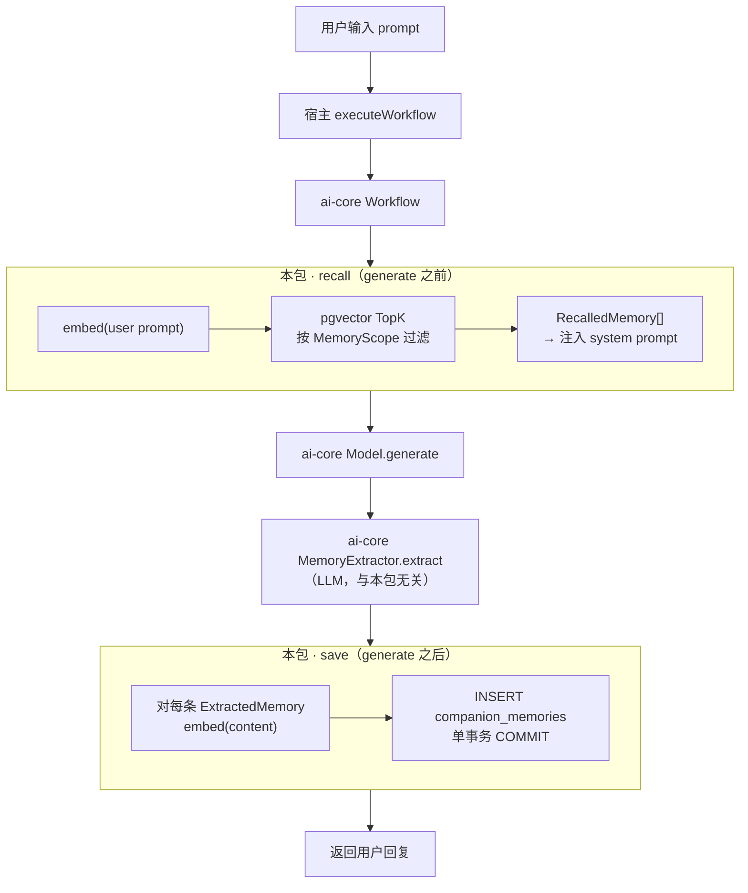
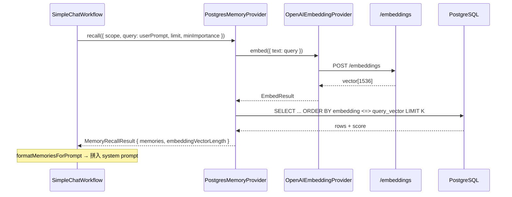
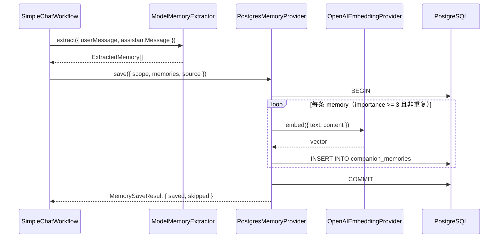
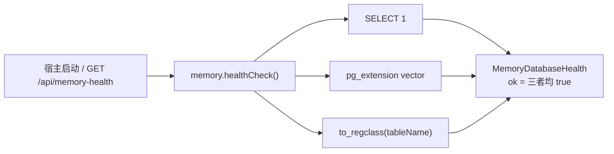

# @ying-ai/memory-postgres

**[English](./README.md)** | 简体中文

`@ying-ai/ai-core` 的 PostgreSQL + pgvector 长期记忆适配包。实现 `MemoryProvider` 与 `EmbeddingProvider`，将 Core 的记忆抽象落地为**可持久化、可语义检索**的向量存储。

---

## 1. 包定位与边界

本包是 **ai-core 记忆系统的数据库实现层**，不参与聊天编排，只在 Workflow 的 `recall` / `save` 步骤被调用。

| 原则           | 说明                                                               |
| -------------- | ------------------------------------------------------------------ |
| 不读环境变量   | `DATABASE_URL`、`OPENAI_API_KEY` 等由宿主读取后以参数传入          |
| 不创建连接池   | 调用方创建并持有 `pg.Pool`，本包只使用传入的 pool                  |
| 不污染 ai-core | `pg` / `pgvector` 依赖隔离在此包                                   |
| 可插拔注入     | `createCompanionCore({ memory: new PostgresMemoryProvider(...) })` |

**本包负责：** 向量化（embed）+ 持久化（INSERT）+ 语义召回（pgvector TopK）+ 健康检查（healthCheck）

**本包不负责：** 记忆抽取（`ModelMemoryExtractor` 在 ai-core）、Prompt 拼装、聊天主链路编排

---

## 2. 模块说明

### 2.1 `src/` 源码

| 文件                           | 实现的 ai-core 抽象 | 作用                                                                                                       |
| ------------------------------ | ------------------- | ---------------------------------------------------------------------------------------------------------- |
| `index.ts`                     | —                   | 公共导出入口                                                                                               |
| `postgres-memory-provider.ts`  | `MemoryProvider`    | `recall`（query 向量 → pgvector TopK）、`save`（事务内 embed + INSERT）、`healthCheck`、`dispose`（no-op） |
| `openai-embedding-provider.ts` | `EmbeddingProvider` | 调用 OpenAI-compatible `POST /embeddings`，将文本转为浮点向量                                              |

### 2.2 `postgres-memory-provider.ts` 内部职责

| 符号                                        | 类型         | 作用                                                          |
| ------------------------------------------- | ------------ | ------------------------------------------------------------- |
| `PostgresMemoryProviderOptions`             | 构造参数     | 注入 `pool`、`embeddingProvider`、可选 `tableName`            |
| `MemoryDatabaseHealth`                      | 健康检查结果 | `ok` / `databaseConnected` / `pgvectorEnabled` / `tableReady` |
| `PostgresMemoryProvider`                    | 主类         | 实现 `MemoryProvider` 契约                                    |
| `hasDuplicate`                              | 内部函数     | 同 scope 下 `type + content` 去重                             |
| `rowToMemoryRecord` / `rowToRecalledMemory` | 映射         | DB 行 → ai-core `MemoryRecord` / `RecalledMemory`             |
| `toPgVector`                                | 工具         | `number[]` → pgvector 字面量 `[x,y,z,...]`                    |
| `validateTableName`                         | 安全         | 表名白名单校验，防 SQL 注入                                   |

### 2.3 `openai-embedding-provider.ts` 内部职责

| 符号                             | 作用                                                   |
| -------------------------------- | ------------------------------------------------------ |
| `OpenAIEmbeddingProviderOptions` | `apiKey`、`baseUrl`、`model`、可注入 `fetch`（测试用） |
| `OpenAIEmbeddingProvider.embed`  | 单段文本 → `EmbedResult.vector`；HTTP/格式错误抛错     |

### 2.4 `migrations/`

| 文件                                 | 作用                                                                          |
| ------------------------------------ | ----------------------------------------------------------------------------- |
| `0001_create_companion_memories.sql` | 启用 `vector` 扩展；创建 `companion_memories` 表与 scope/type/importance 索引 |

默认表结构：`embedding vector(1536)`，对应 `text-embedding-3-small`。

### 2.5 与 ai-core 的分工

```txt
用户 prompt
  → ai-core SimpleChatWorkflow
      → memory.recall()     ──→  PostgresMemoryProvider.recall()
      │                         └─ OpenAIEmbeddingProvider.embed(query)
      │                         └─ SQL pgvector TopK
      → model.generate()    （ai-core，与本包无关）
      → memoryExtractor     （ai-core ModelMemoryExtractor，LLM 抽取）
      → memory.save()       ──→  PostgresMemoryProvider.save()
                                └─ embed(content) × N
                                └─ INSERT × N（单事务）
```

---

## 3. 在完整伴侣链路中的真实调用流程

> 下图描述：用户发送一条 prompt 后，**本包在何时、被谁、如何调用**。
> 完整 Core 编排见 [`packages/ai-core/README.zh-CN.md`](../ai-core/README.zh-CN.md) §3。

### 3.1 端到端总览（本包高亮）



### 3.2 单轮对话中本包的两次介入

#### 介入 1：`recall`（模型生成前）



**SQL 核心逻辑：**

- 过滤：`owner_type`、`owner_id`、`companion_id IS NOT DISTINCT FROM`、`importance >= minImportance`
- 排序：`ORDER BY embedding <=> $query_vector`（余弦距离，越小越相似）
- 分数：`score = 1 - distance`（越接近 1 越相关）

#### 介入 2：`save`（模型生成后）



**写路径约束：**

- `importance < 3` → `skipped`（Workflow 层也会预过滤）
- 同 scope 下 `type + content` 完全相同 → `skipped`
- 任一步失败 → `ROLLBACK`，整批不入库

### 3.3 `healthCheck`（不在聊天热路径）



- **不抛错**：`ok: false` 时宿主决定 fallback（demo 用 `UnavailableMemoryProvider`）
- chat 请求路径**不**重复做重型探测，只读宿主缓存的 health snapshot

### 3.4 跨轮次的记忆闭环

```txt
第 1 轮：用户「我喜欢五月天」
  → generate 回复
  → extract → save → DB 写入 preference 记忆 + embedding

第 2 轮：用户「推荐一首晚上听的歌」
  → recall(query=本轮 prompt) → 命中「喜欢五月天」记忆（score 高）
  → 记忆注入 prompt → generate 可自然引用偏好
  → extract → save → 可能写入新的 preference/event
```

---

## 4. 涉及到的知识点

### 4.1 架构

| 知识点               | 体现                                                                      |
| -------------------- | ------------------------------------------------------------------------- |
| **适配器模式**       | `PostgresMemoryProvider` 实现 ai-core `MemoryProvider`，Workflow 无感替换 |
| **依赖注入**         | `Pool`、`EmbeddingProvider` 构造注入；连接池生命周期归宿主                |
| **包边界**           | DB 依赖不进入 ai-core，符合阶段 4 硬性约束                                |
| **副作用与编排分离** | 本包只做存储/检索；何时 recall/save 由 Workflow 决定                      |

### 4.2 向量检索（RAG 存储层）

| 知识点               | 出现在            | 说明                                    |
| -------------------- | ----------------- | --------------------------------------- |
| **Embedding**        | recall、save      | 文本 → 固定维度浮点向量                 |
| **pgvector**         | DB                | `vector(1536)` 列；`<=>` 余弦距离运算符 |
| **TopK 召回**        | recall            | `ORDER BY distance LIMIT K`             |
| **相似度分数**       | recall 结果       | `score = 1 - distance`，供 demo 展示    |
| **MemoryScope 隔离** | recall/save WHERE | 多用户/多伴侣记忆不互串                 |
| **importance 过滤**  | recall/save       | 默认阈值 3，低价值记忆不召回不写入      |

### 4.3 数据库工程

| 知识点         | 说明                                                    |
| -------------- | ------------------------------------------------------- |
| **连接池**     | 宿主 `new Pool()`；Provider 用 `pool.query` / `connect` |
| **事务**       | save 用 `BEGIN/COMMIT/ROLLBACK`，批量原子写入           |
| **去重**       | `EXISTS` 查询同 scope + type + content                  |
| **表名校验**   | `validateTableName` 仅允许 `[A-Za-z_][A-Za-z0-9_]*`     |
| **参数化查询** | scope/content 等走 `$1..$N`；表名经白名单后拼接         |

### 4.4 Embedding API

| 知识点                | 说明                                      |
| --------------------- | ----------------------------------------- |
| **OpenAI-compatible** | `POST {baseUrl}/embeddings`，Bearer 鉴权  |
| **默认模型**          | `text-embedding-3-small` → 1536 维        |
| **维度一致性**        | 换模型必须同步改 migration 中 `vector(N)` |
| **响应校验**          | 非 2xx 或向量非 `number[]` 时抛错         |

### 4.5 数据表 `companion_memories`

| 字段                                       | 类型         | 说明                                     |
| ------------------------------------------ | ------------ | ---------------------------------------- |
| `id`                                       | TEXT PK      | UUID                                     |
| `owner_type` / `owner_id` / `companion_id` | TEXT         | MemoryScope 隔离                         |
| `type`                                     | TEXT         | fact / preference / relationship / event |
| `content`                                  | TEXT         | 记忆正文（save 时 embed 的对象）         |
| `importance`                               | INTEGER      | 1–5                                      |
| `embedding`                                | vector(1536) | 内容向量；recall 用 query 向量检索       |
| `source_*`                                 | TEXT / JSONB | 来源会话、messageIds、reason             |
| `metadata`                                 | JSONB        | 扩展字段                                 |
| `created_at` / `updated_at`                | TIMESTAMPTZ  | 时间戳                                   |

索引：`companion_memories_scope_idx`、`type_idx`、`importance_idx`。

---

## 5. 快速上手

```ts
import { Pool } from "pg";
import { createCompanionCore, createModel } from "@ying-ai/ai-core";
import { OpenAIEmbeddingProvider, PostgresMemoryProvider } from "@ying-ai/memory-postgres";

const pool = new Pool({ connectionString: process.env.DATABASE_URL });

const embeddingProvider = new OpenAIEmbeddingProvider({
  apiKey: process.env.OPENAI_API_KEY ?? "",
  baseUrl: process.env.OPENAI_BASE_URL,
  model: process.env.OPENAI_EMBEDDING_MODEL ?? "text-embedding-3-small",
});

const memory = new PostgresMemoryProvider({
  pool,
  embeddingProvider,
  tableName: "companion_memories",
});

const health = await memory.healthCheck();
if (!health.ok) {
  // 宿主决定 fallback
}

const core = createCompanionCore({
  model: createModel({
    /* ... */
  }),
  memory,
});

// 退出时
await pool.end();
```

`dispose()` 不关闭 Pool，由宿主管理连接池生命周期。

---

## 6. 本地数据库准备

### 6.1 安装与建库（macOS Homebrew 示例）

```bash
brew install postgresql@16 pgvector
brew services start postgresql@16
createdb ying_companion_dev
psql -d ying_companion_dev -c "CREATE EXTENSION IF NOT EXISTS vector;"
```

### 6.2 执行 migration

```bash
psql -d ying_companion_dev -f packages/memory-postgres/migrations/0001_create_companion_memories.sql
psql -d ying_companion_dev -c "\d companion_memories"
```

### 6.3 Demo 验证

```bash
cp apps/model-runtime-demo/.env.example apps/model-runtime-demo/.env
pnpm --filter @ying-ai/model-runtime-demo dev
```

环境变量：`DATABASE_URL`、`MEMORY_POSTGRES_TABLE`、`OPENAI_API_KEY`、`OPENAI_BASE_URL`、`OPENAI_EMBEDDING_MODEL`

验证闭环：

1. 输入「我喜欢五月天，尤其喜欢突然好想你。」→ 页面看到 saved memories
2. `SELECT type, content, importance FROM companion_memories ORDER BY created_at DESC LIMIT 5;`
3. 输入「推荐一首适合晚上听的歌。」→ 页面看到 recalled memories 与 score

---

## 相关文档

- ai-core 完整链路：[`packages/ai-core/README.zh-CN.md`](../ai-core/README.zh-CN.md)
- V1.0 阶段 4 规格：[`.requirements/companion/stages/v1.0/stage-04/04-memory-system.md`](../../.requirements/companion/stages/v1.0/stage-04/04-memory-system.md)
- 调试应用：[`apps/model-runtime-demo`](../../apps/model-runtime-demo/README.zh-CN.md)
